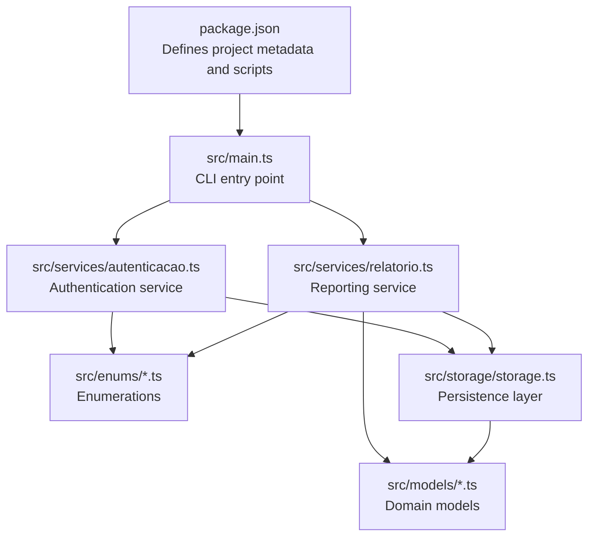
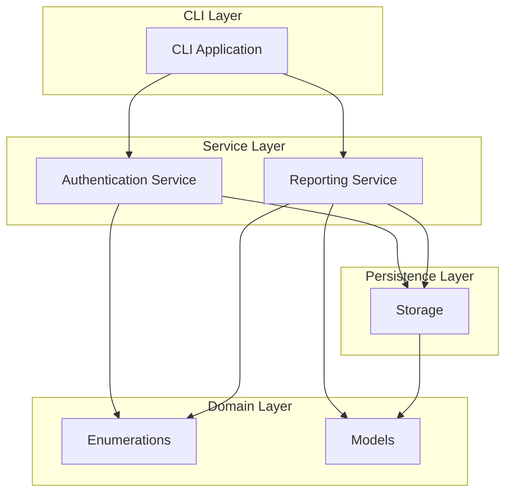
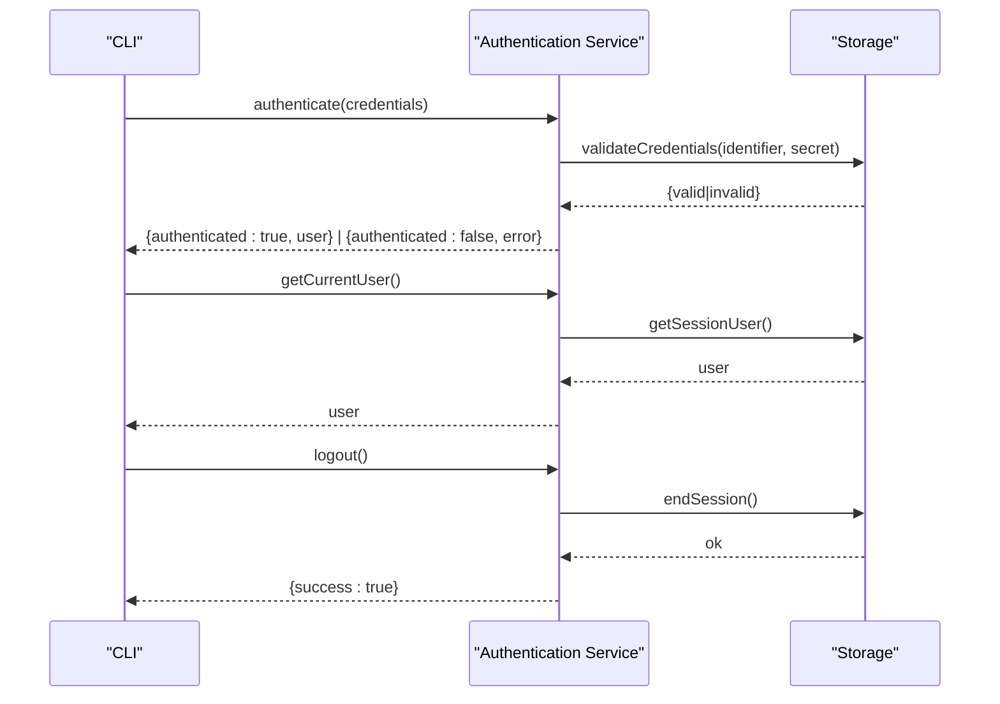
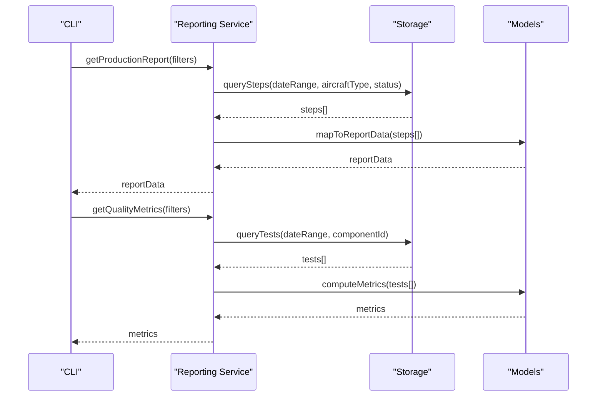
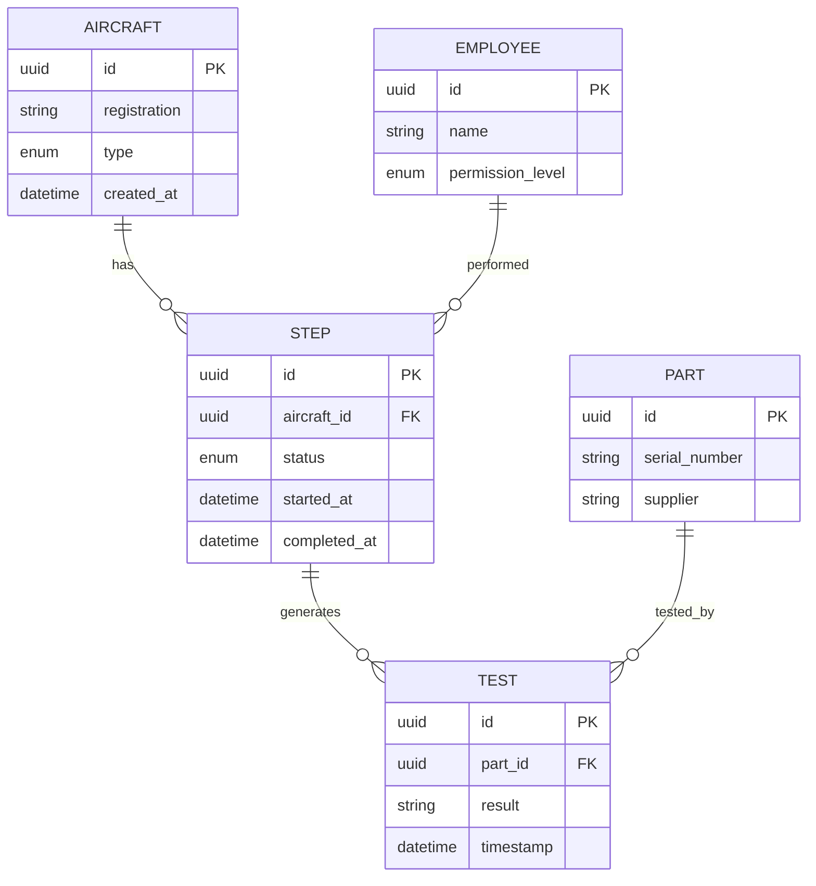
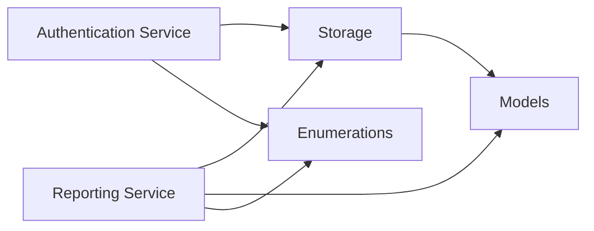

# API Reference

<cite>
**Referenced Files in This Document**
- [package.json](file://package.json)
- [main.ts](file://src/main.ts)
- [autenticacao.ts](file://src/services/autenticacao.ts)
- [relatorio.ts](file://src/services/relatorio.ts)
- [nivelPermissao.ts](file://src/enums/nivelPermissao.ts)
- [statusEtapa.ts](file://src/enums/statusEtapa.ts)
- [tipoAeronave.ts](file://src/enums/tipoAeronave.ts)
- [aeronave.ts](file://src/models/aeronave.ts)
- [etapa.ts](file://src/models/etapa.ts)
- [funcionario.ts](file://src/models/funcionario.ts)
- [peca.ts](file://src/models/peca.ts)
- [teste.ts](file://src/models/teste.ts)
- [storage.ts](file://src/storage/storage.ts)
</cite>

## Table of Contents
1. [Introduction](#introduction)
2. [Project Structure](#project-structure)
3. [Core Components](#core-components)
4. [Architecture Overview](#architecture-overview)
5. [Detailed Component Analysis](#detailed-component-analysis)
6. [Dependency Analysis](#dependency-analysis)
7. [Performance Considerations](#performance-considerations)
8. [Troubleshooting Guide](#troubleshooting-guide)
9. [Conclusion](#conclusion)
10. [Appendices](#appendices)

## Introduction
This document provides a comprehensive API reference for the Aerocode CLI System. It covers the authentication and reporting services, enumerations, and data models used to manage aircraft production workflows. The focus is on public methods, method signatures, parameters, return values, error handling, and integration points. Versioning, backward compatibility, and extension points are also addressed.

## Project Structure
The Aerocode CLI System is organized into modules that separate concerns across services, models, enums, and storage. The CLI entry point is defined via the main script in package.json, while the core logic resides under src.

**Diagram sources**
- [package.json:1-23](file://package.json#L1-L23)
- [main.ts:1-1](file://src/main.ts#L1-L1)
- [autenticacao.ts:1-1](file://src/services/autenticacao.ts#L1-L1)
- [relatorio.ts:1-1](file://src/services/relatorio.ts#L1-L1)
- [storage.ts:1-1](file://src/storage/storage.ts#L1-L1)

**Section sources**
- [package.json:1-23](file://package.json#L1-L23)
- [main.ts:1-1](file://src/main.ts#L1-L1)

## Core Components
This section outlines the primary services and their responsibilities, along with the enumerations and models they rely on.

- Authentication Service: Handles user authentication and session management.
- Reporting Service: Provides reporting capabilities for production data, including aircraft, steps, employees, components, and quality tests.
- Enumerations: Define permission levels, status codes, and aircraft types used across the system.
- Models: Represent domain entities such as aircraft, production steps, employees, components, and quality tests.
- Storage: Manages persistence and retrieval of domain entities.

**Section sources**
- [autenticacao.ts:1-1](file://src/services/autenticacao.ts#L1-L1)
- [relatorio.ts:1-1](file://src/services/relatorio.ts#L1-L1)
- [nivelPermissao.ts:1-1](file://src/enums/nivelPermissao.ts#L1-L1)
- [statusEtapa.ts:1-1](file://src/enums/statusEtapa.ts#L1-L1)
- [tipoAeronave.ts:1-1](file://src/enums/tipoAeronave.ts#L1-L1)
- [aeronave.ts:1-1](file://src/models/aeronave.ts#L1-L1)
- [etapa.ts:1-1](file://src/models/etapa.ts#L1-L1)
- [funcionario.ts:1-1](file://src/models/funcionario.ts#L1-L1)
- [peca.ts:1-1](file://src/models/peca.ts#L1-L1)
- [teste.ts:1-1](file://src/models/teste.ts#L1-L1)
- [storage.ts:1-1](file://src/storage/storage.ts#L1-L1)

## Architecture Overview
The system follows a layered architecture:
- CLI entry point initializes services.
- Services depend on storage for persistence and models for data representation.
- Enumerations provide shared type definitions across services.

**Diagram sources**
- [main.ts:1-1](file://src/main.ts#L1-L1)
- [autenticacao.ts:1-1](file://src/services/autenticacao.ts#L1-L1)
- [relatorio.ts:1-1](file://src/services/relatorio.ts#L1-L1)
- [storage.ts:1-1](file://src/storage/storage.ts#L1-L1)

## Detailed Component Analysis

### Authentication Service
The authentication service exposes methods for user authentication and session management. The following methods are defined:

- authenticate(credentials): Validates credentials and returns an authentication result.
- logout(): Ends the current session.
- getCurrentUser(): Retrieves the currently authenticated user profile.

Method signatures and parameters:
- authenticate(credentials)
  - Parameters: credentials (object containing user identifier and secret)
  - Returns: authentication result (success/failure indicator and optional user profile)
  - Errors: invalid credentials, internal server errors during validation

- logout()
  - Parameters: none
  - Returns: operation result (success/failure)
  - Errors: session not found, unexpected runtime errors

- getCurrentUser()
  - Parameters: none
  - Returns: user profile (identifier, permissions)
  - Errors: no active session, session expired

Integration and dependencies:
- Uses storage to persist and retrieve user sessions.
- Relies on enumerations for permission level validation.

Example invocation flow:

**Diagram sources**
- [autenticacao.ts:1-1](file://src/services/autenticacao.ts#L1-L1)
- [storage.ts:1-1](file://src/storage/storage.ts#L1-L1)

**Section sources**
- [autenticacao.ts:1-1](file://src/services/autenticacao.ts#L1-L1)
- [storage.ts:1-1](file://src/storage/storage.ts#L1-L1)

### Reporting Service
The reporting service provides methods for retrieving aggregated production data. The following methods are defined:

- getProductionReport(filters): Generates a production report filtered by date range, aircraft type, and status.
- getQualityMetrics(filters): Computes quality metrics for components and tests.
- getEmployeeProductivityReport(filters): Produces productivity reports per employee.
- getAircraftStatusReport(aircraftId): Returns the status of a specific aircraft and its production steps.

Method signatures and parameters:
- getProductionReport(filters)
  - Parameters: filters (dateFrom, dateTo, aircraftType, status)
  - Returns: report summary (counts, statuses, summaries)
  - Errors: invalid date range, unsupported aircraft type, internal processing errors

- getQualityMetrics(filters)
  - Parameters: filters (dateFrom, dateTo, componentId)
  - Returns: quality metrics (pass/fail rates, defect counts)
  - Errors: missing filters, invalid component identifiers, data unavailability

- getEmployeeProductivityReport(filters)
  - Parameters: filters (dateFrom, dateTo, employeeId)
  - Returns: productivity metrics (completed steps, average duration)
  - Errors: missing filters, invalid employee identifiers, data unavailability

- getAircraftStatusReport(aircraftId)
  - Parameters: aircraftId (unique identifier)
  - Returns: aircraft status and related steps
  - Errors: invalid aircraftId, missing data, internal retrieval errors

Data transformation patterns:
- Aggregates data from models (aircraft, steps, employees, components, tests).
- Applies filters and computes derived metrics.
- Formats results for CLI output.

Example invocation flow:

**Diagram sources**
- [relatorio.ts:1-1](file://src/services/relatorio.ts#L1-L1)
- [storage.ts:1-1](file://src/storage/storage.ts#L1-L1)
- [aeronave.ts:1-1](file://src/models/aeronave.ts#L1-L1)
- [etapa.ts:1-1](file://src/models/etapa.ts#L1-L1)
- [peca.ts:1-1](file://src/models/peca.ts#L1-L1)
- [teste.ts:1-1](file://src/models/teste.ts#L1-L1)

**Section sources**
- [relatorio.ts:1-1](file://src/services/relatorio.ts#L1-L1)
- [storage.ts:1-1](file://src/storage/storage.ts#L1-L1)

### Enumerations
Permission levels define user roles and access controls:
- Permission Level Enumeration
  - Values: [enumeration values]
  - Usage: applied to user profiles and validated during authentication

Status codes represent production step states:
- Status Enumeration
  - Values: [enumeration values]
  - Usage: applied to production steps and used for filtering and reporting

Aircraft types classify aircraft models:
- Aircraft Type Enumeration
  - Values: [enumeration values]
  - Usage: used for filtering production reports and aircraft-specific queries

**Section sources**
- [nivelPermissao.ts:1-1](file://src/enums/nivelPermissao.ts#L1-L1)
- [statusEtapa.ts:1-1](file://src/enums/statusEtapa.ts#L1-L1)
- [tipoAeronave.ts:1-1](file://src/enums/tipoAeronave.ts#L1-L1)

### Data Models
The following models represent domain entities used across services:

- Aircraft Model
  - Fields: [model fields]
  - Relationships: linked to production steps and components
  - Validation: required fields, type checks

- Production Step Model
  - Fields: [model fields]
  - Relationships: belongs to an aircraft, links to components and tests
  - Validation: status must be from the status enumeration

- Employee Model
  - Fields: [model fields]
  - Relationships: performs steps, assigned to components
  - Validation: unique identifier, permission level checks

- Component Model
  - Fields: [model fields]
  - Relationships: used in steps, tested via quality tests
  - Validation: serial number uniqueness, supplier checks

- Quality Test Model
  - Fields: [model fields]
  - Relationships: associated with components and steps
  - Validation: pass/fail criteria, timestamp consistency

**Diagram sources**
- [aeronave.ts:1-1](file://src/models/aeronave.ts#L1-L1)
- [etapa.ts:1-1](file://src/models/etapa.ts#L1-L1)
- [funcionario.ts:1-1](file://src/models/funcionario.ts#L1-L1)
- [peca.ts:1-1](file://src/models/peca.ts#L1-L1)
- [teste.ts:1-1](file://src/models/teste.ts#L1-L1)

**Section sources**
- [aeronave.ts:1-1](file://src/models/aeronave.ts#L1-L1)
- [etapa.ts:1-1](file://src/models/etapa.ts#L1-L1)
- [funcionario.ts:1-1](file://src/models/funcionario.ts#L1-L1)
- [peca.ts:1-1](file://src/models/peca.ts#L1-L1)
- [teste.ts:1-1](file://src/models/teste.ts#L1-L1)

## Dependency Analysis
The following diagram shows module-level dependencies among services, models, enums, and storage:

**Diagram sources**
- [autenticacao.ts:1-1](file://src/services/autenticacao.ts#L1-L1)
- [relatorio.ts:1-1](file://src/services/relatorio.ts#L1-L1)
- [storage.ts:1-1](file://src/storage/storage.ts#L1-L1)

**Section sources**
- [autenticacao.ts:1-1](file://src/services/autenticacao.ts#L1-L1)
- [relatorio.ts:1-1](file://src/services/relatorio.ts#L1-L1)
- [storage.ts:1-1](file://src/storage/storage.ts#L1-L1)

## Performance Considerations
- Prefer batch queries for reporting to minimize round trips to storage.
- Apply filters early to reduce dataset sizes before aggregation.
- Cache frequently accessed enumerations and user profiles to avoid repeated computations.
- Use pagination for large datasets in CLI output to improve responsiveness.

## Troubleshooting Guide
Common issues and resolutions:
- Authentication failures: Verify credentials and ensure the user exists in storage.
- Session errors: Confirm session validity and re-authenticate if expired.
- Reporting errors: Validate filter parameters and supported enumeration values.
- Data retrieval errors: Check entity existence and relationships before querying.

**Section sources**
- [autenticacao.ts:1-1](file://src/services/autenticacao.ts#L1-L1)
- [relatorio.ts:1-1](file://src/services/relatorio.ts#L1-L1)
- [storage.ts:1-1](file://src/storage/storage.ts#L1-L1)

## Conclusion
The Aerocode CLI System provides a modular architecture for managing aircraft production workflows. The authentication and reporting services integrate with enumerations and models to deliver robust functionality. By following the documented APIs, validation rules, and extension points, developers can maintain backward compatibility and evolve the system safely.

## Appendices

### API Versioning and Backward Compatibility
- Version: 1.0.0
- Backward compatibility: Methods and models are designed to remain stable; breaking changes require incrementing the major version.
- Extension points: Add new endpoints under existing services or introduce new service modules while maintaining consistent parameter and response patterns.

**Section sources**
- [package.json:1-23](file://package.json#L1-L23)