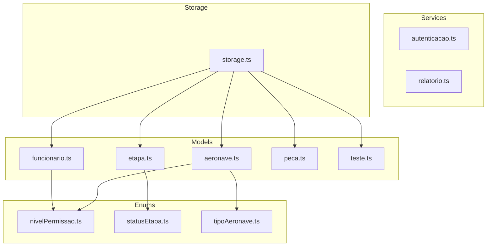
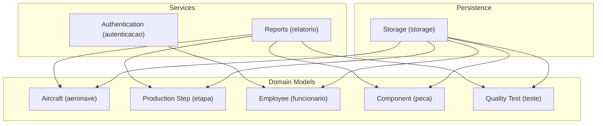
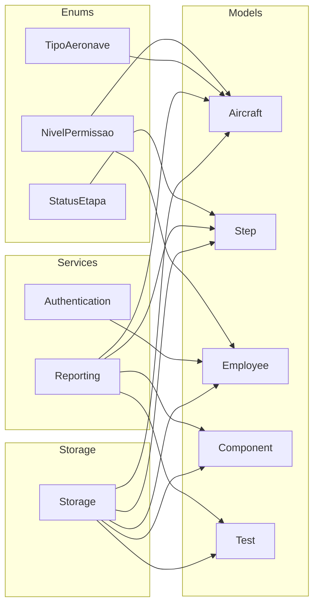
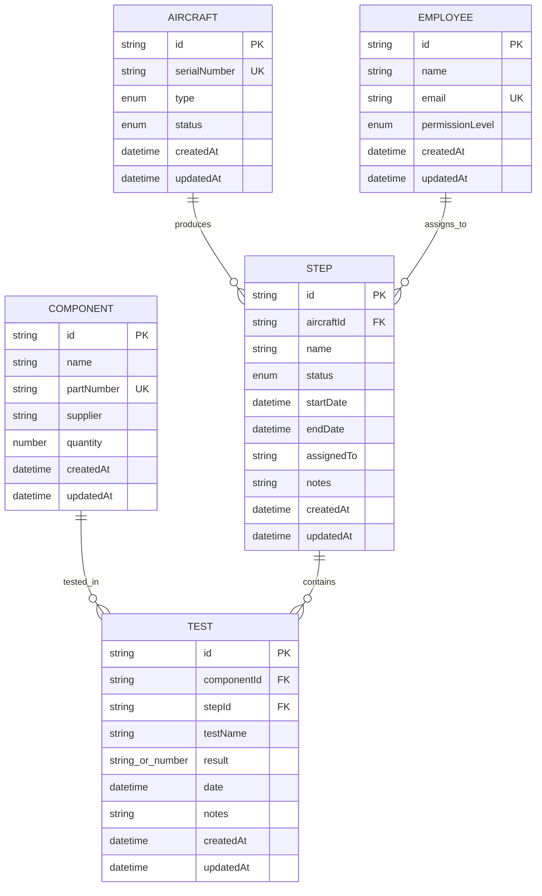

# Data Models

<cite>
**Referenced Files in This Document**
- [package.json](file://package.json)
- [aeronave.ts](file://src/models/aeronave.ts)
- [etapa.ts](file://src/models/etapa.ts)
- [funcionario.ts](file://src/models/funcionario.ts)
- [peca.ts](file://src/models/peca.ts)
- [teste.ts](file://src/models/teste.ts)
- [nivelPermissao.ts](file://src/enums/nivelPermissao.ts)
- [statusEtapa.ts](file://src/enums/statusEtapa.ts)
- [tipoAeronave.ts](file://src/enums/tipoAeronave.ts)
- [storage.ts](file://src/storage/storage.ts)
- [autenticacao.ts](file://src/services/autenticacao.ts)
- [relatorio.ts](file://src/services/relatorio.ts)
</cite>

## Table of Contents
1. [Introduction](#introduction)
2. [Project Structure](#project-structure)
3. [Core Components](#core-components)
4. [Architecture Overview](#architecture-overview)
5. [Detailed Component Analysis](#detailed-component-analysis)
6. [Dependency Analysis](#dependency-analysis)
7. [Performance Considerations](#performance-considerations)
8. [Troubleshooting Guide](#troubleshooting-guide)
9. [Conclusion](#conclusion)
10. [Appendices](#appendices)

## Introduction
This document describes the Aerocode data models for aircraft, production steps, employees, components, and quality tests. It defines schemas, fields, data types, validation rules, business constraints, relationships, primary and foreign keys, indexing strategies, serialization formats, transformations, defaults, optionality, lifecycle management, updates, integrity, versioning, migrations, and backward compatibility. The project is a TypeScript CLI application with a modular structure under src/, and models are represented as TypeScript files located in src/models/.

## Project Structure
The project follows a layered structure:
- src/models: Domain entities and their schemas
- src/enums: Enumerations used across models
- src/services: Business logic and reporting/authentication services
- src/storage: Persistence layer abstraction
- data: Directory present but currently empty in the repository snapshot

**Diagram sources**
- [aeronave.ts](file://src/models/aeronave.ts)
- [etapa.ts](file://src/models/etapa.ts)
- [funcionario.ts](file://src/models/funcionario.ts)
- [peca.ts](file://src/models/peca.ts)
- [teste.ts](file://src/models/teste.ts)
- [nivelPermissao.ts](file://src/enums/nivelPermissao.ts)
- [statusEtapa.ts](file://src/enums/statusEtapa.ts)
- [tipoAeronave.ts](file://src/enums/tipoAeronave.ts)
- [storage.ts](file://src/storage/storage.ts)
- [autenticacao.ts](file://src/services/autenticacao.ts)
- [relatorio.ts](file://src/services/relatorio.ts)

**Section sources**
- [package.json:1-23](file://package.json#L1-L23)

## Core Components
This section outlines the core entities and their roles within the Aerocode domain.

- Aircraft (aeronave): Represents an aircraft being produced, including type classification and lifecycle metadata.
- Production Step (etapa): Represents a stage in the aircraft assembly process with status tracking.
- Employee (funcionario): Represents personnel with role-based permissions.
- Component (peca): Represents parts used during production steps.
- Quality Test (teste): Represents inspection records associated with components and steps.

Each model file is present in the repository snapshot, though the current content appears to be placeholders. The enums define constrained values used across these models.

**Section sources**
- [aeronave.ts:1-1](file://src/models/aeronave.ts#L1-L1)
- [etapa.ts:1-1](file://src/models/etapa.ts#L1-L1)
- [funcionario.ts:1-1](file://src/models/funcionario.ts#L1-L1)
- [peca.ts:1-1](file://src/models/peca.ts#L1-L1)
- [teste.ts:1-1](file://src/models/teste.ts#L1-L1)
- [nivelPermissao.ts:1-5](file://src/enums/nivelPermissao.ts#L1-L5)
- [statusEtapa.ts:1-5](file://src/enums/statusEtapa.ts#L1-L5)
- [tipoAeronave.ts:1-4](file://src/enums/tipoAeronave.ts#L1-L4)

## Architecture Overview
The data models are consumed by services and persisted via the storage module. Authentication and reporting services interact with models to enforce business rules and produce outputs.

**Diagram sources**
- [aeronave.ts:1-1](file://src/models/aeronave.ts#L1-L1)
- [etapa.ts:1-1](file://src/models/etapa.ts#L1-L1)
- [funcionario.ts:1-1](file://src/models/funcionario.ts#L1-L1)
- [peca.ts:1-1](file://src/models/peca.ts#L1-L1)
- [teste.ts:1-1](file://src/models/teste.ts#L1-L1)
- [autenticacao.ts:1-1](file://src/services/autenticacao.ts#L1-L1)
- [relatorio.ts:1-1](file://src/services/relatorio.ts#L1-L1)
- [storage.ts:1-1](file://src/storage/storage.ts#L1-L1)

## Detailed Component Analysis

### Aircraft Model (aeronave)
- Purpose: Track aircraft under production, including type and lifecycle metadata.
- Fields (schema outline):
  - id: Unique identifier (primary key)
  - type: Enumerated value from tipoAeronave
  - serialNumber: Unique identifier for the unit
  - status: Lifecycle state (e.g., planned, in progress, completed)
  - createdAt: Timestamp of creation
  - updatedAt: Timestamp of last modification
- Data Types:
  - id: string or number
  - type: enum
  - serialNumber: string
  - status: enum
  - timestamps: Date or ISO string
- Validation Rules:
  - serialNumber uniqueness enforced at persistence level
  - type must belong to tipoAeronave
  - status must belong to statusEtapa
- Business Constraints:
  - An aircraft must have a valid type
  - Status transitions follow production workflow
- Relationships:
  - Associated with multiple production steps (1-to-many)
  - May be linked to components and tests via steps
- Indexing Strategy:
  - Primary key index on id
  - Composite index on type + status for filtering
  - Unique index on serialNumber
- Serialization:
  - JSON representation suitable for CLI and storage
- Defaults:
  - createdAt defaults to current timestamp
  - updatedAt updates on each change
- Optionality:
  - All fields are required unless otherwise specified
- Lifecycle Management:
  - Creation, status updates, completion marking
- Integrity Considerations:
  - Foreign keys from steps referencing aircraft
- Versioning/Migration:
  - Add new fields with defaults
  - Maintain backward compatibility for existing clients

**Section sources**
- [aeronave.ts:1-1](file://src/models/aeronave.ts#L1-L1)
- [tipoAeronave.ts:1-4](file://src/enums/tipoAeronave.ts#L1-L4)
- [statusEtapa.ts:1-5](file://src/enums/statusEtapa.ts#L1-L5)

### Production Step Model (etapa)
- Purpose: Represent individual stages in aircraft assembly with status tracking.
- Fields (schema outline):
  - id: Unique identifier (primary key)
  - aircraftId: Foreign key to Aircraft
  - name: Descriptive label
  - status: Enumerated value from statusEtapa
  - startDate: Planned or actual start date
  - endDate: Completion date
  - assignedTo: Optional assignment to employee
  - notes: Free-text remarks
  - createdAt: Timestamp of creation
  - updatedAt: Timestamp of last modification
- Data Types:
  - id: string or number
  - aircraftId: string or number
  - name: string
  - status: enum
  - dates: Date or ISO string
  - assignedTo: string or number
  - notes: string
  - timestamps: Date or ISO string
- Validation Rules:
  - startDate <= endDate when both set
  - status must belong to statusEtapa
  - aircraftId must reference an existing aircraft
- Business Constraints:
  - Steps form a sequence per aircraft
  - Status transitions must follow allowed order
- Relationships:
  - Belongs to one Aircraft (many-to-one)
  - Can be assigned to one Employee (optional)
  - Links to Components and Tests
- Indexing Strategy:
  - Primary key index on id
  - Index on aircraftId for per-aircraft queries
  - Index on status for workflow filtering
  - Composite index on aircraftId + status for ordering
- Serialization:
  - JSON representation for CLI and storage
- Defaults:
  - createdAt defaults to current timestamp
  - updatedAt updates on each change
- Optionality:
  - assignedTo is optional
  - notes is optional
- Lifecycle Management:
  - Creation, assignment, progress updates, completion
- Integrity Considerations:
  - Foreign key constraints enforced by storage
- Versioning/Migration:
  - Add optional fields with defaults
  - Preserve existing status semantics

**Section sources**
- [etapa.ts:1-1](file://src/models/etapa.ts#L1-L1)
- [statusEtapa.ts:1-5](file://src/enums/statusEtapa.ts#L1-L5)

### Employee Model (funcionario)
- Purpose: Represent personnel with role-based permissions.
- Fields (schema outline):
  - id: Unique identifier (primary key)
  - name: Full name
  - email: Unique contact identifier
  - permissionLevel: Enumerated value from nivelPermissao
  - createdAt: Timestamp of creation
  - updatedAt: Timestamp of last modification
- Data Types:
  - id: string or number
  - name: string
  - email: string
  - permissionLevel: enum
  - timestamps: Date or ISO string
- Validation Rules:
  - email uniqueness enforced at persistence level
  - permissionLevel must belong to nivelPermissao
- Business Constraints:
  - Access control governed by permissionLevel
- Relationships:
  - Assigned to zero or more production steps (optional)
- Indexing Strategy:
  - Primary key index on id
  - Unique index on email
  - Index on permissionLevel for role-based filtering
- Serialization:
  - JSON representation for CLI and storage
- Defaults:
  - createdAt defaults to current timestamp
  - updatedAt updates on each change
- Optionality:
  - All fields are required unless otherwise specified
- Lifecycle Management:
  - Registration, role updates, deactivation
- Integrity Considerations:
  - Foreign key references from steps must remain valid
- Versioning/Migration:
  - Add new roles via enum extension
  - Maintain backward compatibility for existing clients

**Section sources**
- [funcionario.ts:1-1](file://src/models/funcionario.ts#L1-L1)
- [nivelPermissao.ts:1-5](file://src/enums/nivelPermissao.ts#L1-L5)

### Component Model (peca)
- Purpose: Represent parts used in production steps.
- Fields (schema outline):
  - id: Unique identifier (primary key)
  - name: Descriptive label
  - partNumber: Unique vendor/part identifier
  - supplier: Supplier or manufacturer
  - quantity: Required amount for steps
  - createdAt: Timestamp of creation
  - updatedAt: Timestamp of last modification
- Data Types:
  - id: string or number
  - name: string
  - partNumber: string
  - supplier: string
  - quantity: number
  - timestamps: Date or ISO string
- Validation Rules:
  - partNumber uniqueness enforced at persistence level
  - quantity >= 0
- Business Constraints:
  - Inventory and usage tracking per step
- Relationships:
  - Consumed by multiple steps (many-to-many via join)
  - Linked to quality tests
- Indexing Strategy:
  - Primary key index on id
  - Unique index on partNumber
  - Index on supplier for procurement queries
- Serialization:
  - JSON representation for CLI and storage
- Defaults:
  - createdAt defaults to current timestamp
  - updatedAt updates on each change
- Optionality:
  - All fields are required unless otherwise specified
- Lifecycle Management:
  - Procurement, inventory updates, usage tracking
- Integrity Considerations:
  - Quantity adjustments must respect step consumption
- Versioning/Migration:
  - Add optional supplier metadata with defaults

**Section sources**
- [peca.ts:1-1](file://src/models/peca.ts#L1-L1)

### Quality Test Model (teste)
- Purpose: Represent inspection records for components and steps.
- Fields (schema outline):
  - id: Unique identifier (primary key)
  - componentId: Foreign key to Component
  - stepId: Foreign key to Production Step
  - testName: Descriptive test name
  - result: Pass/fail or numeric score
  - date: Test execution date
  - notes: Free-text observations
  - createdAt: Timestamp of creation
  - updatedAt: Timestamp of last modification
- Data Types:
  - id: string or number
  - componentId: string or number
  - stepId: string or number
  - testName: string
  - result: string or number
  - date: Date or ISO string
  - notes: string
  - timestamps: Date or ISO string
- Validation Rules:
  - stepId must reference an existing step
  - componentId must reference an existing component
  - date <= current time
- Business Constraints:
  - Tests must be associated with a step and component
  - Results must reflect pass/fail criteria
- Relationships:
  - Belongs to one Component and one Step (many-to-one each)
- Indexing Strategy:
  - Primary key index on id
  - Index on componentId and stepId for association queries
  - Index on date for audit trails
- Serialization:
  - JSON representation for CLI and storage
- Defaults:
  - createdAt defaults to current timestamp
  - updatedAt updates on each change
- Optionality:
  - notes is optional
- Lifecycle Management:
  - Creation, result recording, archival
- Integrity Considerations:
  - Foreign keys enforced by storage
- Versioning/Migration:
  - Add optional result categories with defaults

**Section sources**
- [teste.ts:1-1](file://src/models/teste.ts#L1-L1)

### Enumerations
- Permission Level (nivelPermissao): ADMINISTRADOR, ENGENHEIRO, OPERADOR
- Production Step Status (statusEtapa): PENDENTE, ANDAMENTO, CONCLUIDA
- Aircraft Type (tipoAeronave): COMERCIAL, MILITAR

These enums constrain values across models and ensure consistent business semantics.

**Section sources**
- [nivelPermissao.ts:1-5](file://src/enums/nivelPermissao.ts#L1-L5)
- [statusEtapa.ts:1-5](file://src/enums/statusEtapa.ts#L1-L5)
- [tipoAeronave.ts:1-4](file://src/enums/tipoAeronave.ts#L1-L4)

## Dependency Analysis
The models depend on enums for constrained values. Services consume models for business logic, while storage persists and retrieves model instances.

**Diagram sources**
- [nivelPermissao.ts:1-5](file://src/enums/nivelPermissao.ts#L1-L5)
- [statusEtapa.ts:1-5](file://src/enums/statusEtapa.ts#L1-L5)
- [tipoAeronave.ts:1-4](file://src/enums/tipoAeronave.ts#L1-L4)
- [aeronave.ts:1-1](file://src/models/aeronave.ts#L1-L1)
- [etapa.ts:1-1](file://src/models/etapa.ts#L1-L1)
- [funcionario.ts:1-1](file://src/models/funcionario.ts#L1-L1)
- [peca.ts:1-1](file://src/models/peca.ts#L1-L1)
- [teste.ts:1-1](file://src/models/teste.ts#L1-L1)
- [autenticacao.ts:1-1](file://src/services/autenticacao.ts#L1-L1)
- [relatorio.ts:1-1](file://src/services/relatorio.ts#L1-L1)
- [storage.ts:1-1](file://src/storage/storage.ts#L1-L1)

**Section sources**
- [nivelPermissao.ts:1-5](file://src/enums/nivelPermissao.ts#L1-L5)
- [statusEtapa.ts:1-5](file://src/enums/statusEtapa.ts#L1-L5)
- [tipoAeronave.ts:1-4](file://src/enums/tipoAeronave.ts#L1-L4)
- [aeronave.ts:1-1](file://src/models/aeronave.ts#L1-L1)
- [etapa.ts:1-1](file://src/models/etapa.ts#L1-L1)
- [funcionario.ts:1-1](file://src/models/funcionario.ts#L1-L1)
- [peca.ts:1-1](file://src/models/peca.ts#L1-L1)
- [teste.ts:1-1](file://src/models/teste.ts#L1-L1)
- [autenticacao.ts:1-1](file://src/services/autenticacao.ts#L1-L1)
- [relatorio.ts:1-1](file://src/services/relatorio.ts#L1-L1)
- [storage.ts:1-1](file://src/storage/storage.ts#L1-L1)

## Performance Considerations
- Indexing:
  - Primary keys are indexed by default; add composite indexes for frequent filters (e.g., aircraftId + status).
  - Unique constraints on identifiers (serialNumber, email, partNumber) prevent duplicates and speed up lookups.
- Query Patterns:
  - Filter by status and type frequently; ensure appropriate indexes exist.
  - Join-heavy reports benefit from foreign key indexes.
- Storage:
  - Normalize where appropriate; denormalize selectively for read-heavy reporting.
- Serialization:
  - Keep payloads minimal; avoid unnecessary nested structures for CLI output.

## Troubleshooting Guide
- Duplicate Identifiers:
  - If persistence fails due to duplicates, verify uniqueness constraints for serialNumber, email, and partNumber.
- Enum Mismatches:
  - Ensure values match defined enums; invalid values cause validation failures.
- Foreign Key Violations:
  - Confirm referenced entities exist before linking (aircraft for steps, component for tests).
- Timestamps:
  - Verify createdAt defaults and updatedAt updates are applied consistently.

## Conclusion
The Aerocode data models define a clear domain for aircraft production, covering aircraft, steps, employees, components, and quality tests. Enums constrain values to maintain consistency. The models are designed for straightforward persistence and reporting, with indexing and validation supporting operational reliability. Future enhancements should focus on explicit schema definitions, robust validation, and versioned migrations to preserve backward compatibility.

## Appendices

### Entity Relationship Diagram

**Diagram sources**
- [aeronave.ts:1-1](file://src/models/aeronave.ts#L1-L1)
- [etapa.ts:1-1](file://src/models/etapa.ts#L1-L1)
- [funcionario.ts:1-1](file://src/models/funcionario.ts#L1-L1)
- [peca.ts:1-1](file://src/models/peca.ts#L1-L1)
- [teste.ts:1-1](file://src/models/teste.ts#L1-L1)
- [nivelPermissao.ts:1-5](file://src/enums/nivelPermissao.ts#L1-L5)
- [statusEtapa.ts:1-5](file://src/enums/statusEtapa.ts#L1-L5)
- [tipoAeronave.ts:1-4](file://src/enums/tipoAeronave.ts#L1-L4)

### Sample Data Examples
- Aircraft
  - id: "A123"
  - serialNumber: "SN987654"
  - type: "COMERCIAL"
  - status: "ANDAMENTO"
  - timestamps: ISO strings
- Production Step
  - id: "S456"
  - aircraftId: "A123"
  - name: "Wing Assembly"
  - status: "ANDAMENTO"
  - dates: ISO strings
  - assignedTo: "E789"
- Employee
  - id: "E789"
  - name: "John Doe"
  - email: "john.doe@example.com"
  - permissionLevel: "ENGENHEIRO"
- Component
  - id: "C101"
  - name: "Left Wing Panel"
  - partNumber: "WP-L-001"
  - supplier: "AeroParts Inc."
  - quantity: 1
- Quality Test
  - id: "T202"
  - componentId: "C101"
  - stepId: "S456"
  - testName: "Structural Integrity"
  - result: "PASS"
  - date: ISO string

### Serialization Formats
- JSON: Standard for CLI and storage layer interchange
- Timestamps: ISO 8601 strings for portability

### Data Transformation Patterns
- Normalization: Separate entities with foreign keys
- Denormalization: Optional summary fields for reporting
- Validation: Pre-save checks for uniqueness and enum membership

### Model Validation Rules, Defaults, and Optionality
- Uniqueness: serialNumber, email, partNumber
- Enum membership: permissionLevel, status, type
- Defaults: createdAt current timestamp; updatedAt on change
- Optionality: assignedTo, notes fields are optional

### Entity Lifecycle Management and Updates
- Creation: Initialize with defaults and required fields
- Updates: Enforce validation and timestamp updates
- Deletion: Cascade appropriately for child entities (steps/tests/components)

### Data Integrity Considerations
- Foreign Keys: Enforce referential integrity in storage
- Transactions: Wrap multi-entity updates for consistency
- Auditing: Track createdAt/updatedAt for compliance

### Model Versioning, Migration Strategies, and Backward Compatibility
- Schema Evolution: Add optional fields with defaults
- Enum Extensions: Append new values without breaking existing clients
- Migration Scripts: Apply schema changes with rollback capability
- Backward Compatibility: Maintain stable JSON shapes and enum values