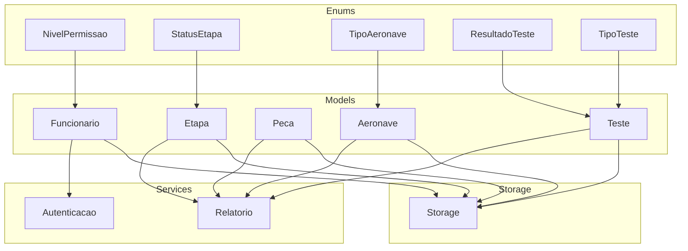
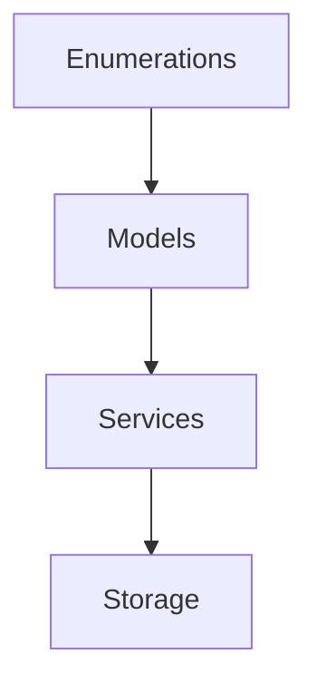
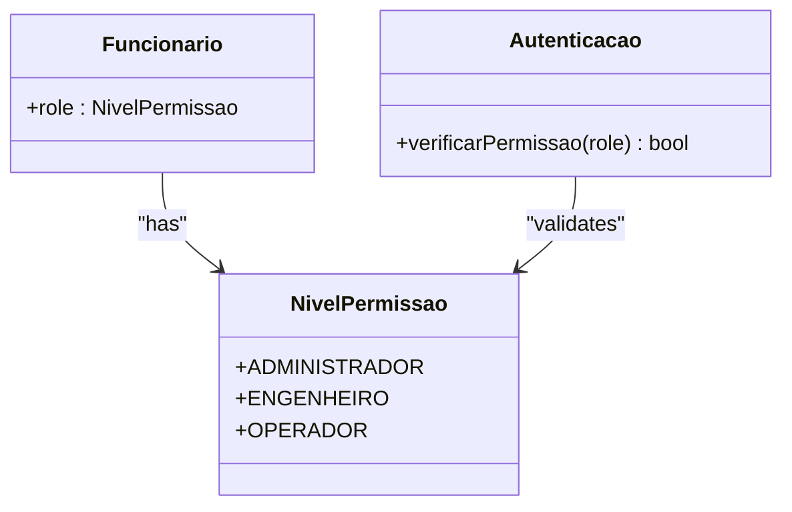
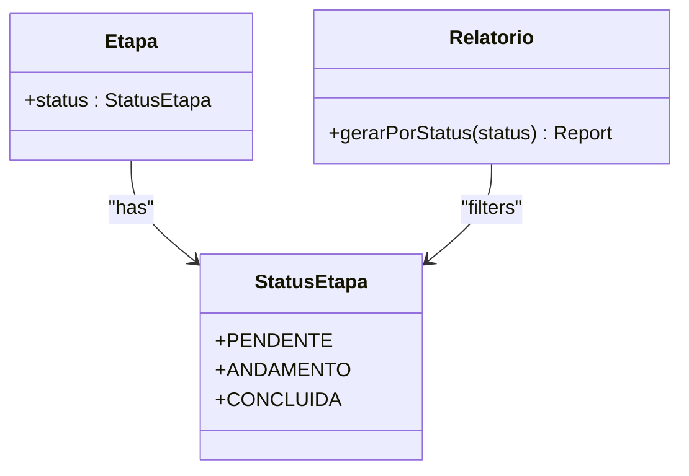
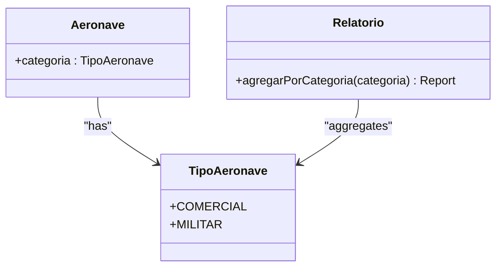
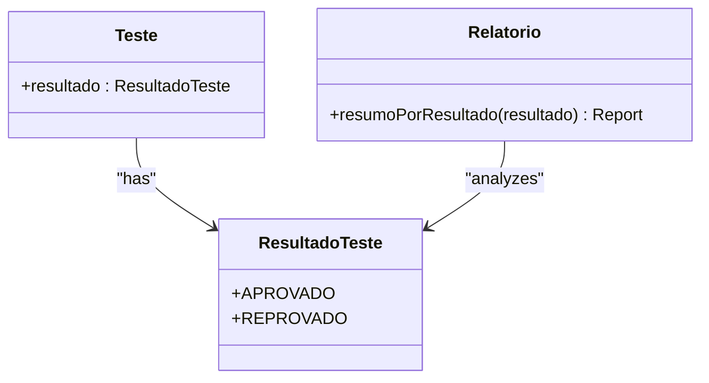
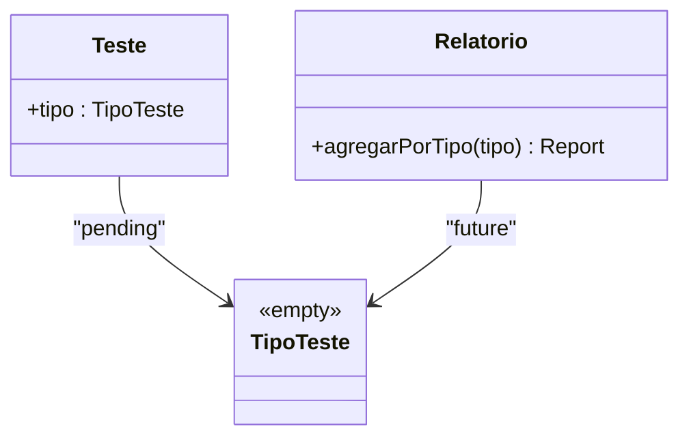
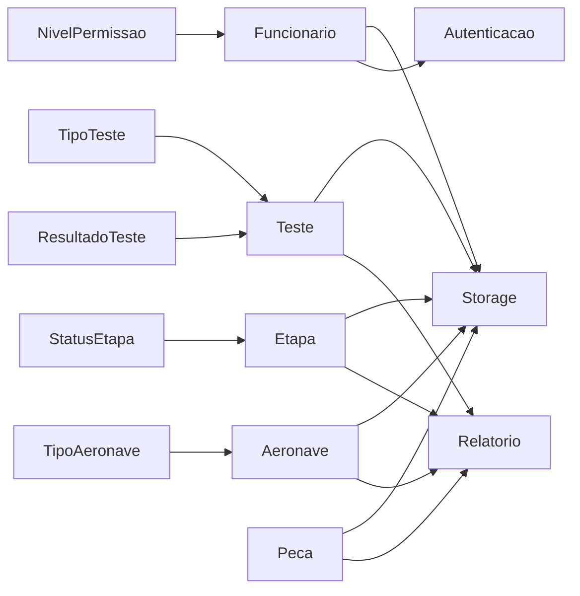

# Enumerations

<cite>
**Referenced Files in This Document**
- [nivelPermissao.ts](file://src/enums/nivelPermissao.ts)
- [statusEtapa.ts](file://src/enums/statusEtapa.ts)
- [tipoAeronave.ts](file://src/enums/tipoAeronave.ts)
- [resultadoTeste.ts](file://src/enums/resultadoTeste.ts)
- [tipoTeste.ts](file://src/enums/tipoTeste.ts)
- [aeronave.ts](file://src/models/aeronave.ts)
- [etapa.ts](file://src/models/etapa.ts)
- [peca.ts](file://src/models/peca.ts)
- [teste.ts](file://src/models/teste.ts)
- [funcionario.ts](file://src/models/funcionario.ts)
- [autenticacao.ts](file://src/services/autenticacao.ts)
- [relatorio.ts](file://src/services/relatorio.ts)
- [storage.ts](file://src/storage/storage.ts)
- [main.ts](file://src/main.ts)
</cite>

## Table of Contents
1. [Introduction](#introduction)
2. [Project Structure](#project-structure)
3. [Core Components](#core-components)
4. [Architecture Overview](#architecture-overview)
5. [Detailed Component Analysis](#detailed-component-analysis)
6. [Dependency Analysis](#dependency-analysis)
7. [Performance Considerations](#performance-considerations)
8. [Troubleshooting Guide](#troubleshooting-guide)
9. [Conclusion](#conclusion)

## Introduction
This document provides comprehensive enumeration documentation for the Aerocode system. It focuses on permission levels, production step statuses, aircraft types, test results, and test types. For each enumeration, we describe all possible values, descriptions, usage contexts, type safety benefits, validation rules, integration patterns with data models, and practical examples of usage in service methods, model properties, and business logic. We also outline expansion strategies, backward compatibility considerations, migration patterns, comparison operators, filtering mechanisms, and display formatting options.

## Project Structure
The enumerations are defined under the src/enums directory and integrated into domain models located under src/models. Services under src/services consume these enumerations for business logic, while storage and reporting services handle persistence and presentation. The main entry point orchestrates application flow.

**Diagram sources**
- [nivelPermissao.ts:1-5](file://src/enums/nivelPermissao.ts#L1-L5)
- [statusEtapa.ts:1-5](file://src/enums/statusEtapa.ts#L1-L5)
- [tipoAeronave.ts:1-4](file://src/enums/tipoAeronave.ts#L1-L4)
- [resultadoTeste.ts:1-5](file://src/enums/resultadoTeste.ts#L1-L5)
- [tipoTeste.ts:1-4](file://src/enums/tipoTeste.ts#L1-L4)
- [aeronave.ts:1-1](file://src/models/aeronave.ts#L1-L1)
- [etapa.ts:1-1](file://src/models/etapa.ts#L1-L1)
- [peca.ts:1-1](file://src/models/peca.ts#L1-L1)
- [teste.ts:1-1](file://src/models/teste.ts#L1-L1)
- [funcionario.ts:1-1](file://src/models/funcionario.ts#L1-L1)
- [autenticacao.ts:1-1](file://src/services/autenticacao.ts#L1-L1)
- [relatorio.ts:1-1](file://src/services/relatorio.ts#L1-L1)
- [storage.ts:1-1](file://src/storage/storage.ts#L1-L1)

**Section sources**
- [main.ts:1-1](file://src/main.ts#L1-L1)
- [package.json:1-23](file://package.json#L1-L23)

## Core Components
This section enumerates and documents each available enumeration with its values, descriptions, usage contexts, and integration patterns.

### Permission Levels (NivelPermissao)
- Values:
  - ADMINISTRADOR
  - ENGENHEIRO
  - OPERADOR
- Description:
  - Defines user role-based access levels for system operations.
- Usage Contexts:
  - Authentication and authorization checks in services.
  - Access control for sensitive actions and data exposure.
- Type Safety Benefits:
  - Compile-time enforcement of valid permission values.
  - Reduced risk of typos and invalid role assignments.
- Validation Rules:
  - Must be one of the predefined constants.
  - Prefer strict equality comparisons.
- Integration Patterns:
  - Model property on user profiles.
  - Guard clauses in service methods.
- Examples of Usage:
  - Service method guards to restrict operations based on role.
  - Filtering of reports or dashboards by role.
  - Display formatting for role labels in UI components.

**Section sources**
- [nivelPermissao.ts:1-5](file://src/enums/nivelPermissao.ts#L1-L5)
- [funcionario.ts:1-1](file://src/models/funcionario.ts#L1-L1)
- [autenticacao.ts:1-1](file://src/services/autenticacao.ts#L1-L1)

### Production Step Statuses (StatusEtapa)
- Values:
  - PENDENTE
  - ANDAMENTO
  - CONCLUIDA
- Description:
  - Tracks lifecycle states of manufacturing steps.
- Usage Contexts:
  - Workflows and progress tracking.
  - Filtering and sorting in reporting.
- Type Safety Benefits:
  - Ensures only valid statuses are assigned.
  - Prevents invalid state transitions.
- Validation Rules:
  - Must match one of the defined statuses.
  - Prefer explicit checks for allowed transitions.
- Integration Patterns:
  - Model property on step entities.
  - Business logic enforcing state machines.
- Examples of Usage:
  - Service methods transitioning steps between statuses.
  - Reporting filtered by current step status.
  - Display formatting for status badges.

**Section sources**
- [statusEtapa.ts:1-5](file://src/enums/statusEtapa.ts#L1-L5)
- [etapa.ts:1-1](file://src/models/etapa.ts#L1-L1)
- [relatorio.ts:1-1](file://src/services/relatorio.ts#L1-L1)

### Aircraft Types (TipoAeronave)
- Values:
  - COMERCIAL
  - MILITAR
- Description:
  - Distinguishes aircraft categories for production and maintenance workflows.
- Usage Contexts:
  - Product definition and categorization.
  - Specialized process routing and resource allocation.
- Type Safety Benefits:
  - Compile-time verification of category values.
  - Consistent categorization across models and services.
- Validation Rules:
  - Must be one of the predefined categories.
  - Use strict equality for category-specific logic.
- Integration Patterns:
  - Model property on aircraft entities.
  - Conditional logic in services and reports.
- Examples of Usage:
  - Service methods applying category-specific validations.
  - Filtering lists by aircraft type.
  - Display formatting for category labels.

**Section sources**
- [tipoAeronave.ts:1-4](file://src/enums/tipoAeronave.ts#L1-L4)
- [aeronave.ts:1-1](file://src/models/aeronave.ts#L1-L1)
- [relatorio.ts:1-1](file://src/services/relatorio.ts#L1-L1)

### Test Results (ResultadoTeste)
- Values:
  - APROVADO
  - REPROVADO
- Description:
  - Captures outcomes of quality assurance tests.
- Usage Contexts:
  - Quality gates and pass/fail criteria.
  - Reporting on compliance metrics.
- Type Safety Benefits:
  - Guarantees only valid outcomes are recorded.
  - Prevents ambiguous or invalid result values.
- Validation Rules:
  - Must be one of the two outcomes.
  - Prefer explicit checks in business logic.
- Integration Patterns:
  - Model property on test entities.
  - Aggregation and filtering in reporting.
- Examples of Usage:
  - Service methods determining next steps based on result.
  - Reports summarizing pass rates by category.
  - Display formatting for result indicators.

**Section sources**
- [resultadoTeste.ts:1-5](file://src/enums/resultadoTeste.ts#L1-L5)
- [teste.ts:1-1](file://src/models/teste.ts#L1-L1)
- [relatorio.ts:1-1](file://src/services/relatorio.ts#L1-L1)

### Test Types (TipoTeste)
- Values:
  - (No values defined)
- Description:
  - Placeholder or incomplete enumeration for test classification.
- Usage Contexts:
  - Currently unused or pending definition.
- Type Safety Benefits:
  - No compile-time enforcement until populated.
- Validation Rules:
  - Requires population before use.
- Integration Patterns:
  - Pending model property integration.
  - Future-proofing service logic.
- Examples of Usage:
  - Service methods conditionally handling undefined values.
  - Migration path to populate values.

**Section sources**
- [tipoTeste.ts:1-4](file://src/enums/tipoTeste.ts#L1-L4)

## Architecture Overview
The enumerations are consumed by models and services to enforce domain semantics and enable robust business logic. Storage persists model states, while reporting aggregates data for display.

**Diagram sources**
- [nivelPermissao.ts:1-5](file://src/enums/nivelPermissao.ts#L1-L5)
- [statusEtapa.ts:1-5](file://src/enums/statusEtapa.ts#L1-L5)
- [tipoAeronave.ts:1-4](file://src/enums/tipoAeronave.ts#L1-L4)
- [resultadoTeste.ts:1-5](file://src/enums/resultadoTeste.ts#L1-L5)
- [tipoTeste.ts:1-4](file://src/enums/tipoTeste.ts#L1-L4)
- [aeronave.ts:1-1](file://src/models/aeronave.ts#L1-L1)
- [etapa.ts:1-1](file://src/models/etapa.ts#L1-L1)
- [peca.ts:1-1](file://src/models/peca.ts#L1-L1)
- [teste.ts:1-1](file://src/models/teste.ts#L1-L1)
- [funcionario.ts:1-1](file://src/models/funcionario.ts#L1-L1)
- [autenticacao.ts:1-1](file://src/services/autenticacao.ts#L1-L1)
- [relatorio.ts:1-1](file://src/services/relatorio.ts#L1-L1)
- [storage.ts:1-1](file://src/storage/storage.ts#L1-L1)

## Detailed Component Analysis

### Permission Levels (NivelPermissao)
- Values and Descriptions:
  - ADMINISTRADOR: Full system access.
  - ENGENHEIRO: Technical operations and configurations.
  - OPERADOR: Operational tasks and monitoring.
- Type Safety Benefits:
  - Compile-time checks prevent invalid roles.
- Validation Rules:
  - Strict equality checks recommended.
- Integration Patterns:
  - Role stored in user profile model.
  - Guarded service methods check role before execution.
- Comparison Operators:
  - Equality checks for role matching.
- Filtering Mechanisms:
  - Filter operations by role in reporting.
- Display Formatting:
  - Human-readable labels mapped to enum values.

**Diagram sources**
- [nivelPermissao.ts:1-5](file://src/enums/nivelPermissao.ts#L1-L5)
- [funcionario.ts:1-1](file://src/models/funcionario.ts#L1-L1)
- [autenticacao.ts:1-1](file://src/services/autenticacao.ts#L1-L1)

**Section sources**
- [nivelPermissao.ts:1-5](file://src/enums/nivelPermissao.ts#L1-L5)
- [funcionario.ts:1-1](file://src/models/funcionario.ts#L1-L1)
- [autenticacao.ts:1-1](file://src/services/autenticacao.ts#L1-L1)

### Production Step Statuses (StatusEtapa)
- Values and Descriptions:
  - PENDENTE: Awaiting initiation.
  - ANDAMENTO: In progress.
  - CONCLUIDA: Completed.
- Type Safety Benefits:
  - Prevents invalid state transitions.
- Validation Rules:
  - Enforce allowed transitions in business logic.
- Integration Patterns:
  - Status stored in step model.
  - Reporting filters by status.
- Comparison Operators:
  - Equality checks for current status.
- Filtering Mechanisms:
  - Filter by status for work queues and dashboards.
- Display Formatting:
  - Status badges and labels.

**Diagram sources**
- [statusEtapa.ts:1-5](file://src/enums/statusEtapa.ts#L1-L5)
- [etapa.ts:1-1](file://src/models/etapa.ts#L1-L1)
- [relatorio.ts:1-1](file://src/services/relatorio.ts#L1-L1)

**Section sources**
- [statusEtapa.ts:1-5](file://src/enums/statusEtapa.ts#L1-L5)
- [etapa.ts:1-1](file://src/models/etapa.ts#L1-L1)
- [relatorio.ts:1-1](file://src/services/relatorio.ts#L1-L1)

### Aircraft Types (TipoAeronave)
- Values and Descriptions:
  - COMERCIAL: Passenger or cargo aircraft.
  - MILITAR: Military aircraft.
- Type Safety Benefits:
  - Ensures category consistency.
- Validation Rules:
  - Strict equality for category-specific logic.
- Integration Patterns:
  - Category stored in aircraft model.
  - Conditional logic in services and reports.
- Comparison Operators:
  - Equality checks for category matching.
- Filtering Mechanisms:
  - Filter by category for production planning.
- Display Formatting:
  - Category labels and icons.

**Diagram sources**
- [tipoAeronave.ts:1-4](file://src/enums/tipoAeronave.ts#L1-L4)
- [aeronave.ts:1-1](file://src/models/aeronave.ts#L1-L1)
- [relatorio.ts:1-1](file://src/services/relatorio.ts#L1-L1)

**Section sources**
- [tipoAeronave.ts:1-4](file://src/enums/tipoAeronave.ts#L1-L4)
- [aeronave.ts:1-1](file://src/models/aeronave.ts#L1-L1)
- [relatorio.ts:1-1](file://src/services/relatorio.ts#L1-L1)

### Test Results (ResultadoTeste)
- Values and Descriptions:
  - APROVADO: Passed quality criteria.
  - REPROVADO: Failed quality criteria.
- Type Safety Benefits:
  - Guarantees valid outcomes.
- Validation Rules:
  - Explicit checks in business logic.
- Integration Patterns:
  - Outcome stored in test model.
  - Aggregation in reporting.
- Comparison Operators:
  - Equality checks for pass/fail decisions.
- Filtering Mechanisms:
  - Filter by outcome for compliance reports.
- Display Formatting:
  - Color-coded indicators and labels.

**Diagram sources**
- [resultadoTeste.ts:1-5](file://src/enums/resultadoTeste.ts#L1-L5)
- [teste.ts:1-1](file://src/models/teste.ts#L1-L1)
- [relatorio.ts:1-1](file://src/services/relatorio.ts#L1-L1)

**Section sources**
- [resultadoTeste.ts:1-5](file://src/enums/resultadoTeste.ts#L1-L5)
- [teste.ts:1-1](file://src/models/teste.ts#L1-L1)
- [relatorio.ts:1-1](file://src/services/relatorio.ts#L1-L1)

### Test Types (TipoTeste)
- Values and Descriptions:
  - None defined yet.
- Type Safety Benefits:
  - None until populated.
- Validation Rules:
  - Treat as optional or fallback until defined.
- Integration Patterns:
  - Pending model property integration.
  - Future-proof service logic.
- Comparison Operators:
  - Equality checks after population.
- Filtering Mechanisms:
  - Filter by type after population.
- Display Formatting:
  - Placeholder labels until populated.

**Diagram sources**
- [tipoTeste.ts:1-4](file://src/enums/tipoTeste.ts#L1-L4)
- [teste.ts:1-1](file://src/models/teste.ts#L1-L1)
- [relatorio.ts:1-1](file://src/services/relatorio.ts#L1-L1)

**Section sources**
- [tipoTeste.ts:1-4](file://src/enums/tipoTeste.ts#L1-L4)
- [teste.ts:1-1](file://src/models/teste.ts#L1-L1)
- [relatorio.ts:1-1](file://src/services/relatorio.ts#L1-L1)

## Dependency Analysis
Enumerations are consumed by models and services. The following diagram shows how enums flow through the system.

**Diagram sources**
- [nivelPermissao.ts:1-5](file://src/enums/nivelPermissao.ts#L1-L5)
- [statusEtapa.ts:1-5](file://src/enums/statusEtapa.ts#L1-L5)
- [tipoAeronave.ts:1-4](file://src/enums/tipoAeronave.ts#L1-L4)
- [resultadoTeste.ts:1-5](file://src/enums/resultadoTeste.ts#L1-L5)
- [tipoTeste.ts:1-4](file://src/enums/tipoTeste.ts#L1-L4)
- [aeronave.ts:1-1](file://src/models/aeronave.ts#L1-L1)
- [etapa.ts:1-1](file://src/models/etapa.ts#L1-L1)
- [peca.ts:1-1](file://src/models/peca.ts#L1-L1)
- [teste.ts:1-1](file://src/models/teste.ts#L1-L1)
- [funcionario.ts:1-1](file://src/models/funcionario.ts#L1-L1)
- [autenticacao.ts:1-1](file://src/services/autenticacao.ts#L1-L1)
- [relatorio.ts:1-1](file://src/services/relatorio.ts#L1-L1)
- [storage.ts:1-1](file://src/storage/storage.ts#L1-L1)

**Section sources**
- [nivelPermissao.ts:1-5](file://src/enums/nivelPermissao.ts#L1-L5)
- [statusEtapa.ts:1-5](file://src/enums/statusEtapa.ts#L1-L5)
- [tipoAeronave.ts:1-4](file://src/enums/tipoAeronave.ts#L1-L4)
- [resultadoTeste.ts:1-5](file://src/enums/resultadoTeste.ts#L1-L5)
- [tipoTeste.ts:1-4](file://src/enums/tipoTeste.ts#L1-L4)
- [aeronave.ts:1-1](file://src/models/aeronave.ts#L1-L1)
- [etapa.ts:1-1](file://src/models/etapa.ts#L1-L1)
- [peca.ts:1-1](file://src/models/peca.ts#L1-L1)
- [teste.ts:1-1](file://src/models/teste.ts#L1-L1)
- [funcionario.ts:1-1](file://src/models/funcionario.ts#L1-L1)
- [autenticacao.ts:1-1](file://src/services/autenticacao.ts#L1-L1)
- [relatorio.ts:1-1](file://src/services/relatorio.ts#L1-L1)
- [storage.ts:1-1](file://src/storage/storage.ts#L1-L1)

## Performance Considerations
- Enum comparisons are O(1) string equality checks, efficient for filtering and validation.
- Using enums reduces memory overhead compared to raw strings.
- Prefer single-pass filtering and aggregation in reporting services to minimize repeated scans.

## Troubleshooting Guide
- Empty or incomplete enumerations:
  - Verify that enum files are properly defined and exported.
  - Ensure models and services are updated to reflect new values.
- Validation failures:
  - Confirm strict equality checks and avoid loose comparisons.
  - Add defensive checks for unexpected values during migration.
- Display issues:
  - Map enum values to localized labels for consistent formatting.
- Migration risks:
  - Maintain backward compatibility by treating unknown values as defaults or errors.
  - Log and audit changes to enum values to track impact.

## Conclusion
Enumerations in Aerocode provide strong type safety and clear semantic meaning across permissions, production steps, aircraft categories, and test outcomes. By integrating enums into models and services, the system enforces domain rules, simplifies validation, and improves maintainability. As the system evolves, expand enumerations thoughtfully, preserve backward compatibility, and adopt robust migration patterns to ensure smooth transitions.