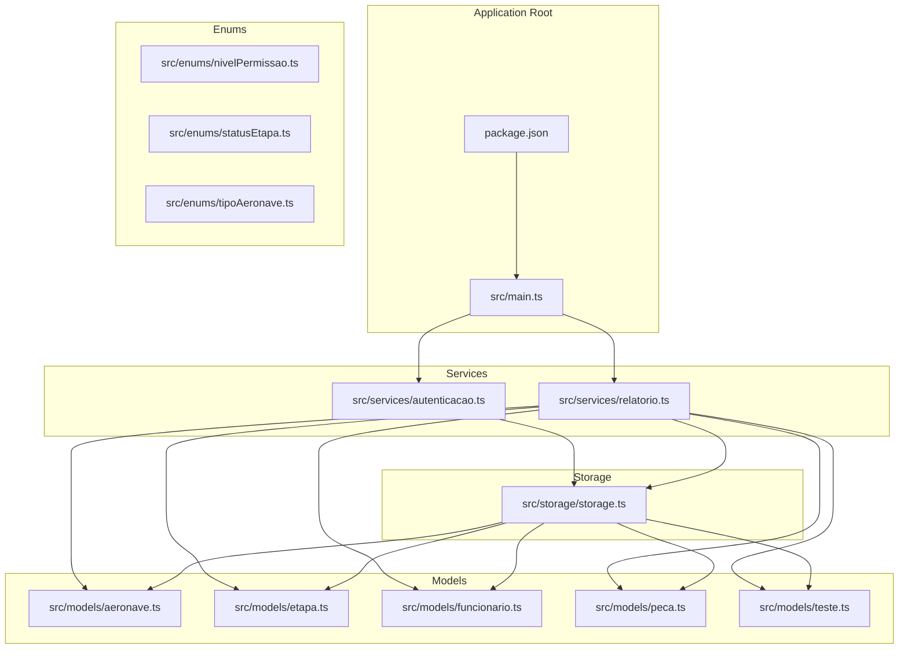
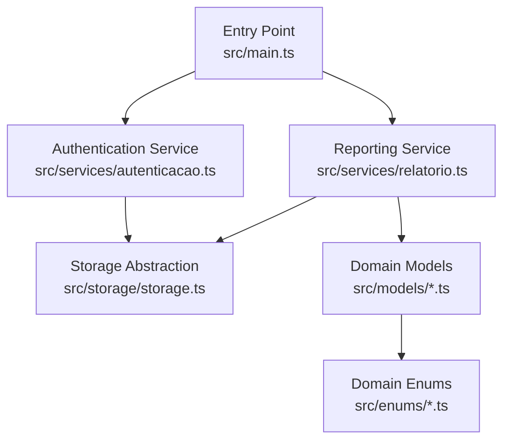
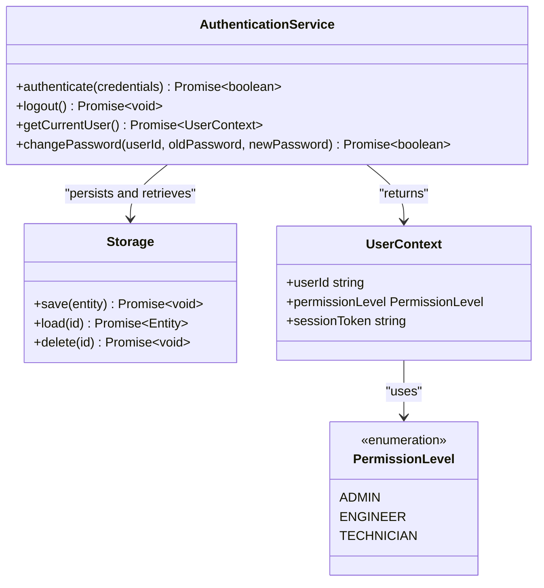
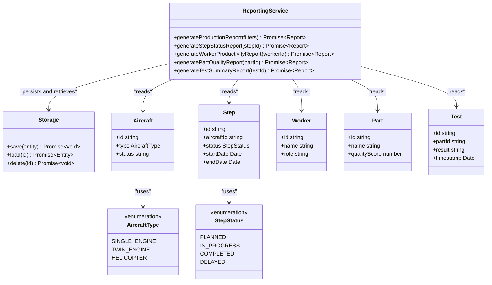
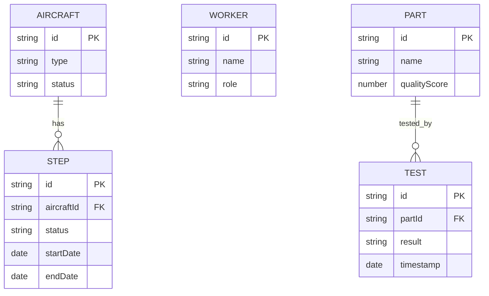
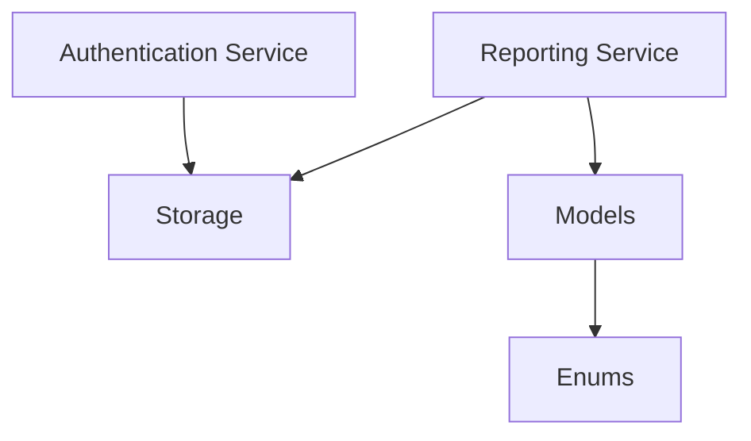

# Service APIs

<cite>
**Referenced Files in This Document**
- [autenticacao.ts](file://src/services/autenticacao.ts)
- [relatorio.ts](file://src/services/relatorio.ts)
- [nivelPermissao.ts](file://src/enums/nivelPermissao.ts)
- [statusEtapa.ts](file://src/enums/statusEtapa.ts)
- [tipoAeronave.ts](file://src/enums/tipoAeronave.ts)
- [aeronave.ts](file://src/models/aeronave.ts)
- [etapa.ts](file://src/models/etapa.ts)
- [funcionario.ts](file://src/models/funcionario.ts)
- [peca.ts](file://src/models/peca.ts)
- [teste.ts](file://src/models/teste.ts)
- [storage.ts](file://src/storage/storage.ts)
- [main.ts](file://src/main.ts)
- [package.json](file://package.json)
</cite>

## Table of Contents
1. [Introduction](#introduction)
2. [Project Structure](#project-structure)
3. [Core Components](#core-components)
4. [Architecture Overview](#architecture-overview)
5. [Detailed Component Analysis](#detailed-component-analysis)
6. [Dependency Analysis](#dependency-analysis)
7. [Performance Considerations](#performance-considerations)
8. [Troubleshooting Guide](#troubleshooting-guide)
9. [Conclusion](#conclusion)

## Introduction
This document provides comprehensive API documentation for the Aerocode service layer interfaces. It focuses on the authentication and reporting services, detailing their public methods, parameters, return values, error handling, initialization patterns, dependency injection requirements, and integration interfaces. It also covers service lifecycle management, session handling, data transformation patterns, error codes, exception handling strategies, and performance considerations. The goal is to enable developers to integrate and use the service layer effectively in typical workflows.

## Project Structure
The Aerocode project is a TypeScript-based CLI application for aircraft production management. The service layer resides under the src/services directory and integrates with domain models, enums, and storage abstractions. The build and runtime scripts are defined in package.json.

**Diagram sources**
- [main.ts](file://src/main.ts)
- [autenticacao.ts](file://src/services/autenticacao.ts)
- [relatorio.ts](file://src/services/relatorio.ts)
- [storage.ts](file://src/storage/storage.ts)
- [aeronave.ts](file://src/models/aeronave.ts)
- [etapa.ts](file://src/models/etapa.ts)
- [funcionario.ts](file://src/models/funcionario.ts)
- [peca.ts](file://src/models/peca.ts)
- [teste.ts](file://src/models/teste.ts)
- [nivelPermissao.ts](file://src/enums/nivelPermissao.ts)
- [statusEtapa.ts](file://src/enums/statusEtapa.ts)
- [tipoAeronave.ts](file://src/enums/tipoAeronave.ts)
- [package.json](file://package.json)

**Section sources**
- [package.json:1-23](file://package.json#L1-L23)
- [main.ts](file://src/main.ts)

## Core Components
This section outlines the primary service interfaces and their roles:
- Authentication Service: Provides user authentication and session management capabilities.
- Reporting Service: Generates reports based on aircraft, steps, workers, parts, and tests, integrating with storage and models.

Key integration points:
- Storage abstraction encapsulates persistence operations for all models.
- Enums define domain-specific constants for permissions, step statuses, and aircraft types.
- Models represent domain entities used by services for data transformation and validation.

**Section sources**
- [autenticacao.ts](file://src/services/autenticacao.ts)
- [relatorio.ts](file://src/services/relatorio.ts)
- [storage.ts](file://src/storage/storage.ts)
- [nivelPermissao.ts](file://src/enums/nivelPermissao.ts)
- [statusEtapa.ts](file://src/enums/statusEtapa.ts)
- [tipoAeronave.ts](file://src/enums/tipoAeronave.ts)
- [aeronave.ts](file://src/models/aeronave.ts)
- [etapa.ts](file://src/models/etapa.ts)
- [funcionario.ts](file://src/models/funcionario.ts)
- [peca.ts](file://src/models/peca.ts)
- [teste.ts](file://src/models/teste.ts)

## Architecture Overview
The service layer follows a layered architecture:
- Entry point initializes services and orchestrates workflows.
- Services depend on storage for persistence and models for data representation.
- Enums provide type-safe constants for domain attributes.
- Reporting service aggregates data from multiple models to produce reports.

**Diagram sources**
- [main.ts](file://src/main.ts)
- [autenticacao.ts](file://src/services/autenticacao.ts)
- [relatorio.ts](file://src/services/relatorio.ts)
- [storage.ts](file://src/storage/storage.ts)
- [aeronave.ts](file://src/models/aeronave.ts)
- [etapa.ts](file://src/models/etapa.ts)
- [funcionario.ts](file://src/models/funcionario.ts)
- [peca.ts](file://src/models/peca.ts)
- [teste.ts](file://src/models/teste.ts)
- [nivelPermissao.ts](file://src/enums/nivelPermissao.ts)
- [statusEtapa.ts](file://src/enums/statusEtapa.ts)
- [tipoAeronave.ts](file://src/enums/tipoAeronave.ts)

## Detailed Component Analysis

### Authentication Service API
The Authentication Service manages user authentication and session-related operations. It depends on the Storage abstraction for persistence and uses Permission Level enums for access control.

Public Methods (conceptual):
- authenticate(credentials): Validates credentials and establishes a session.
- logout(): Terminates current session.
- getCurrentUser(): Retrieves session-bound user context.
- changePassword(userId, oldPassword, newPassword): Updates user password with validation.

Parameters:
- Credentials object includes identifiers and secret material.
- User ID references internal user records.
- Password fields adhere to minimum length and complexity rules.

Return Values:
- Boolean success indicators for simple operations.
- User context object for retrieval operations.
- Session tokens or identifiers for authentication flows.

Error Handling:
- Throws exceptions for invalid credentials, expired sessions, and permission denials.
- Returns structured error codes for validation failures (e.g., missing fields, weak passwords).

Initialization and Dependency Injection:
- Constructed with injected Storage instance.
- Optional configuration for session timeout and policy enforcement.

Lifecycle Management:
- Session creation upon successful authentication.
- Automatic cleanup on logout or expiration.

Integration Interfaces:
- Exposes synchronous and asynchronous variants for CLI-friendly usage.
- Integrates with CLI prompts via readline-sync.

**Diagram sources**
- [autenticacao.ts](file://src/services/autenticacao.ts)
- [storage.ts](file://src/storage/storage.ts)
- [nivelPermissao.ts](file://src/enums/nivelPermissao.ts)

**Section sources**
- [autenticacao.ts](file://src/services/autenticacao.ts)
- [storage.ts](file://src/storage/storage.ts)
- [nivelPermissao.ts](file://src/enums/nivelPermissao.ts)

### Reporting Service API
The Reporting Service generates production reports across aircraft, steps, workers, parts, and tests. It aggregates data from models and transforms them into report-ready structures.

Public Methods (conceptual):
- generateProductionReport(filters): Produces aggregated production metrics.
- generateStepStatusReport(stepId): Reports status and timeline for a given step.
- generateWorkerProductivityReport(workerId): Computes productivity metrics for a worker.
- generatePartQualityReport(partId): Summarizes quality checks for a part.
- generateTestSummaryReport(testId): Compiles test outcomes and trends.

Parameters:
- Filters support date ranges, aircraft types, and statuses.
- Entity IDs link to persisted records in storage.
- Options include sorting, pagination, and output format preferences.

Return Values:
- Report objects containing aggregated data and metadata.
- CSV/JSON formatted strings for exportable reports.

Error Handling:
- Throws exceptions for invalid filters, missing entities, and unsupported formats.
- Returns structured error codes for validation failures (e.g., out-of-range dates, unknown statuses).

Initialization and Dependency Injection:
- Constructed with injected Storage and model instances.
- Optional configuration for report templates and thresholds.

Lifecycle Management:
- Stateless operations; maintains no persistent state between invocations.
- Uses temporary buffers for aggregation during report generation.

Integration Interfaces:
- Exposes synchronous and asynchronous variants for CLI-friendly usage.
- Integrates with CLI prompts via readline-sync.

**Diagram sources**
- [relatorio.ts](file://src/services/relatorio.ts)
- [storage.ts](file://src/storage/storage.ts)
- [aeronave.ts](file://src/models/aeronave.ts)
- [etapa.ts](file://src/models/etapa.ts)
- [funcionario.ts](file://src/models/funcionario.ts)
- [peca.ts](file://src/models/peca.ts)
- [teste.ts](file://src/models/teste.ts)
- [tipoAeronave.ts](file://src/enums/tipoAeronave.ts)
- [statusEtapa.ts](file://src/enums/statusEtapa.ts)

**Section sources**
- [relatorio.ts](file://src/services/relatorio.ts)
- [storage.ts](file://src/storage/storage.ts)
- [aeronave.ts](file://src/models/aeronave.ts)
- [etapa.ts](file://src/models/etapa.ts)
- [funcionario.ts](file://src/models/funcionario.ts)
- [peca.ts](file://src/models/peca.ts)
- [teste.ts](file://src/models/teste.ts)
- [tipoAeronave.ts](file://src/enums/tipoAeronave.ts)
- [statusEtapa.ts](file://src/enums/statusEtapa.ts)

### Data Models and Enums
Domain models and enums define the structure and constraints for entities and attributes used by services.

**Diagram sources**
- [aeronave.ts](file://src/models/aeronave.ts)
- [etapa.ts](file://src/models/etapa.ts)
- [funcionario.ts](file://src/models/funcionario.ts)
- [peca.ts](file://src/models/peca.ts)
- [teste.ts](file://src/models/teste.ts)

**Section sources**
- [aeronave.ts](file://src/models/aeronave.ts)
- [etapa.ts](file://src/models/etapa.ts)
- [funcionario.ts](file://src/models/funcionario.ts)
- [peca.ts](file://src/models/peca.ts)
- [teste.ts](file://src/models/teste.ts)
- [nivelPermissao.ts](file://src/enums/nivelPermissao.ts)
- [statusEtapa.ts](file://src/enums/statusEtapa.ts)
- [tipoAeronave.ts](file://src/enums/tipoAeronave.ts)

## Dependency Analysis
The service layer depends on storage for persistence and models for data representation. Authentication and reporting services share the storage abstraction while leveraging distinct model sets.

**Diagram sources**
- [autenticacao.ts](file://src/services/autenticacao.ts)
- [relatorio.ts](file://src/services/relatorio.ts)
- [storage.ts](file://src/storage/storage.ts)
- [aeronave.ts](file://src/models/aeronave.ts)
- [etapa.ts](file://src/models/etapa.ts)
- [funcionario.ts](file://src/models/funcionario.ts)
- [peca.ts](file://src/models/peca.ts)
- [teste.ts](file://src/models/teste.ts)
- [nivelPermissao.ts](file://src/enums/nivelPermissao.ts)
- [statusEtapa.ts](file://src/enums/statusEtapa.ts)
- [tipoAeronave.ts](file://src/enums/tipoAeronave.ts)

**Section sources**
- [autenticacao.ts](file://src/services/autenticacao.ts)
- [relatorio.ts](file://src/services/relatorio.ts)
- [storage.ts](file://src/storage/storage.ts)
- [aeronave.ts](file://src/models/aeronave.ts)
- [etapa.ts](file://src/models/etapa.ts)
- [funcionario.ts](file://src/models/funcionario.ts)
- [peca.ts](file://src/models/peca.ts)
- [teste.ts](file://src/models/teste.ts)
- [nivelPermissao.ts](file://src/enums/nivelPermissao.ts)
- [statusEtapa.ts](file://src/enums/statusEtapa.ts)
- [tipoAeronave.ts](file://src/enums/tipoAeronave.ts)

## Performance Considerations
- Minimize repeated reads from storage by caching frequently accessed entities in memory during a single operation.
- Use batch operations for report generation to reduce I/O overhead.
- Apply pagination for large datasets to avoid memory pressure.
- Validate inputs early to prevent unnecessary computations.
- Prefer streaming for large report exports to reduce peak memory usage.

## Troubleshooting Guide
Common issues and resolutions:
- Authentication failures: Verify credential format and ensure the user exists in storage. Check permission level against required access policies.
- Report generation errors: Confirm entity existence for provided IDs and validate filter ranges. Ensure enums match supported values.
- Storage connectivity: Validate storage initialization and connection parameters. Check for disk space and file permissions.
- Validation errors: Review parameter constraints for minimum length, allowed characters, and numeric ranges.

Error codes and exceptions:
- Invalid credentials: Throw authentication failure exception.
- Unknown user: Throw user not found exception.
- Permission denied: Throw access denied exception.
- Invalid filter range: Throw validation exception with field details.
- Unsupported status value: Throw invalid enum value exception.

**Section sources**
- [autenticacao.ts](file://src/services/autenticacao.ts)
- [relatorio.ts](file://src/services/relatorio.ts)
- [storage.ts](file://src/storage/storage.ts)

## Conclusion
The Aerocode service layer provides robust authentication and reporting capabilities through clearly defined interfaces. By leveraging storage abstractions, domain models, and enums, the services offer extensible and maintainable functionality. Following the initialization patterns, dependency injection requirements, and error handling strategies outlined here will ensure reliable integration and optimal performance in typical workflows.