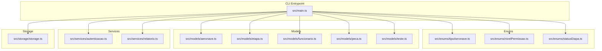
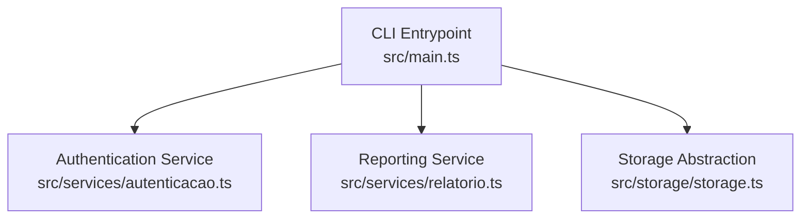
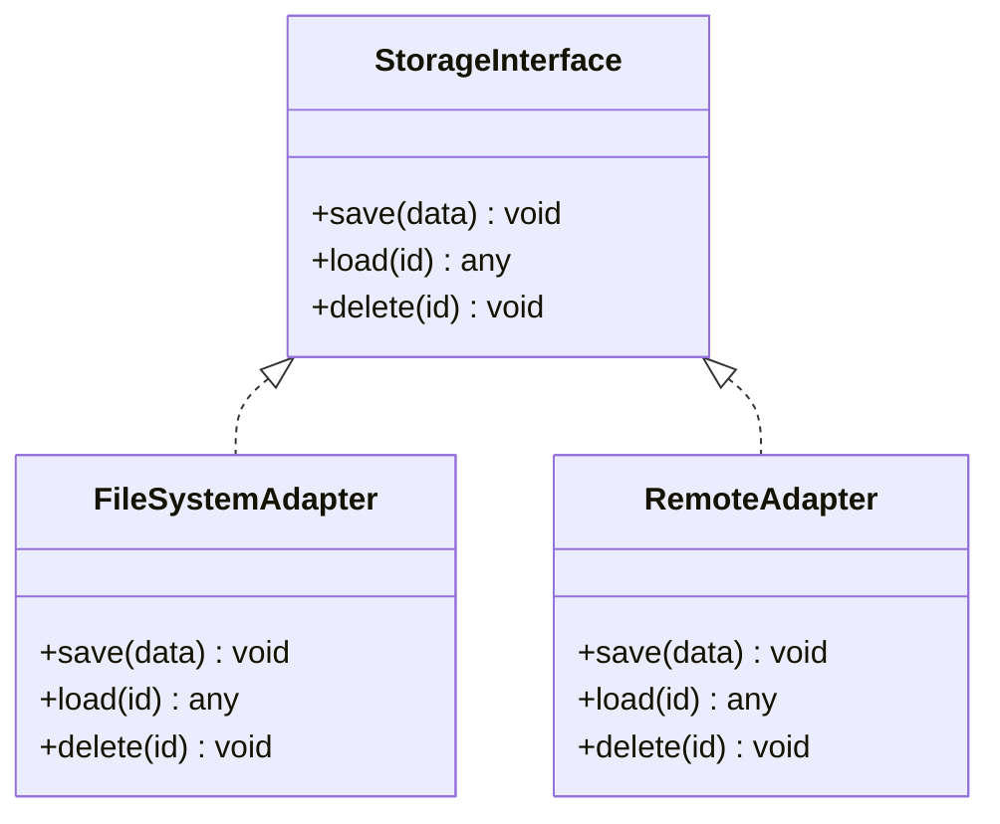
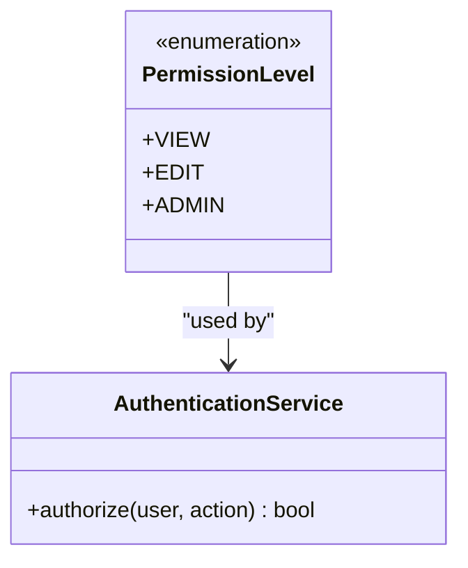
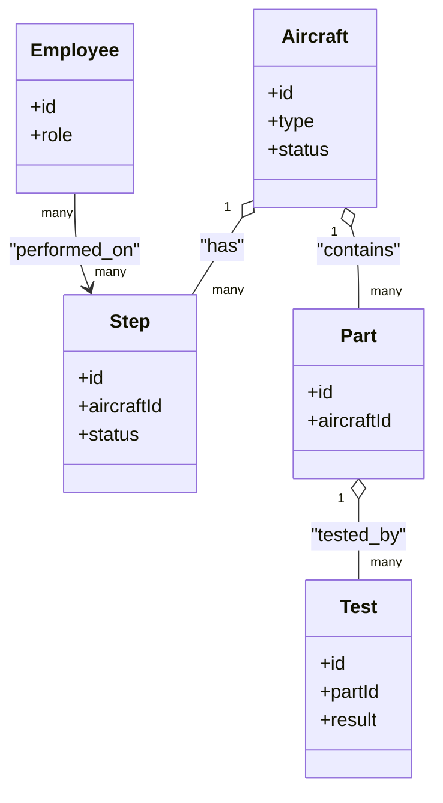
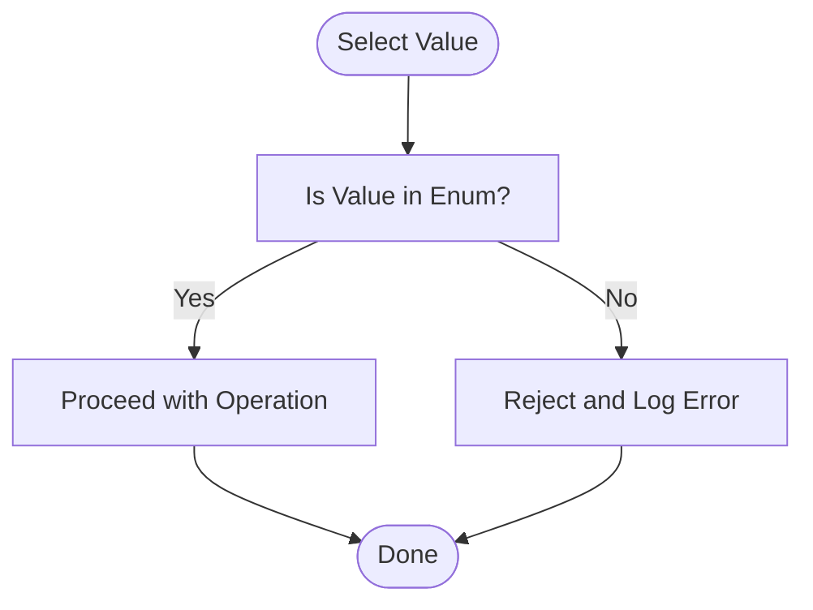
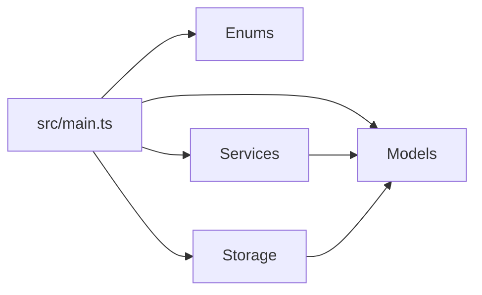

# Configuration & Customization

<cite>
**Referenced Files in This Document**
- [package.json](file://package.json)
- [src/main.ts](file://src/main.ts)
- [src/enums/tipoAeronave.ts](file://src/enums/tipoAeronave.ts)
- [src/enums/nivelPermissao.ts](file://src/enums/nivelPermissao.ts)
- [src/enums/statusEtapa.ts](file://src/enums/statusEtapa.ts)
- [src/models/aeronave.ts](file://src/models/aeronave.ts)
- [src/models/etapa.ts](file://src/models/etapa.ts)
- [src/models/funcionario.ts](file://src/models/funcionario.ts)
- [src/models/peca.ts](file://src/models/peca.ts)
- [src/models/teste.ts](file://src/models/teste.ts)
- [src/services/autenticacao.ts](file://src/services/autenticacao.ts)
- [src/services/relatorio.ts](file://src/services/relatorio.ts)
- [src/storage/storage.ts](file://src/storage/storage.ts)
</cite>

## Table of Contents
1. [Introduction](#introduction)
2. [Project Structure](#project-structure)
3. [Core Components](#core-components)
4. [Architecture Overview](#architecture-overview)
5. [Detailed Component Analysis](#detailed-component-analysis)
6. [Dependency Analysis](#dependency-analysis)
7. [Performance Considerations](#performance-considerations)
8. [Troubleshooting Guide](#troubleshooting-guide)
9. [Conclusion](#conclusion)
10. [Appendices](#appendices)

## Introduction
This document explains how to configure and customize the Aerocode CLI System for aircraft production management. It focuses on environment-driven configuration, storage backend selection, and permission system setup. It also covers how to adapt data models and enums to business needs, and outlines operational practices for secure and maintainable deployments.

## Project Structure
The project follows a modular structure with clear separation of concerns:
- Enums define domain-specific enumerations (e.g., aircraft types, permission levels, stage statuses).
- Models represent core entities (aircraft, steps, employees, parts, tests).
- Services encapsulate cross-cutting concerns (authentication, reporting).
- Storage provides an abstraction for persistence.
- The CLI entrypoint wires the system together.

**Diagram sources**
- [src/main.ts](file://src/main.ts)
- [src/enums/tipoAeronave.ts](file://src/enums/tipoAeronave.ts)
- [src/enums/nivelPermissao.ts](file://src/enums/nivelPermissao.ts)
- [src/enums/statusEtapa.ts](file://src/enums/statusEtapa.ts)
- [src/models/aeronave.ts](file://src/models/aeronave.ts)
- [src/models/etapa.ts](file://src/models/etapa.ts)
- [src/models/funcionario.ts](file://src/models/funcionario.ts)
- [src/models/peca.ts](file://src/models/peca.ts)
- [src/models/teste.ts](file://src/models/teste.ts)
- [src/services/autenticacao.ts](file://src/services/autenticacao.ts)
- [src/services/relatorio.ts](file://src/services/relatorio.ts)
- [src/storage/storage.ts](file://src/storage/storage.ts)

**Section sources**
- [package.json](file://package.json)
- [src/main.ts](file://src/main.ts)

## Core Components
- Enums: Define categorical domains such as aircraft type, permission level, and stage status. These are foundational for access control and business rules.
- Models: Represent entities in the system (aircraft, steps, employees, parts, tests). They serve as the data contract for storage and services.
- Services: Provide authentication and reporting capabilities. These are ideal extension points for adding new features or integrating external systems.
- Storage: Abstracts persistence. It is the primary target for adapting to different storage backends.

**Section sources**
- [src/enums/tipoAeronave.ts](file://src/enums/tipoAeronave.ts)
- [src/enums/nivelPermissao.ts](file://src/enums/nivelPermissao.ts)
- [src/enums/statusEtapa.ts](file://src/enums/statusEtapa.ts)
- [src/models/aeronave.ts](file://src/models/aeronave.ts)
- [src/models/etapa.ts](file://src/models/etapa.ts)
- [src/models/funcionario.ts](file://src/models/funcionario.ts)
- [src/models/peca.ts](file://src/models/peca.ts)
- [src/models/teste.ts](file://src/models/teste.ts)
- [src/services/autenticacao.ts](file://src/services/autenticacao.ts)
- [src/services/relatorio.ts](file://src/services/relatorio.ts)
- [src/storage/storage.ts](file://src/storage/storage.ts)

## Architecture Overview
The CLI orchestrates enums, models, services, and storage. Authentication and reporting are service-layer concerns, while storage is abstracted behind a single module. This design allows swapping storage backends and extending business logic via enums and models.

**Diagram sources**
- [src/main.ts](file://src/main.ts)
- [src/services/autenticacao.ts](file://src/services/autenticacao.ts)
- [src/services/relatorio.ts](file://src/services/relatorio.ts)
- [src/storage/storage.ts](file://src/storage/storage.ts)

## Detailed Component Analysis

### Environment Variables and Configuration
- Build and runtime scripts are defined in the package manifest. Use environment variables to parameterize behavior at runtime (e.g., storage endpoint, logging level, feature flags).
- Keep secrets out of source code; pass them via environment variables or secure secret managers.

Practical guidance:
- Define a .env file for local development and load it before starting the CLI.
- For CI/CD, inject environment variables at build or runtime.
- Validate required environment variables during startup to fail fast.

**Section sources**
- [package.json](file://package.json)

### Storage Configuration Options
The storage module acts as the persistence abstraction. Customize it to support:
- Local file system
- Remote object storage
- Database connectors
- Encrypted or compressed backends

Implementation approach:
- Extend the storage interface to add new adapters.
- Parameterize credentials, endpoints, and encryption keys via environment variables.
- Add health checks and retry policies for remote backends.

**Diagram sources**
- [src/storage/storage.ts](file://src/storage/storage.ts)

**Section sources**
- [src/storage/storage.ts](file://src/storage/storage.ts)

### Permission System Setup
Permission levels are modeled as an enumeration. To customize:
- Extend the permission enum to reflect your organization’s roles (e.g., engineer, inspector, manager).
- Map permissions to actions on models (e.g., read/write/delete on aircraft or steps).
- Enforce permissions in services that operate on sensitive data.

**Diagram sources**
- [src/enums/nivelPermissao.ts](file://src/enums/nivelPermissao.ts)
- [src/services/autenticacao.ts](file://src/services/autenticacao.ts)

**Section sources**
- [src/enums/nivelPermissao.ts](file://src/enums/nivelPermissao.ts)
- [src/services/autenticacao.ts](file://src/services/autenticacao.ts)

### Data Model Customization
Models represent core entities. To adapt them:
- Add fields to reflect business requirements (e.g., additional aircraft attributes, extended employee metadata).
- Introduce new models for domain extensions (e.g., supplier, compliance record).
- Keep backward compatibility when evolving models; version fields or migration helpers can help.

**Diagram sources**
- [src/models/aeronave.ts](file://src/models/aeronave.ts)
- [src/models/etapa.ts](file://src/models/etapa.ts)
- [src/models/funcionario.ts](file://src/models/funcionario.ts)
- [src/models/peca.ts](file://src/models/peca.ts)
- [src/models/teste.ts](file://src/models/teste.ts)

**Section sources**
- [src/models/aeronave.ts](file://src/models/aeronave.ts)
- [src/models/etapa.ts](file://src/models/etapa.ts)
- [src/models/funcionario.ts](file://src/models/funcionario.ts)
- [src/models/peca.ts](file://src/models/peca.ts)
- [src/models/teste.ts](file://src/models/teste.ts)

### Enum Modifications for Business-Specific Requirements
Enums capture fixed sets of values. To tailor them:
- Replace placeholder enums with your domain vocabulary (e.g., aircraft types, step statuses).
- Ensure all services and storage logic handle new values consistently.
- Validate inputs against enums to prevent invalid states.

**Diagram sources**
- [src/enums/tipoAeronave.ts](file://src/enums/tipoAeronave.ts)
- [src/enums/statusEtapa.ts](file://src/enums/statusEtapa.ts)

**Section sources**
- [src/enums/tipoAeronave.ts](file://src/enums/tipoAeronave.ts)
- [src/enums/statusEtapa.ts](file://src/enums/statusEtapa.ts)

### Runtime Parameter Adjustments
- Use environment variables for toggling features, selecting storage backends, and configuring logging verbosity.
- Accept command-line arguments for ad-hoc overrides (e.g., specifying a report template or a test mode).
- Centralize configuration loading early in the CLI lifecycle to avoid scattered config reads.

**Section sources**
- [package.json](file://package.json)
- [src/main.ts](file://src/main.ts)

### Security Considerations
- Principle of least privilege: assign minimal permissions required for roles.
- Encrypt sensitive data at rest and in transit; parameterize encryption keys via environment variables.
- Audit critical operations (e.g., edits to aircraft records) and log authorization decisions.
- Validate and sanitize all inputs; reject unexpected enum values or malformed identifiers.

**Section sources**
- [src/services/autenticacao.ts](file://src/services/autenticacao.ts)
- [src/storage/storage.ts](file://src/storage/storage.ts)

### Backup Configurations and Maintenance
- Regularly back up storage artifacts (e.g., serialized models, reports).
- For database-backed storage, schedule logical backups and verify restore procedures.
- Maintain immutable deployment artifacts and track configuration changes via version control.
- Monitor storage health (latency, throughput, error rates) and set alerts for anomalies.

[No sources needed since this section provides general guidance]

## Dependency Analysis
The CLI depends on enums, models, services, and storage. The dependency graph emphasizes cohesion within modules and controlled coupling across boundaries.

**Diagram sources**
- [src/main.ts](file://src/main.ts)
- [src/enums/tipoAeronave.ts](file://src/enums/tipoAeronave.ts)
- [src/enums/nivelPermissao.ts](file://src/enums/nivelPermissao.ts)
- [src/enums/statusEtapa.ts](file://src/enums/statusEtapa.ts)
- [src/models/aeronave.ts](file://src/models/aeronave.ts)
- [src/models/etapa.ts](file://src/models/etapa.ts)
- [src/models/funcionario.ts](file://src/models/funcionario.ts)
- [src/models/peca.ts](file://src/models/peca.ts)
- [src/models/teste.ts](file://src/models/teste.ts)
- [src/services/autenticacao.ts](file://src/services/autenticacao.ts)
- [src/services/relatorio.ts](file://src/services/relatorio.ts)
- [src/storage/storage.ts](file://src/storage/storage.ts)

**Section sources**
- [src/main.ts](file://src/main.ts)
- [src/storage/storage.ts](file://src/storage/storage.ts)

## Performance Considerations
- Minimize I/O by batching writes and enabling compression for large payloads.
- Cache frequently accessed metadata (e.g., permission matrices) in memory with periodic refresh.
- Use asynchronous operations for long-running tasks (e.g., generating reports).
- Profile hot paths and optimize storage queries (indexing, pagination).

[No sources needed since this section provides general guidance]

## Troubleshooting Guide
Common issues and resolutions:
- Missing environment variables cause startup failures. Add required variables and re-run.
- Invalid enum values lead to rejected operations. Validate inputs and align with supported enums.
- Storage connectivity errors require endpoint verification and credential rotation. Test connectivity separately from the CLI.
- Permission denials indicate misconfigured roles. Review role-to-permission mappings and reassign roles as needed.

**Section sources**
- [src/services/autenticacao.ts](file://src/services/autenticacao.ts)
- [src/storage/storage.ts](file://src/storage/storage.ts)

## Conclusion
Aerocode’s modular design enables straightforward customization. By leveraging environment variables, extending the storage abstraction, refining enums and models, and enforcing a robust permission system, organizations can tailor the CLI to meet production management needs securely and efficiently.

[No sources needed since this section summarizes without analyzing specific files]

## Appendices

### Example Customization Scenarios
- Add a new aircraft type: extend the aircraft type enum and update any logic that filters or displays by type.
- Introduce a new permission role: add a new value to the permission enum and wire it into the authentication service.
- Switch storage backend: implement a new adapter in the storage module and select it via an environment variable.
- Add a new entity: define a new model, update services to handle it, and integrate with storage.

**Section sources**
- [src/enums/tipoAeronave.ts](file://src/enums/tipoAeronave.ts)
- [src/enums/nivelPermissao.ts](file://src/enums/nivelPermissao.ts)
- [src/models/aeronave.ts](file://src/models/aeronave.ts)
- [src/storage/storage.ts](file://src/storage/storage.ts)
- [src/services/autenticacao.ts](file://src/services/autenticacao.ts)