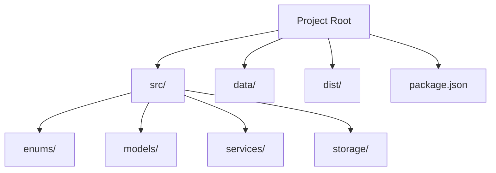
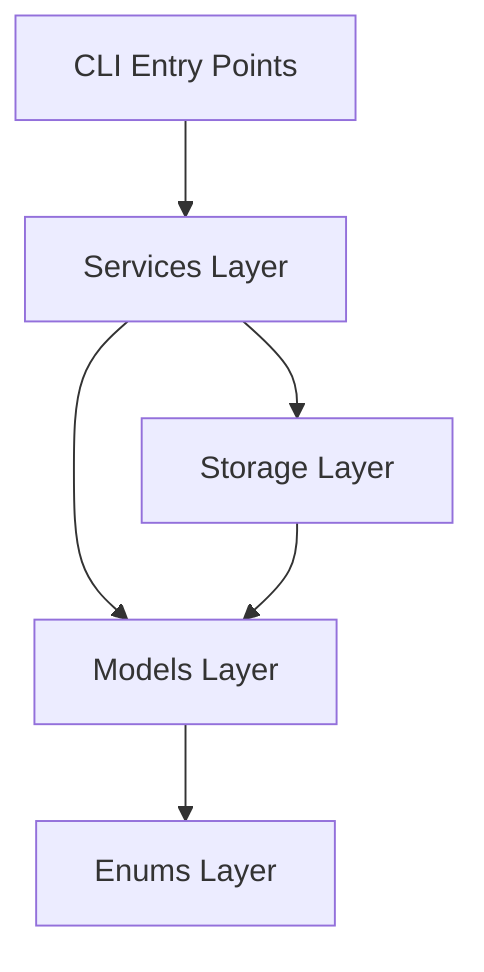
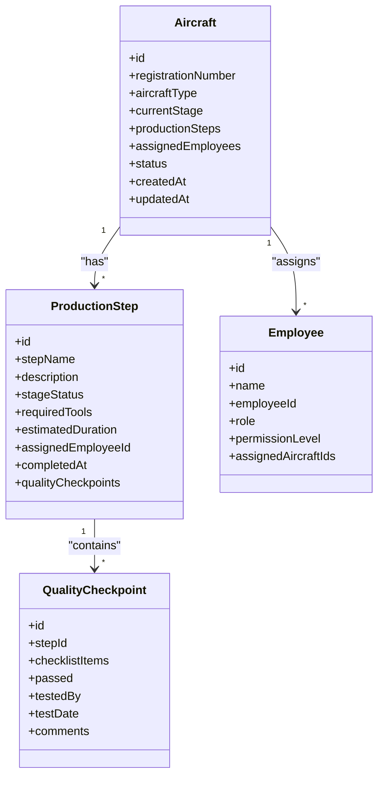
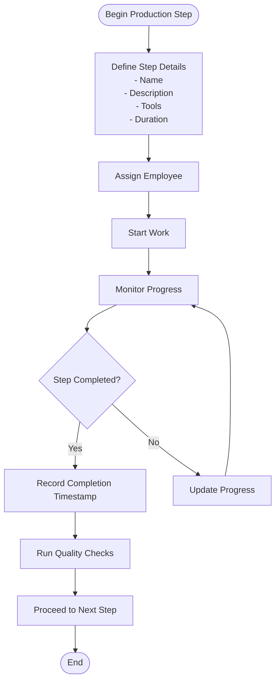
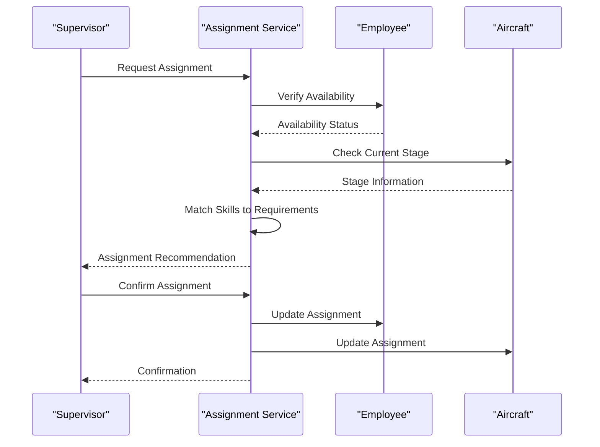
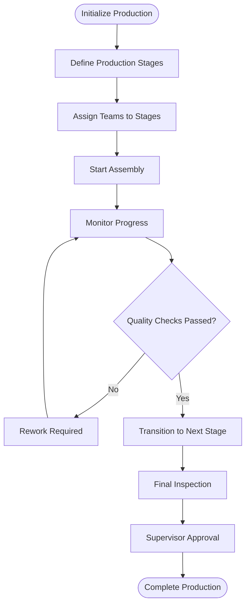
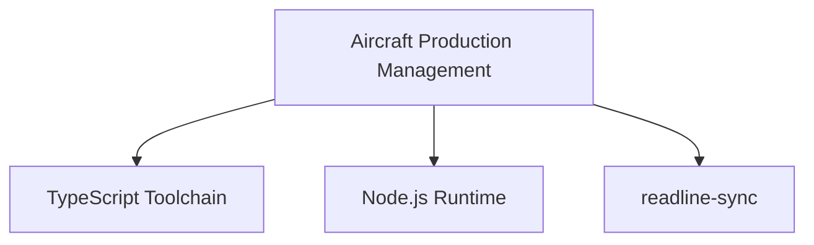

# Aircraft Production Management

<cite>
**Referenced Files in This Document**
- [package.json](file://package.json)
</cite>

## Table of Contents
1. [Introduction](#introduction)
2. [Project Structure](#project-structure)
3. [Core Components](#core-components)
4. [Architecture Overview](#architecture-overview)
5. [Detailed Component Analysis](#detailed-component-analysis)
6. [Dependency Analysis](#dependency-analysis)
7. [Performance Considerations](#performance-considerations)
8. [Troubleshooting Guide](#troubleshooting-guide)
9. [Conclusion](#conclusion)

## Introduction
This document describes the Aircraft Production Management system, focusing on aircraft assembly tracking, production stage management, quality testing coordination, and employee assignment workflows. It documents the aircraft data model, production step definitions, employee assignments, and workflow orchestration. It also explains production pipelines, stage transitions, quality checkpoints, and supervisor oversight, and provides practical examples of production tracking, stage completion workflows, quality testing procedures, and team coordination patterns.

## Project Structure
The project is a TypeScript-based Command Line Interface (CLI) application designed to manage aircraft production. The build and runtime scripts indicate a standard TypeScript compilation pipeline and a development mode using ts-node. The package.json defines the project metadata, scripts, and dependencies.

**Diagram sources**
- [package.json:1-23](file://package.json#L1-L23)

**Section sources**
- [package.json:1-23](file://package.json#L1-L23)

## Core Components
The CLI application is structured around four primary areas:
- enums: Permission levels, aircraft types, and production stage statuses
- models: Core domain entities and data structures
- services: Business logic and orchestration of workflows
- storage: Persistence and retrieval of data

These components collectively support:
- Aircraft assembly tracking
- Production stage management
- Quality testing coordination
- Employee assignment workflows

**Section sources**
- [package.json:1-23](file://package.json#L1-L23)

## Architecture Overview
The system follows a layered architecture:
- Presentation layer: CLI entry points and user interactions
- Domain layer: Models representing aircraft, employees, stages, and quality checks
- Services layer: Orchestration of workflows and business rules
- Infrastructure layer: Storage utilities for persistence

[No sources needed since this diagram shows conceptual architecture, not actual code structure]

## Detailed Component Analysis

### Aircraft Data Model
The aircraft data model underpins assembly tracking and stage management. It includes attributes such as registration number, type, current stage, and associated production steps. The model supports:
- Assembly progress tracking
- Stage transitions
- Quality checkpoint integration
- Employee assignment linkage

[No sources needed since this diagram shows conceptual data model, not actual code structure]

### Production Step Definitions
Production steps define the tasks required to assemble an aircraft. Each step includes:
- Name and description
- Stage status tracking
- Required tools and estimated duration
- Assigned employee and completion timestamp
- Associated quality checkpoints

[No sources needed since this diagram shows conceptual workflow, not actual code structure]

### Employee Assignment Workflows
Employee assignments connect workers to specific aircraft and production steps. The system manages:
- Role-based permissions
- Assignment to multiple aircraft
- Supervisor oversight capabilities
- Workload balancing across teams

[No sources needed since this diagram shows conceptual workflow, not actual code structure]

### Workflow Orchestration
The system orchestrates end-to-end production workflows:
- Stage transitions based on completion criteria
- Quality checkpoint integration
- Supervisor oversight and approvals
- Team coordination and communication

[No sources needed since this diagram shows conceptual workflow, not actual code structure]

### Practical Examples

#### Production Tracking Example
- Track aircraft registration number through each production stage
- Update stage status upon completion
- Log timestamps for transparency and auditability

#### Stage Completion Workflow
- Verify required tools and materials
- Assign qualified employees to complete the step
- Record completion timestamp and quality pass/fail

#### Quality Testing Procedures
- Define checklist items for each quality checkpoint
- Assign testers and schedule inspections
- Document test results and corrective actions

#### Team Coordination Patterns
- Cross-train employees across multiple roles
- Rotate assignments to prevent bottlenecks
- Maintain supervisor oversight for critical stages

[No sources needed since this section provides conceptual examples, not specific code analysis]

## Dependency Analysis
The project relies on a minimal set of dependencies:
- readline-sync: Synchronous terminal input/output for CLI interactions
- TypeScript toolchain: Compilation and development support
- Node.js runtime: Execution environment

**Diagram sources**
- [package.json:14-22](file://package.json#L14-L22)

**Section sources**
- [package.json:14-22](file://package.json#L14-L22)

## Performance Considerations
- Optimize CLI interactions by minimizing synchronous I/O operations
- Cache frequently accessed data (e.g., employee skills, aircraft status)
- Batch updates for production stage transitions to reduce overhead
- Use efficient data structures for tracking assembly progress

[No sources needed since this section provides general guidance]

## Troubleshooting Guide
Common issues and resolutions:
- CLI hangs during input: Ensure readline-sync is properly initialized and handle timeouts
- Data inconsistencies: Implement validation checks before stage transitions
- Performance degradation: Profile long-running operations and optimize hot paths
- Supervisor access issues: Verify permission levels and role-based access controls

[No sources needed since this section provides general guidance]

## Conclusion
The Aircraft Production Management system provides a structured approach to managing aircraft assembly workflows. Its layered architecture supports robust production tracking, stage management, quality testing, and employee assignments. By following the documented patterns and leveraging the described components, teams can efficiently coordinate complex manufacturing processes while maintaining oversight and quality standards.