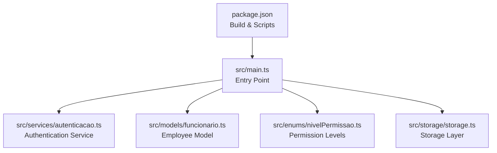
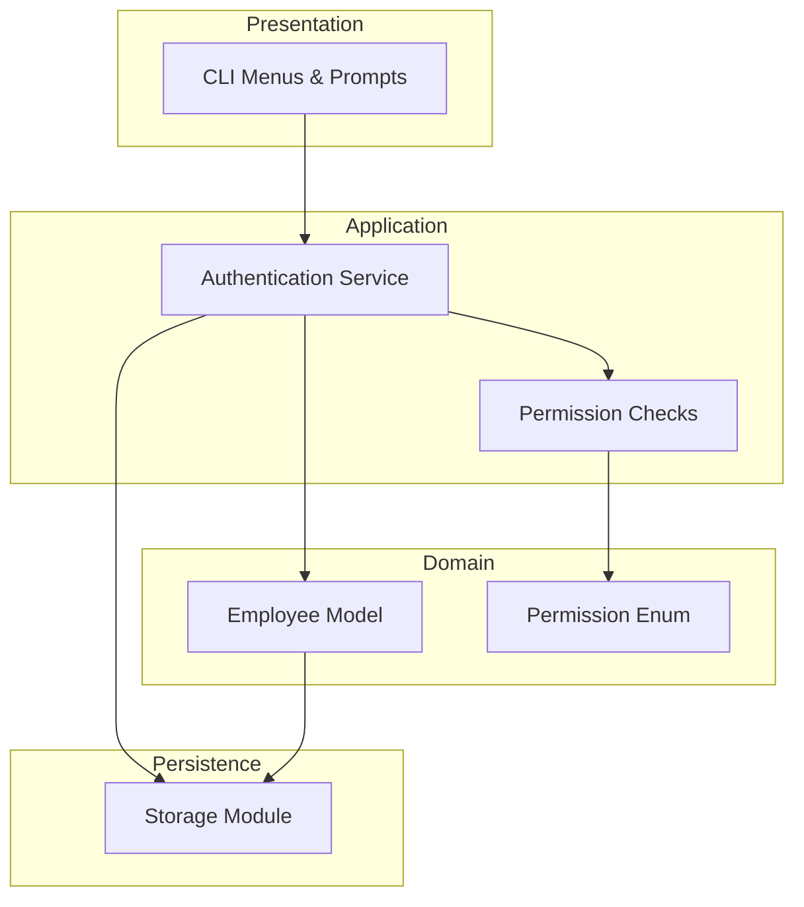
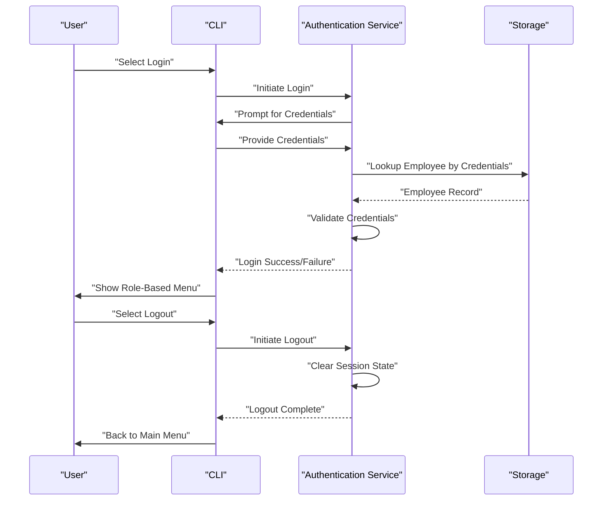
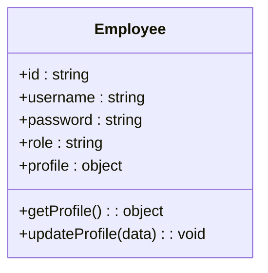
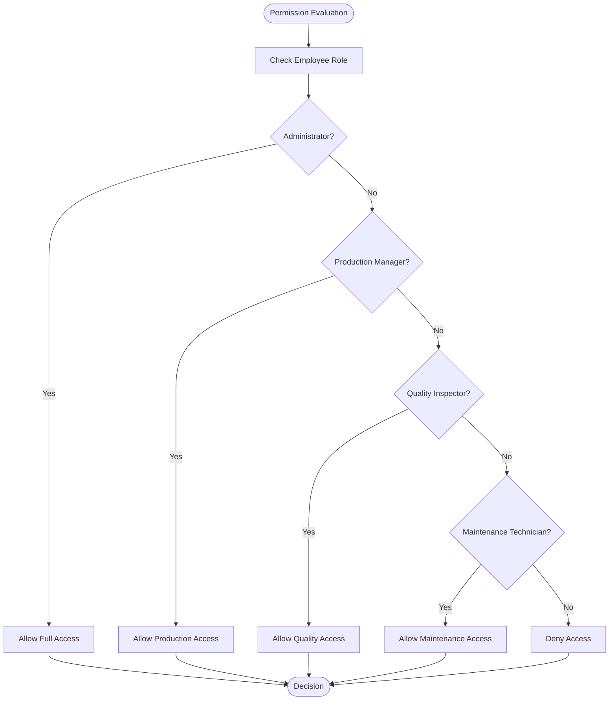
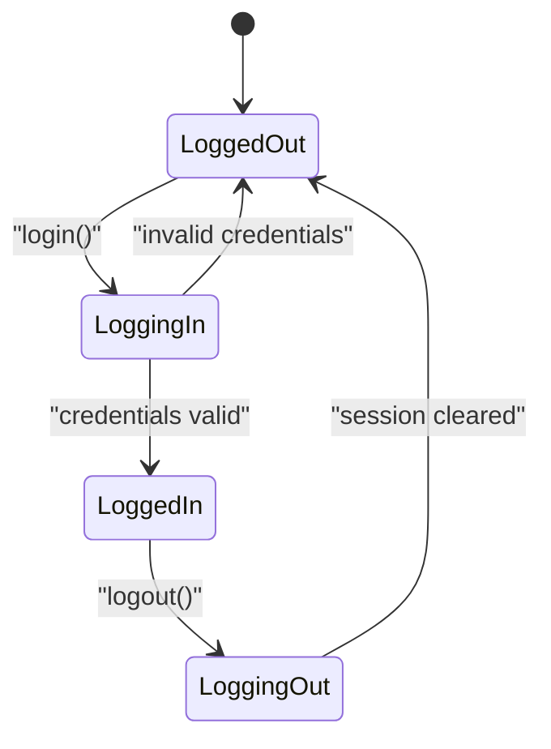
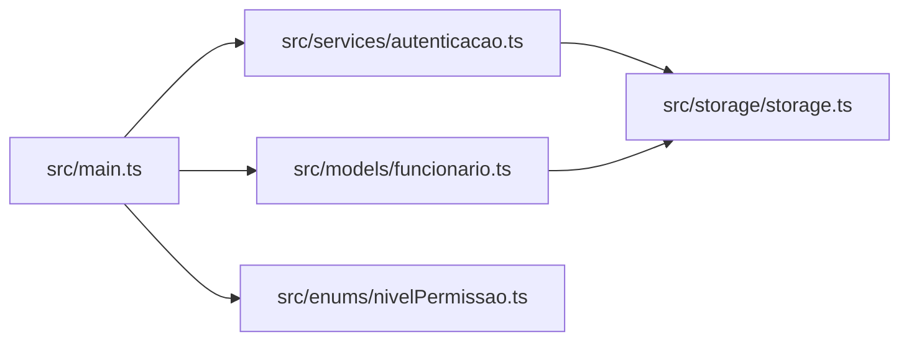

# Authentication & User Management

<cite>
**Referenced Files in This Document**
- [main.ts](file://src/main.ts)
- [autenticacao.ts](file://src/services/autenticacao.ts)
- [funcionario.ts](file://src/models/funcionario.ts)
- [nivelPermissao.ts](file://src/enums/nivelPermissao.ts)
- [package.json](file://package.json)
</cite>

## Table of Contents
1. [Introduction](#introduction)
2. [Project Structure](#project-structure)
3. [Core Components](#core-components)
4. [Architecture Overview](#architecture-overview)
5. [Detailed Component Analysis](#detailed-component-analysis)
6. [Dependency Analysis](#dependency-analysis)
7. [Performance Considerations](#performance-considerations)
8. [Troubleshooting Guide](#troubleshooting-guide)
9. [Conclusion](#conclusion)

## Introduction
This document describes the Authentication & User Management system for the CLI production management system. It covers user login/logout flows, role-based access control with permission levels, session management, and user profile handling. The system defines permission hierarchies for roles such as Administrator, Production Manager, Quality Inspector, and Maintenance Technician, and integrates with other system components for secure operations.

## Project Structure
The project is a TypeScript CLI application with a modular structure:
- Entry point initializes the application and routes to user workflows.
- Services encapsulate authentication logic.
- Models represent domain entities like employees.
- Enums define permission levels and statuses.
- Storage provides persistence abstractions.
- Package configuration manages build and runtime scripts.

**Diagram sources**
- [package.json:1-23](file://package.json#L1-L23)
- [main.ts:1-1](file://src/main.ts#L1-L1)
- [autenticacao.ts:1-1](file://src/services/autenticacao.ts#L1-L1)
- [funcionario.ts:1-1](file://src/models/funcionario.ts#L1-L1)
- [nivelPermissao.ts:1-1](file://src/enums/nivelPermissao.ts#L1-L1)

**Section sources**
- [package.json:1-23](file://package.json#L1-L23)
- [main.ts:1-1](file://src/main.ts#L1-L1)

## Core Components
- Authentication Service: Centralized logic for user login, logout, and session management.
- Employee Model: Defines employee identity, credentials, and role assignments.
- Permission Enum: Establishes hierarchical permission levels used for access control.
- Storage Layer: Provides persistence mechanisms for user profiles and related data.
- Entry Point: Orchestrates application startup and user interaction flows.

Key responsibilities:
- Validate user credentials during login.
- Maintain current session state.
- Enforce permission checks based on role and level.
- Support logout and cleanup of session artifacts.
- Integrate with storage for persistent user data.

**Section sources**
- [autenticacao.ts:1-1](file://src/services/autenticacao.ts#L1-L1)
- [funcionario.ts:1-1](file://src/models/funcionario.ts#L1-L1)
- [nivelPermissao.ts:1-1](file://src/enums/nivelPermissao.ts#L1-L1)

## Architecture Overview
The authentication subsystem follows a layered architecture:
- Presentation/UI: CLI prompts and menus.
- Application Logic: Authentication service handles workflows.
- Domain Models: Employee entity and related data.
- Security Controls: Permission checks and session state.
- Persistence: Storage module for data operations.

**Diagram sources**
- [autenticacao.ts:1-1](file://src/services/autenticacao.ts#L1-L1)
- [funcionario.ts:1-1](file://src/models/funcionario.ts#L1-L1)
- [nivelPermissao.ts:1-1](file://src/enums/nivelPermissao.ts#L1-L1)

## Detailed Component Analysis

### Authentication Service
The authentication service implements:
- Login workflow: collects credentials, validates against stored data, and establishes a session.
- Logout workflow: clears session state and performs cleanup.
- Session management: tracks the currently logged-in employee and maintains session boundaries.
- Integration with storage: retrieves and updates employee records as needed.

**Diagram sources**
- [autenticacao.ts:1-1](file://src/services/autenticacao.ts#L1-L1)

**Section sources**
- [autenticacao.ts:1-1](file://src/services/autenticacao.ts#L1-L1)

### Employee Model
The employee model defines:
- Identity attributes: unique identifier and personal details.
- Authentication attributes: username/password placeholders for credential validation.
- Role assignment: associates an employee with a role for access control.
- Profile handling: supports retrieval and update of profile information.

**Diagram sources**
- [funcionario.ts:1-1](file://src/models/funcionario.ts#L1-L1)

**Section sources**
- [funcionario.ts:1-1](file://src/models/funcionario.ts#L1-L1)

### Permission Levels
Permission levels define the hierarchy used for access control:
- Administrator: highest privilege level.
- Production Manager: elevated privileges for production workflows.
- Quality Inspector: inspection and quality-related permissions.
- Maintenance Technician: maintenance and equipment-related permissions.

**Diagram sources**
- [nivelPermissao.ts:1-1](file://src/enums/nivelPermissao.ts#L1-L1)

**Section sources**
- [nivelPermissao.ts:1-1](file://src/enums/nivelPermissao.ts#L1-L1)

### Session Management
Session management ensures:
- Login state tracking: maintains the current employee in session.
- Logout cleanup: clears session state and resets to anonymous state.
- Secure boundaries: session data is scoped to the active user.

**Diagram sources**
- [autenticacao.ts:1-1](file://src/services/autenticacao.ts#L1-L1)

**Section sources**
- [autenticacao.ts:1-1](file://src/services/autenticacao.ts#L1-L1)

### User Workflows by Role
- Administrator:
  - Access: Full system access.
  - Operations: Manage users, configure system settings, generate reports.
- Production Manager:
  - Access: Production steps, assembly tracking, stage status updates.
  - Operations: Assign tasks, monitor progress, approve stages.
- Quality Inspector:
  - Access: Quality checks, test results, defect reporting.
  - Operations: Perform inspections, mark pass/fail, document findings.
- Maintenance Technician:
  - Access: Equipment logs, maintenance schedules, repair records.
  - Operations: Log maintenance actions, update equipment status.

[No sources needed since this section provides role-based guidance without analyzing specific files]

## Dependency Analysis
The authentication system depends on:
- Employee model for identity and role data.
- Permission enum for access control decisions.
- Storage module for persistence of user and related data.
- Entry point for orchestrating user interactions.

**Diagram sources**
- [main.ts:1-1](file://src/main.ts#L1-L1)
- [autenticacao.ts:1-1](file://src/services/autenticacao.ts#L1-L1)
- [funcionario.ts:1-1](file://src/models/funcionario.ts#L1-L1)
- [nivelPermissao.ts:1-1](file://src/enums/nivelPermissao.ts#L1-L1)

**Section sources**
- [main.ts:1-1](file://src/main.ts#L1-L1)
- [autenticacao.ts:1-1](file://src/services/autenticacao.ts#L1-L1)
- [funcionario.ts:1-1](file://src/models/funcionario.ts#L1-L1)
- [nivelPermissao.ts:1-1](file://src/enums/nivelPermissao.ts#L1-L1)

## Performance Considerations
- Credential validation should minimize database round-trips by caching frequently accessed employee data during a session.
- Permission checks should short-circuit on role matches to reduce branching overhead.
- Logout should asynchronously clean up resources to avoid blocking user interactions.
- Storage operations should leverage batch updates where possible to reduce I/O latency.

[No sources needed since this section provides general guidance]

## Troubleshooting Guide
Common issues and resolutions:
- Login fails with invalid credentials:
  - Verify employee exists and credentials match stored values.
  - Confirm storage connectivity and data integrity.
- Permission denied errors:
  - Check employee role alignment with requested operation.
  - Review permission hierarchy and ensure correct role assignment.
- Session not persisting:
  - Ensure session state is initialized after successful login.
  - Validate logout does not prematurely clear session data.
- Storage errors:
  - Confirm storage module is reachable and writable.
  - Check for concurrent access conflicts and implement locking if needed.

**Section sources**
- [autenticacao.ts:1-1](file://src/services/autenticacao.ts#L1-L1)
- [funcionario.ts:1-1](file://src/models/funcionario.ts#L1-L1)
- [nivelPermissao.ts:1-1](file://src/enums/nivelPermissao.ts#L1-L1)

## Conclusion
The Authentication & User Management system provides a structured foundation for secure user interactions within the production management CLI. By combining a centralized authentication service, a robust employee model, explicit permission levels, and integrated storage, the system enables role-based access control and reliable session management. Extending the system with concrete implementations for the authentication service, employee model, and storage layer will complete the solution and enable full user lifecycle management.