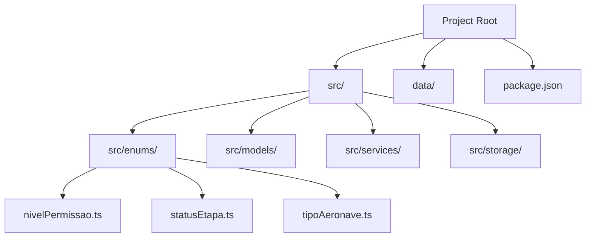
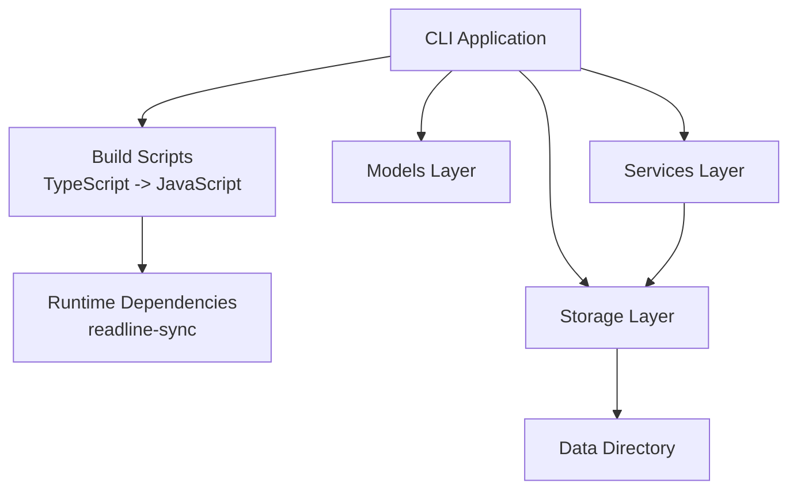
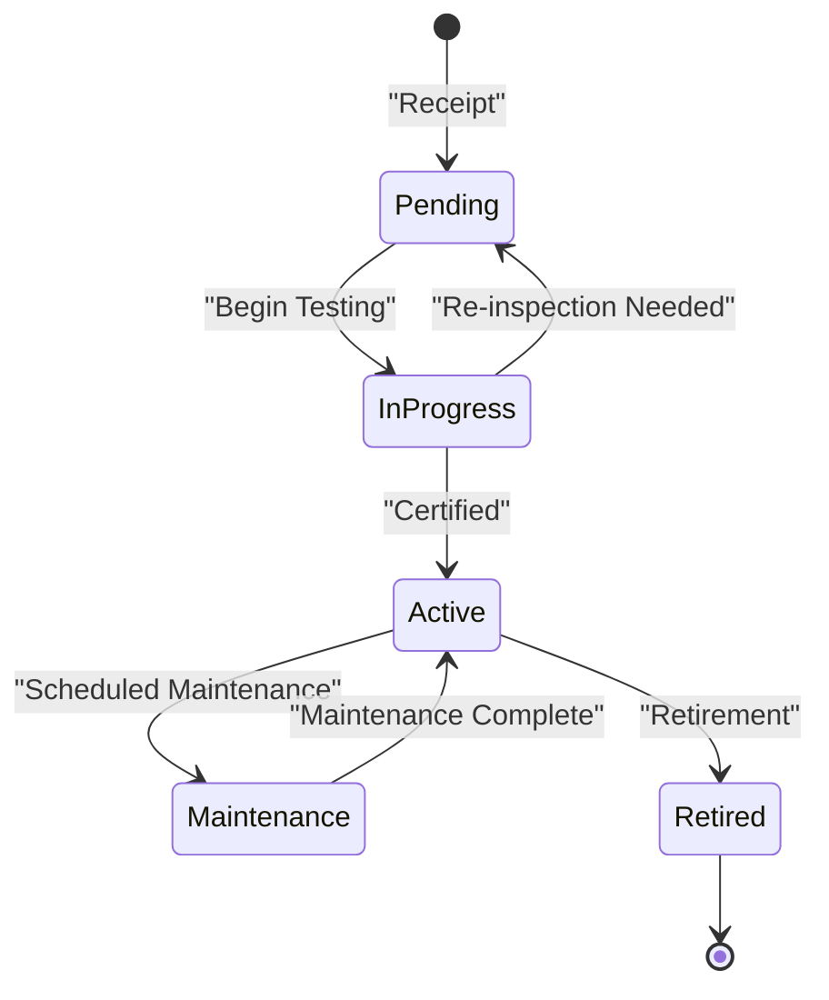
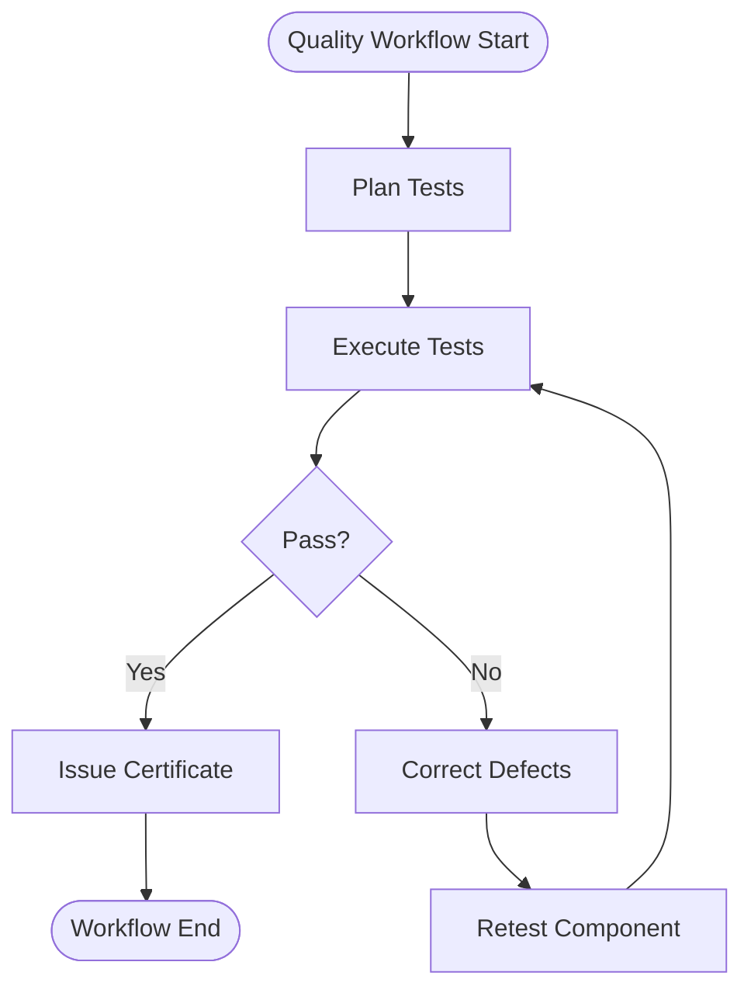
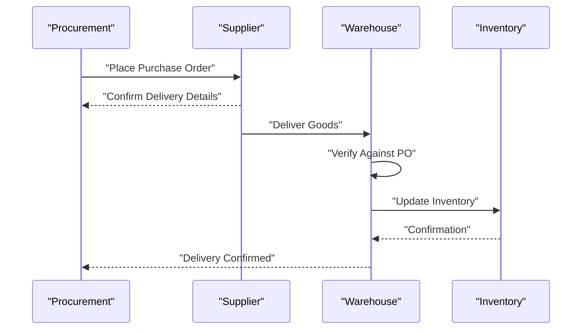
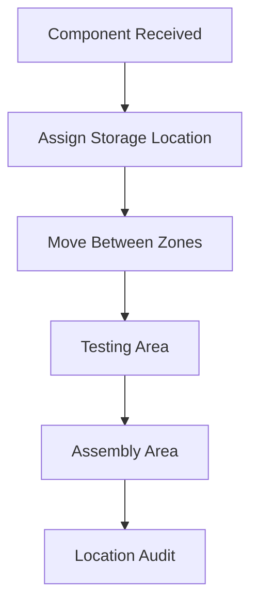
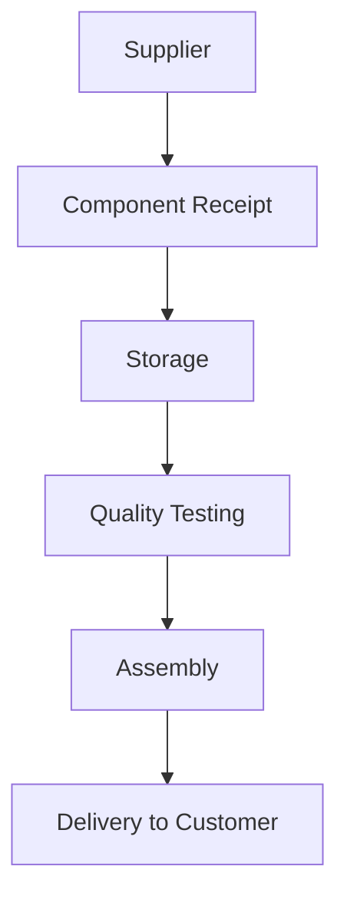
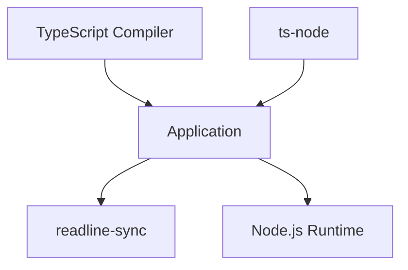

# Component & Inventory Tracking

<cite>
**Referenced Files in This Document**
- [package.json](file://package.json)
- [nivelPermissao.ts](file://src/enums/nivelPermissao.ts)
- [statusEtapa.ts](file://src/enums/statusEtapa.ts)
- [tipoAeronave.ts](file://src/enums/tipoAeronave.ts)
</cite>

## Table of Contents
1. [Introduction](#introduction)
2. [Project Structure](#project-structure)
3. [Core Components](#core-components)
4. [Architecture Overview](#architecture-overview)
5. [Detailed Component Analysis](#detailed-component-analysis)
6. [Dependency Analysis](#dependency-analysis)
7. [Performance Considerations](#performance-considerations)
8. [Troubleshooting Guide](#troubleshooting-guide)
9. [Conclusion](#conclusion)
10. [Appendices](#appendices)

## Introduction
This document describes the Component & Inventory Tracking system with a focus on component inventory management, sourcing operations, location tracking, quality certification processes, and component lifecycle management. The system is implemented as a command-line interface (CLI) application and provides foundational data models and enumerations that support component tracking, status management, and operational workflows. The current repository snapshot includes build scripts, runtime dependencies, and basic enumerations that define permissions, production step statuses, and aircraft types.

## Project Structure
The project follows a modular structure with clear separation of concerns:
- src/enums: Defines shared enumerations for permissions, production step statuses, and aircraft types.
- src/models: Intended to house core domain models (not present in this snapshot).
- src/services: Intended to encapsulate business logic and operations (not present in this snapshot).
- src/storage: Intended to manage persistence and data storage (not present in this snapshot).
- data: Intended to store persistent data artifacts (not present in this snapshot).
- package.json: Contains project metadata, build scripts, and dependencies.

**Diagram sources**
- [package.json:1-23](file://package.json#L1-L23)
- [nivelPermissao.ts:1-5](file://src/enums/nivelPermissao.ts#L1-L5)
- [statusEtapa.ts:1-5](file://src/enums/statusEtapa.ts#L1-L5)
- [tipoAeronave.ts:1-4](file://src/enums/tipoAeronave.ts#L1-L4)

**Section sources**
- [package.json:1-23](file://package.json#L1-L23)

## Core Components
This section outlines the foundational enumerations that underpin the system’s data model and workflows.

- Permission Levels Enumeration
  - Purpose: Define user roles and access control for system operations.
  - Values: ADMINISTRADOR, ENGENHEIRO, OPERADOR.
  - Usage: Supports role-based access for sensitive operations such as inventory adjustments, quality certifications, and production step updates.

- Production Step Status Enumeration
  - Purpose: Track the lifecycle status of manufacturing or assembly steps.
  - Values: PENDENTE, ANDAMENTO, CONCLUIDA.
  - Usage: Enables workflow orchestration and visibility into production progress.

- Aircraft Type Enumeration
  - Purpose: Categorize components and assemblies by aircraft type.
  - Values: COMERCIAL, MILITAR.
  - Usage: Supports sourcing decisions, storage categorization, and lifecycle tracking aligned with aircraft programs.

**Section sources**
- [nivelPermissao.ts:1-5](file://src/enums/nivelPermissao.ts#L1-L5)
- [statusEtapa.ts:1-5](file://src/enums/statusEtapa.ts#L1-L5)
- [tipoAeronave.ts:1-4](file://src/enums/tipoAeronave.ts#L1-L4)

## Architecture Overview
The system is structured around a CLI application with a clear separation of concerns:
- CLI entrypoint: Invoked via Node.js runtime using scripts defined in package.json.
- Data model layer: Intended to reside in src/models and define component, inventory, location, and quality entities.
- Business logic layer: Intended to reside in src/services and coordinate sourcing, testing, lifecycle transitions, and reporting.
- Persistence layer: Intended to reside in src/storage and manage data storage and retrieval.
- Data directory: Intended to persist artifacts such as logs, reports, and exported datasets.

**Diagram sources**
- [package.json:6-10](file://package.json#L6-L10)
- [package.json:14-22](file://package.json#L14-L22)

**Section sources**
- [package.json:6-10](file://package.json#L6-L10)
- [package.json:14-22](file://package.json#L14-L22)

## Detailed Component Analysis
This section provides conceptual guidance for implementing the core data model and workflows. While the current snapshot does not include model, service, or storage implementations, the enumerations indicate intended capabilities.

### Component Lifecycle Management
- Objective: Track components from receipt to installation and retirement.
- Key Activities:
  - Receipt and initial inspection.
  - Storage assignment and location tracking.
  - Quality testing and certification.
  - Lifecycle transitions (active, maintenance, retired).
- Status Tracking:
  - Use the production step status enumeration to represent lifecycle stages such as pending, in-progress, and completed.
- Practical Example:
  - A component enters the facility with a pending status, undergoes quality testing, receives certification, and transitions to active status for assembly.

[No sources needed since this diagram shows conceptual workflow, not actual code structure]

### Quality Assurance Workflows
- Objective: Ensure components meet specifications before use.
- Key Activities:
  - Test planning and scheduling.
  - Execution of tests and recording outcomes.
  - Certification issuance upon pass.
  - Non-conformance handling and corrective actions.
- Practical Example:
  - A component fails initial testing; it is retested after corrective action and then certified for use.

[No sources needed since this diagram shows conceptual workflow, not actual code structure]

### Sourcing Operations
- Objective: Manage procurement and supplier interactions for components.
- Key Activities:
  - Supplier selection and qualification.
  - Purchase orders and delivery tracking.
  - Receipt verification against purchase orders.
  - Inventory update and storage assignment.
- Practical Example:
  - A purchase order is received, goods are inspected upon arrival, and verified against the PO before being accepted into inventory.

[No sources needed since this diagram shows conceptual workflow, not actual code structure]

### Location Tracking
- Objective: Maintain precise location of components across facilities.
- Key Activities:
  - Assign storage locations during receipt.
  - Track movements between zones and facilities.
  - Generate location reports for audits and cycle counts.
- Practical Example:
  - A component is stored in Zone A, moved to Zone B for testing, and later relocated to the assembly area.

[No sources needed since this diagram shows conceptual workflow, not actual code structure]

### Supply Chain Management
- Objective: Coordinate upstream suppliers and downstream assembly operations.
- Key Activities:
  - Supplier performance monitoring.
  - Lead time tracking and demand forecasting.
  - Just-in-time delivery coordination.
- Practical Example:
  - Supplier delivers on time, meets quality standards, and supports JIT assembly schedules.

[No sources needed since this diagram shows conceptual workflow, not actual code structure]

## Dependency Analysis
The project relies on a minimal set of runtime dependencies and build tooling:
- readline-sync: Provides synchronous terminal input/output for CLI interactions.
- TypeScript and ts-node: Enable development and compilation of TypeScript sources.
- Node.js runtime: Executes the compiled JavaScript application.

**Diagram sources**
- [package.json:14-22](file://package.json#L14-L22)

**Section sources**
- [package.json:14-22](file://package.json#L14-L22)

## Performance Considerations
- I/O Bound Operations: CLI interactions and file-based persistence can be I/O bound. Optimize by batching operations and minimizing disk writes.
- Enumerations: Using enumerations reduces string comparisons and improves maintainability; keep them centralized for consistency.
- Memory Efficiency: For large inventories, prefer streaming reads/writes and avoid loading entire datasets into memory.
- Build Pipeline: Ensure efficient TypeScript compilation and incremental builds to reduce development iteration time.

[No sources needed since this section provides general guidance]

## Troubleshooting Guide
- Build Failures:
  - Verify TypeScript compiler availability and correct configuration.
  - Confirm that dev dependencies are installed.
- Runtime Issues:
  - Ensure Node.js runtime is available and compatible with the application.
  - Validate that readline-sync is functioning as expected for terminal interactions.
- Data Integrity:
  - Implement safeguards for concurrent access to shared data artifacts.
  - Add checksums or versioning for data files to prevent corruption.

**Section sources**
- [package.json:6-10](file://package.json#L6-L10)
- [package.json:14-22](file://package.json#L14-L22)

## Conclusion
The Component & Inventory Tracking system is designed around a CLI application with a clear separation of concerns. The current snapshot establishes foundational enumerations for permissions, production step statuses, and aircraft types, along with build and runtime configurations. The next phase involves implementing models, services, and storage layers to realize inventory management, sourcing, location tracking, quality certification, and lifecycle workflows. By following the conceptual diagrams and best practices outlined here, teams can implement robust, maintainable solutions tailored to aerospace production environments.

[No sources needed since this section summarizes without analyzing specific files]

## Appendices
- Glossary:
  - Component: An individual part used in aircraft assembly.
  - Inventory: The aggregate of components tracked by the system.
  - Quality Testing: Procedures to verify compliance with specifications.
  - Lifecycle: The progression of a component from receipt to retirement.
  - Sourcing: The process of acquiring components from suppliers.
  - Location Tracking: Recording and reporting the physical position of components.

[No sources needed since this section provides general guidance]