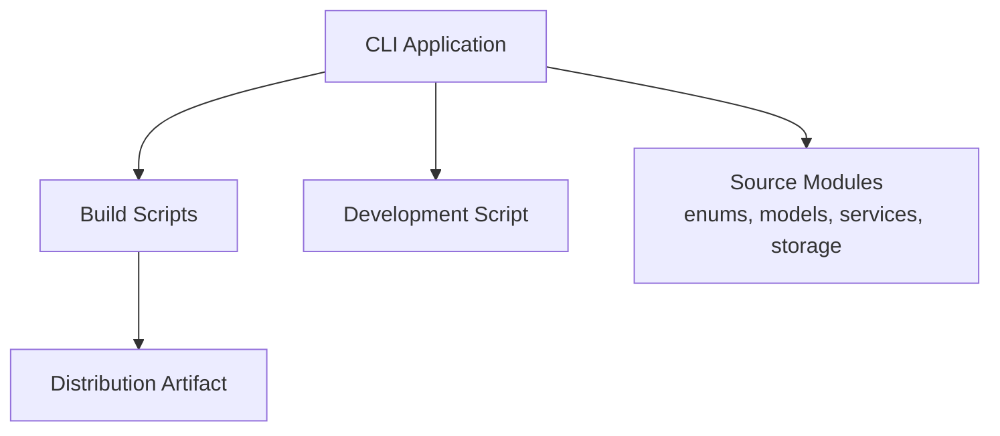
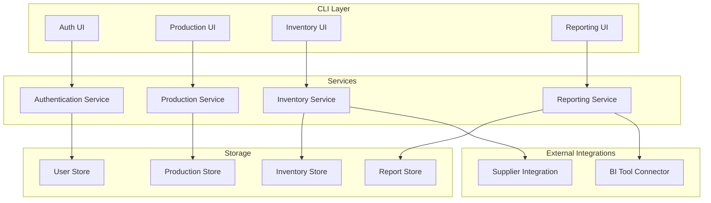
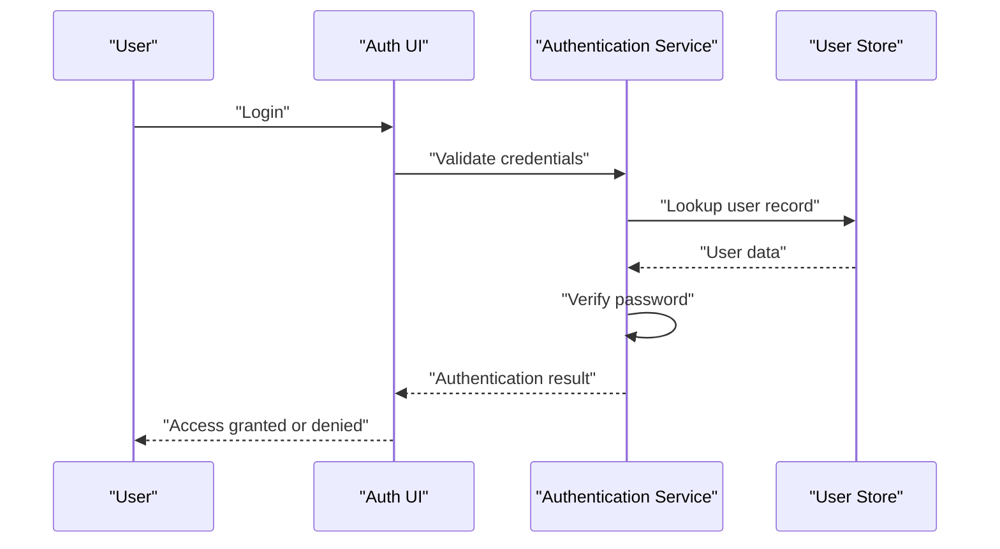
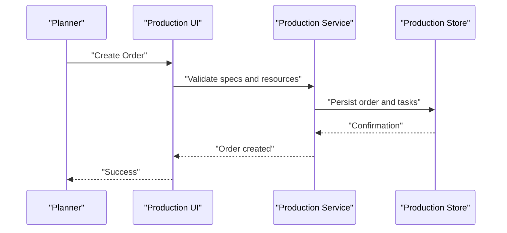
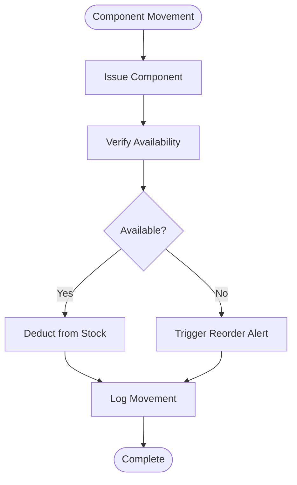
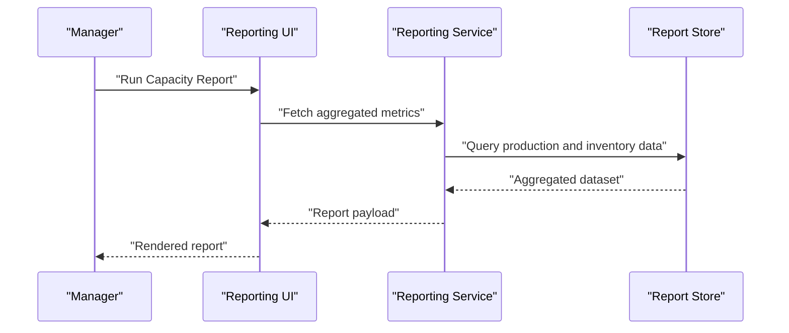
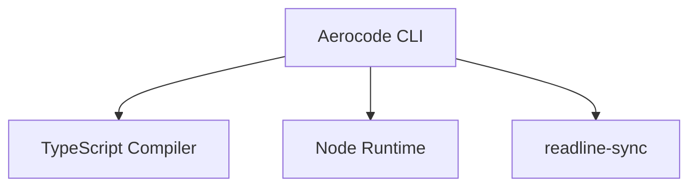

# Core Features

<cite>
**Referenced Files in This Document**
- [package.json](file://package.json)
</cite>

## Table of Contents
1. [Introduction](#introduction)
2. [Project Structure](#project-structure)
3. [Core Components](#core-components)
4. [Architecture Overview](#architecture-overview)
5. [Detailed Component Analysis](#detailed-component-analysis)
6. [Dependency Analysis](#dependency-analysis)
7. [Performance Considerations](#performance-considerations)
8. [Troubleshooting Guide](#troubleshooting-guide)
9. [Conclusion](#conclusion)

## Introduction
This document describes the core features of the Aerocode CLI System with a focus on four functional areas: Authentication & User Management, Aircraft Production Management, Component & Inventory Tracking, and Reporting & Analytics. It explains each feature’s purpose, key operations, user workflows, integration patterns, and how features interact within the system. Guidance on permission levels, role-based access control, and feature availability by role is also included.

## Project Structure
The Aerocode CLI System is a TypeScript-based command-line application. The build and runtime scripts indicate a compiled distribution artifact and a development entry point. The current repository snapshot includes the project metadata and a placeholder for source code directories. The functional areas described here are designed to operate within this structure and rely on the presence of the indicated source modules.

**Section sources**
- [package.json:1-23](file://package.json#L1-L23)

## Core Components
This section outlines the core components that enable the four functional areas. These components are conceptual and intended to reflect the system’s design goals as described in the documentation objective.

- Authentication & User Management
  - Purpose: Manage user identities, sessions, and permissions.
  - Key Operations: Login, logout, register, update profile, reset password, manage roles.
  - Integration Patterns: Centralized session store, role enforcement middleware, audit logging.
  - Permissions: Role-based access control (RBAC) with distinct roles and capabilities.

- Aircraft Production Management
  - Purpose: Track aircraft production stages, assign tasks, and monitor progress.
  - Key Operations: Create production orders, assign workstations, update statuses, schedule milestones.
  - Integration Patterns: Event-driven updates, real-time status propagation, cross-module reporting hooks.

- Component & Inventory Tracking
  - Purpose: Monitor component usage, stock levels, and traceability.
  - Key Operations: Record component issuance, return, inventory adjustments, traceability logs.
  - Integration Patterns: Inventory ledger, supplier integration, automated reorder thresholds.

- Reporting & Analytics
  - Purpose: Aggregate metrics, generate dashboards, and support decision-making.
  - Key Operations: Produce KPI reports, trend analysis, capacity utilization, cost tracking.
  - Integration Patterns: Data export, scheduled jobs, external BI tool connectors.

## Architecture Overview
The Aerocode CLI System follows a modular architecture with clear separation of concerns across functional domains. The CLI orchestrates user interactions, delegates domain-specific logic to services, persists state via storage modules, and exposes data through reporting channels.

## Detailed Component Analysis

### Authentication & User Management
- Purpose: Secure access to the system, enforce RBAC, and maintain user profiles.
- Key Operations:
  - User registration and verification
  - Session creation and lifecycle management
  - Role assignment and capability checks
  - Profile updates and password management
- User Workflows:
  - New user onboarding with role assignment
  - Login with credential validation and session establishment
  - Role-based menu navigation and action filtering
- Integration Patterns:
  - Centralized authentication middleware
  - Audit trail for sensitive actions
  - Encrypted storage for credentials and tokens

- Permission Levels and Role-Based Access Control:
  - Roles: Administrator, Production Manager, Technician, Viewer
  - Feature Availability:
    - Administrator: Full access to all modules
    - Production Manager: Production and reporting modules
    - Technician: Production and inventory modules
    - Viewer: Read-only access to reporting module

**Section sources**
- [package.json:1-23](file://package.json#L1-L23)

### Aircraft Production Management
- Purpose: Coordinate aircraft assembly workflows, track progress, and manage resources.
- Key Operations:
  - Create production orders with specifications
  - Assign workstations and personnel
  - Update status and milestone completion
  - Schedule and reschedule tasks
- User Workflows:
  - Planner creates order and assigns initial tasks
  - Technician updates progress during assembly
  - Manager reviews status and resolves bottlenecks
- Integration Patterns:
  - Event notifications for status changes
  - Cross-module synchronization for material needs
  - Exportable production timelines

- Data Flow:
  - Order creation → task decomposition → resource allocation → progress updates → closure
- Practical Examples:
  - Batch creation of orders for model variants
  - Reallocation of tasks when equipment is unavailable

**Section sources**
- [package.json:1-23](file://package.json#L1-L23)

### Component & Inventory Tracking
- Purpose: Maintain accurate component inventories, support traceability, and automate replenishment.
- Key Operations:
  - Record component issuance and returns
  - Adjust stock levels and locations
  - Trigger reorder alerts based on thresholds
  - Generate traceability reports
- User Workflows:
  - Technician requests components for a task
  - Warehouse operator verifies availability and ships items
  - Inventory clerk reconciles discrepancies
- Integration Patterns:
  - Supplier integration for procurement
  - Automated reorder when stock falls below minimum
  - Ledger-based audit trail for all movements

- Practical Examples:
  - Bulk issuance for a production batch
  - Traceability lookup for a serial-numbered part

**Section sources**
- [package.json:1-23](file://package.json#L1-L23)

### Reporting & Analytics
- Purpose: Provide actionable insights through KPIs, trends, and capacity metrics.
- Key Operations:
  - Generate production throughput reports
  - Compute capacity utilization and downtime metrics
  - Export analytics to external BI tools
  - Schedule recurring reports
- User Workflows:
  - Manager selects report parameters and runs ad-hoc analysis
  - Scheduler generates weekly summaries automatically
  - Viewer accesses dashboards with filtered views
- Integration Patterns:
  - Scheduled job execution
  - Data export APIs for BI connectors
  - Role-filtered dashboards

- Practical Examples:
  - Daily throughput dashboard for shift supervisors
  - Monthly cost-of-production summary for finance

**Section sources**
- [package.json:1-23](file://package.json#L1-L23)

## Dependency Analysis
The Aerocode CLI System relies on a small set of core dependencies for terminal interaction and development tooling. The build pipeline compiles TypeScript sources into a distributable JavaScript artifact consumed by the CLI runtime.

**Section sources**
- [package.json:14-22](file://package.json#L14-L22)

## Performance Considerations
- Minimize synchronous I/O in CLI loops; prefer asynchronous operations for long-running tasks.
- Cache frequently accessed data (e.g., user roles, recent reports) to reduce repeated lookups.
- Batch inventory and production updates to reduce storage overhead.
- Use pagination for large datasets in reporting to avoid memory pressure.

## Troubleshooting Guide
- Authentication Failures
  - Verify credentials and session validity.
  - Check role assignments and access permissions.
- Production Issues
  - Confirm resource availability and task dependencies.
  - Review status transitions and unresolved bottlenecks.
- Inventory Discrepancies
  - Reconcile recent movements and trigger traceability queries.
  - Validate supplier integration and reorder thresholds.
- Reporting Delays
  - Inspect scheduled jobs and data aggregation windows.
  - Confirm external BI connector connectivity.

## Conclusion
The Aerocode CLI System is structured to support robust operations across Authentication & User Management, Aircraft Production Management, Component & Inventory Tracking, and Reporting & Analytics. By enforcing role-based access control, maintaining clear data flows, and integrating with external systems, the platform enables efficient, traceable, and insightful management of aircraft production workflows.