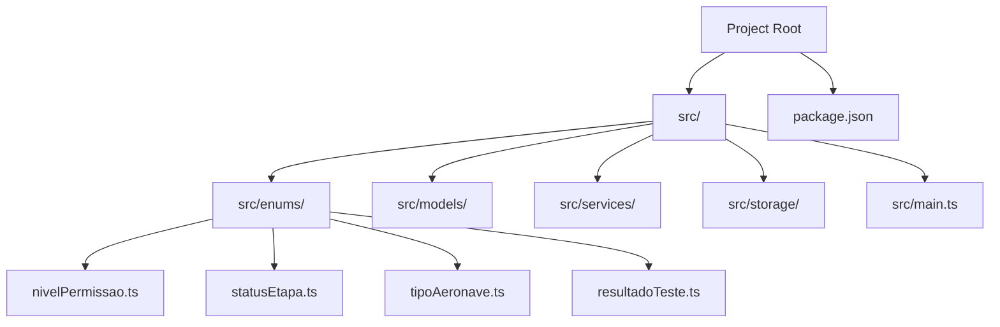
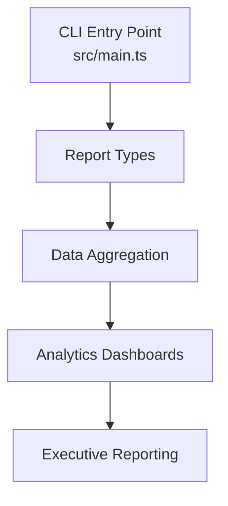
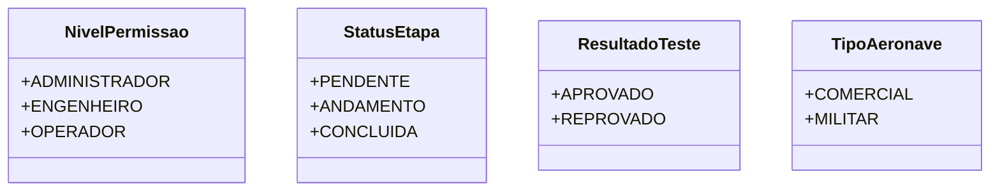
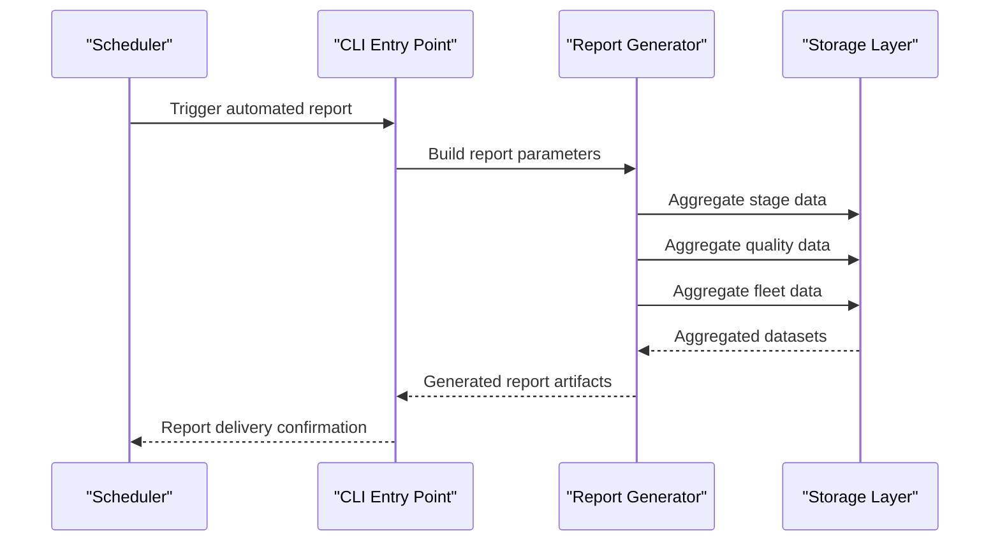
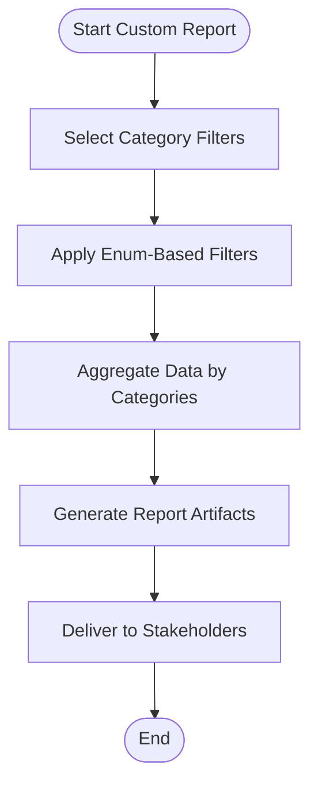
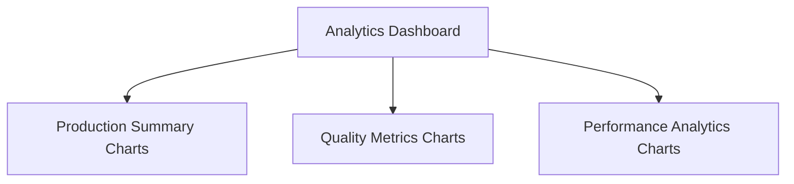
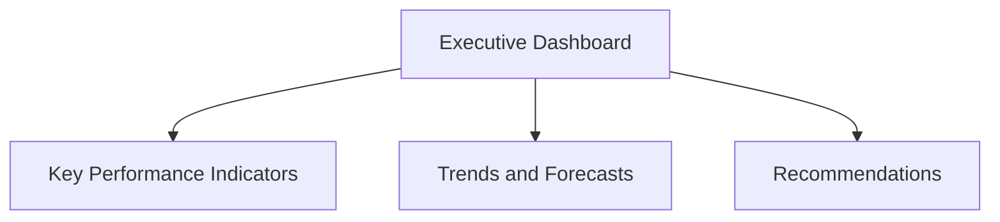
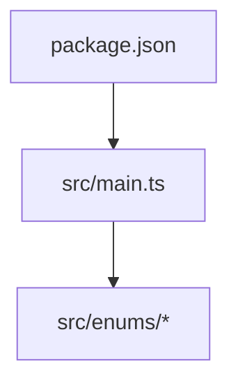

# Reporting & Analytics

<cite>
**Referenced Files in This Document**
- [package.json](file://package.json)
- [src/main.ts](file://src/main.ts)
- [src/enums/nivelPermissao.ts](file://src/enums/nivelPermissao.ts)
- [src/enums/statusEtapa.ts](file://src/enums/statusEtapa.ts)
- [src/enums/tipoAeronave.ts](file://src/enums/tipoAeronave.ts)
- [src/enums/resultadoTeste.ts](file://src/enums/resultadoTeste.ts)
</cite>

## Table of Contents
1. [Introduction](#introduction)
2. [Project Structure](#project-structure)
3. [Core Components](#core-components)
4. [Architecture Overview](#architecture-overview)
5. [Detailed Component Analysis](#detailed-component-analysis)
6. [Dependency Analysis](#dependency-analysis)
7. [Performance Considerations](#performance-considerations)
8. [Troubleshooting Guide](#troubleshooting-guide)
9. [Conclusion](#conclusion)
10. [Appendices](#appendices)

## Introduction
This document describes the Reporting & Analytics system for the Aerocode CLI application. It focuses on production summaries, component tracking reports, quality metrics generation, and performance analytics. The system is designed around a command-line interface that supports automated report generation, custom report creation, and executive reporting features. The current repository snapshot includes foundational enumerations that underpin production tracking, quality outcomes, and operational roles. These elements form the basis for building dashboards, analytics queries, and decision support workflows.

## Project Structure
The project follows a minimal TypeScript CLI layout with a focus on core domain modeling and build tooling. The reporting and analytics capabilities are intended to leverage the existing enums and future model/service layers to produce actionable insights.

**Diagram sources**
- [src/main.ts:1-1](file://src/main.ts#L1-L1)
- [package.json:1-23](file://package.json#L1-L23)
- [src/enums/nivelPermissao.ts:1-5](file://src/enums/nivelPermissao.ts#L1-L5)
- [src/enums/statusEtapa.ts:1-5](file://src/enums/statusEtapa.ts#L1-L5)
- [src/enums/tipoAeronave.ts:1-4](file://src/enums/tipoAeronave.ts#L1-L4)
- [src/enums/resultadoTeste.ts:1-5](file://src/enums/resultadoTeste.ts#L1-L5)

**Section sources**
- [package.json:1-23](file://package.json#L1-L23)
- [src/main.ts:1-1](file://src/main.ts#L1-L1)

## Core Components
The reporting and analytics system relies on the following core components derived from the repository:

- Production lifecycle tracking via stage statuses
- Quality outcome classification for testing results
- Aircraft type categorization for fleet analytics
- Operational role definitions for access-controlled reporting
- CLI entry point orchestrating commands and workflows

These components enable:
- Production summaries by stage completion rates
- Component tracking reports by aircraft type
- Quality metrics generation by pass/fail ratios
- Performance analytics by operator role and stage throughput

**Section sources**
- [src/enums/statusEtapa.ts:1-5](file://src/enums/statusEtapa.ts#L1-L5)
- [src/enums/resultadoTeste.ts:1-5](file://src/enums/resultadoTeste.ts#L1-L5)
- [src/enums/tipoAeronave.ts:1-4](file://src/enums/tipoAeronave.ts#L1-L4)
- [src/enums/nivelPermissao.ts:1-5](file://src/enums/nivelPermissao.ts#L1-L5)
- [src/main.ts:1-1](file://src/main.ts#L1-L1)

## Architecture Overview
The reporting and analytics architecture centers on the CLI entry point and leverages domain enums to drive report generation and analytics. The system is structured to support automated and custom reporting, with dashboards and executive summaries built on top of aggregated data.

[No sources needed since this diagram shows conceptual workflow, not actual code structure]

## Detailed Component Analysis

### Enumerations Supporting Reporting
The enums define categorical data that feed into reporting and analytics:

- Stage status enumeration for production tracking
- Test result enumeration for quality metrics
- Aircraft type enumeration for fleet analytics
- Role enumeration for access-controlled reporting

**Diagram sources**
- [src/enums/nivelPermissao.ts:1-5](file://src/enums/nivelPermissao.ts#L1-L5)
- [src/enums/statusEtapa.ts:1-5](file://src/enums/statusEtapa.ts#L1-L5)
- [src/enums/resultadoTeste.ts:1-5](file://src/enums/resultadoTeste.ts#L1-L5)
- [src/enums/tipoAeronave.ts:1-4](file://src/enums/tipoAeronave.ts#L1-L4)

**Section sources**
- [src/enums/nivelPermissao.ts:1-5](file://src/enums/nivelPermissao.ts#L1-L5)
- [src/enums/statusEtapa.ts:1-5](file://src/enums/statusEtapa.ts#L1-L5)
- [src/enums/resultadoTeste.ts:1-5](file://src/enums/resultadoTeste.ts#L1-L5)
- [src/enums/tipoAeronave.ts:1-4](file://src/enums/tipoAeronave.ts#L1-L4)

### Automated Report Generation Workflow
Automated reporting can be implemented by combining stage statuses, test results, and aircraft types to produce periodic summaries. The workflow below outlines a typical automated pipeline:

[No sources needed since this diagram shows conceptual workflow, not actual code structure]

### Custom Report Creation
Custom reports can be constructed by selecting specific categories from the enums and applying filters. Typical custom report scenarios include:
- Stage completion rate by aircraft type
- Pass/fail ratio by operator role
- Fleet utilization by status distribution

[No sources needed since this diagram shows conceptual workflow, not actual code structure]

### Data Visualization Capabilities
Dashboards can visualize aggregated metrics such as:
- Production summaries by stage completion
- Quality metrics by pass/fail ratios
- Performance analytics by operator role and throughput

[No sources needed since this diagram shows conceptual workflow, not actual code structure]

### Executive Reporting Features
Executive reporting leverages aggregated summaries and KPIs derived from the enums to support decision-making. Typical executive dashboards include:
- Overall production health indicators
- Quality trends and compliance metrics
- Resource utilization and capacity planning

[No sources needed since this diagram shows conceptual workflow, not actual code structure]

## Dependency Analysis
The reporting and analytics system depends on the CLI entry point and the domain enums. The build and runtime dependencies are defined in the project metadata.

**Diagram sources**
- [package.json:1-23](file://package.json#L1-L23)
- [src/main.ts:1-1](file://src/main.ts#L1-L1)

**Section sources**
- [package.json:1-23](file://package.json#L1-L23)
- [src/main.ts:1-1](file://src/main.ts#L1-L1)

## Performance Considerations
- Minimize repeated aggregations by caching intermediate results during report generation.
- Use efficient filtering strategies aligned with enum categories to reduce dataset traversal overhead.
- Batch report generation tasks to avoid frequent I/O operations.
- Monitor CLI startup and report generation latency to identify bottlenecks.

[No sources needed since this section provides general guidance]

## Troubleshooting Guide
- Verify enum values align with expected categories before generating reports.
- Confirm CLI scripts are configured correctly for development and production builds.
- Validate storage connectivity and permissions for report artifact persistence.
- Review logs for errors during automated report scheduling and delivery.

**Section sources**
- [package.json:6-10](file://package.json#L6-L10)

## Conclusion
The Aerocode Reporting & Analytics system is positioned to deliver production summaries, component tracking reports, quality metrics, and performance analytics through a CLI-driven architecture. The current repository snapshot establishes foundational enumerations that enable robust reporting workflows. Future enhancements should focus on implementing the model, service, and storage layers to support automated and custom reporting, advanced analytics dashboards, and executive reporting features.

## Appendices
- CLI Scripts: Development and production build/run commands are defined in the project metadata.
- Enum Reference: Stage statuses, test results, aircraft types, and roles provide the categorical foundation for analytics.

**Section sources**
- [package.json:6-10](file://package.json#L6-L10)
- [src/enums/statusEtapa.ts:1-5](file://src/enums/statusEtapa.ts#L1-L5)
- [src/enums/resultadoTeste.ts:1-5](file://src/enums/resultadoTeste.ts#L1-L5)
- [src/enums/tipoAeronave.ts:1-4](file://src/enums/tipoAeronave.ts#L1-L4)
- [src/enums/nivelPermissao.ts:1-5](file://src/enums/nivelPermissao.ts#L1-L5)