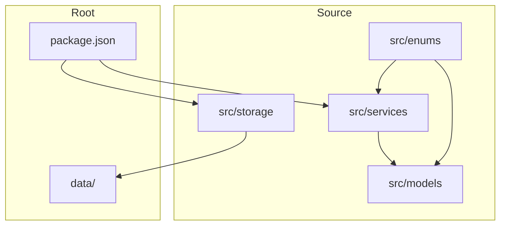
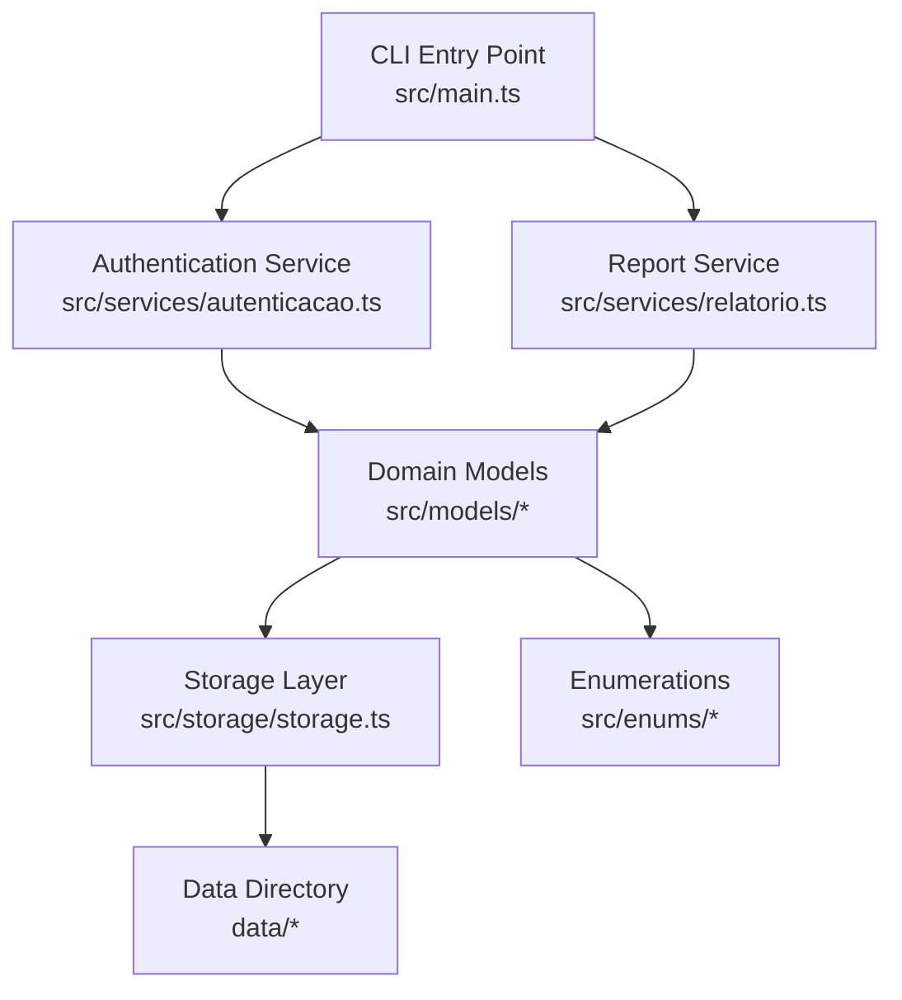
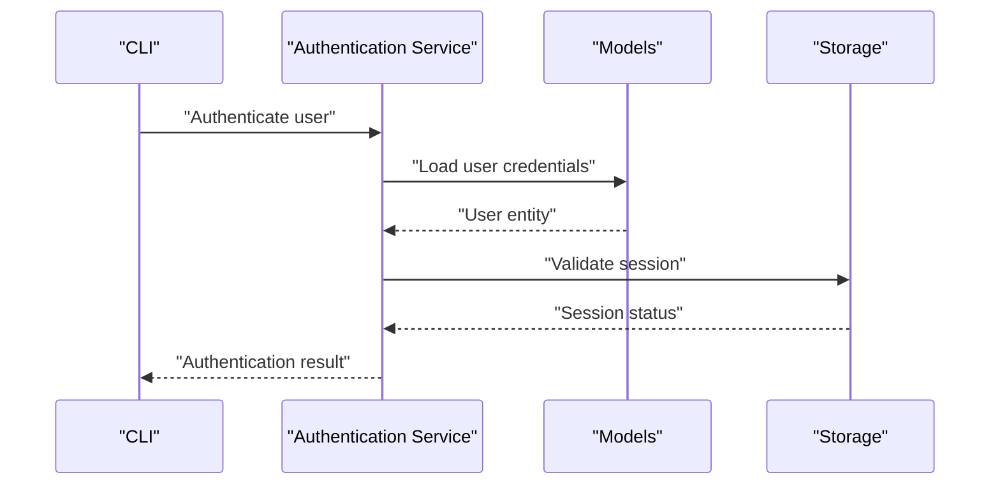
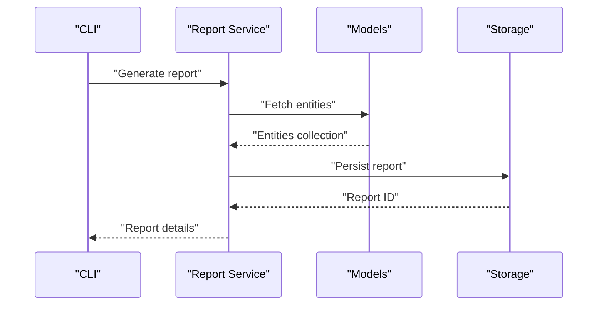
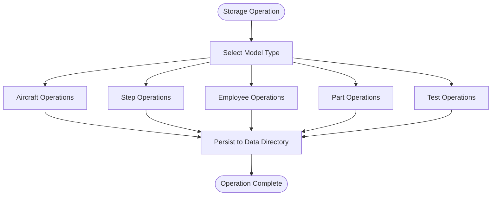
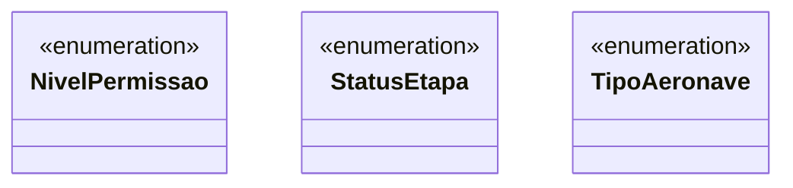
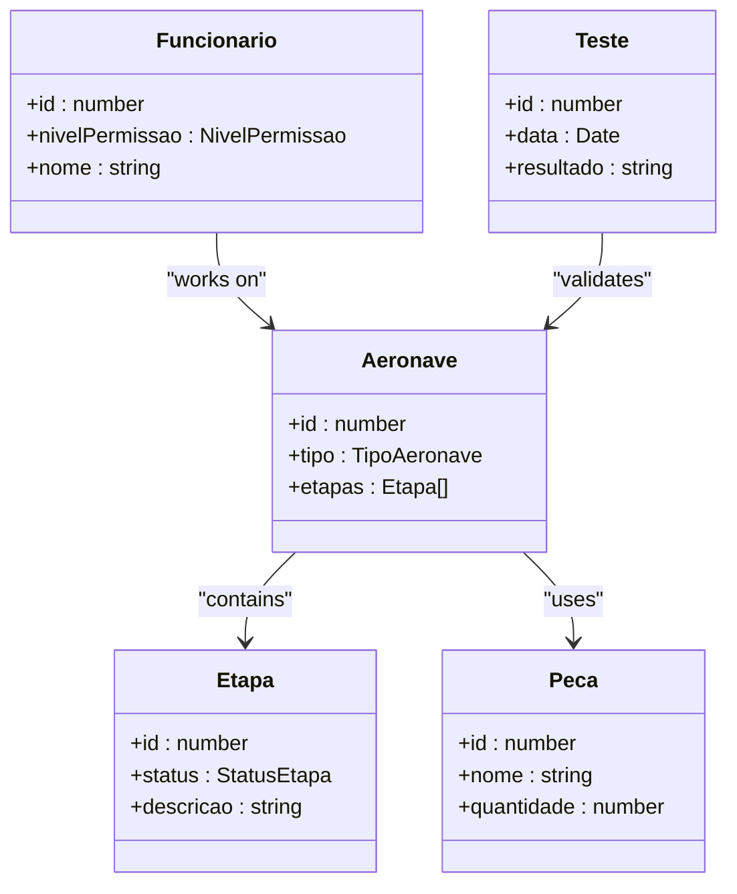
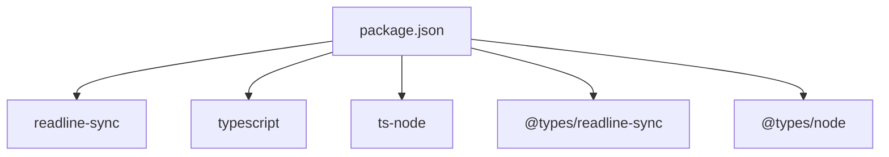

# Development Guide

<cite>
**Referenced Files in This Document**
- [package.json](file://package.json)
- [src/main.ts](file://src/main.ts)
- [src/storage/storage.ts](file://src/storage/storage.ts)
- [src/models/aeronave.ts](file://src/models/aeronave.ts)
- [src/models/etapa.ts](file://src/models/etapa.ts)
- [src/models/funcionario.ts](file://src/models/funcionario.ts)
- [src/models/peca.ts](file://src/models/peca.ts)
- [src/models/teste.ts](file://src/models/teste.ts)
- [src/services/autenticacao.ts](file://src/services/autenticacao.ts)
- [src/services/relatorio.ts](file://src/services/relatorio.ts)
- [src/enums/nivelPermissao.ts](file://src/enums/nivelPermissao.ts)
- [src/enums/statusEtapa.ts](file://src/enums/statusEtapa.ts)
- [src/enums/tipoAeronave.ts](file://src/enums/tipoAeronave.ts)
</cite>

## Table of Contents
1. [Introduction](#introduction)
2. [Project Structure](#project-structure)
3. [Core Components](#core-components)
4. [Architecture Overview](#architecture-overview)
5. [Detailed Component Analysis](#detailed-component-analysis)
6. [Dependency Analysis](#dependency-analysis)
7. [Performance Considerations](#performance-considerations)
8. [Testing Strategies](#testing-strategies)
9. [Debugging Techniques](#debugging-techniques)
10. [Development Workflow Best Practices](#development-workflow-best-practices)
11. [Deployment Procedures](#deployment-procedures)
12. [Configuration Management](#configuration-management)
13. [Code Organization Principles](#code-organization-principles)
14. [TypeScript Best Practices](#typescript-best-practices)
15. [Contribution Guidelines](#contribution-guidelines)
16. [Troubleshooting Guide](#troubleshooting-guide)
17. [Conclusion](#conclusion)

## Introduction
This guide provides comprehensive development documentation for extending and customizing the Aerocode CLI System. It covers adding new features such as creating new service modules, extending data models, implementing storage operations, and integrating with the CLI interface. It also documents testing strategies, debugging techniques, development workflow best practices, deployment procedures for production environments, configuration management, environment-specific settings, code organization principles, TypeScript best practices, contribution guidelines, performance optimization, error handling patterns, and maintaining code quality standards.

## Project Structure
The project follows a modular structure organized by concerns:
- src/enums: Enumerations used across models and services
- src/models: Domain models representing entities
- src/services: Business logic and CLI integration modules
- src/storage: Storage abstraction and persistence layer
- data: Data directory for runtime data files

**Diagram sources**
- [package.json:1-23](file://package.json#L1-L23)
- [src/main.ts:1-1](file://src/main.ts#L1-L1)

**Section sources**
- [package.json:1-23](file://package.json#L1-L23)

## Core Components
- Enums: Define constrained sets of values for permissions, statuses, and aircraft types
- Models: Represent domain entities (aircraft, steps, employees, parts, tests)
- Services: Implement business logic and CLI integration
- Storage: Provides persistence abstraction for data operations

**Section sources**
- [src/enums/nivelPermissao.ts:1-1](file://src/enums/nivelPermissao.ts#L1-L1)
- [src/enums/statusEtapa.ts:1-1](file://src/enums/statusEtapa.ts#L1-L1)
- [src/enums/tipoAeronave.ts:1-1](file://src/enums/tipoAeronave.ts#L1-L1)
- [src/models/aeronave.ts:1-1](file://src/models/aeronave.ts#L1-L1)
- [src/models/etapa.ts:1-1](file://src/models/etapa.ts#L1-L1)
- [src/models/funcionario.ts:1-1](file://src/models/funcionario.ts#L1-L1)
- [src/models/peca.ts:1-1](file://src/models/peca.ts#L1-L1)
- [src/models/teste.ts:1-1](file://src/models/teste.ts#L1-L1)
- [src/services/autenticacao.ts:1-1](file://src/services/autenticacao.ts#L1-L1)
- [src/services/relatorio.ts:1-1](file://src/services/relatorio.ts#L1-L1)
- [src/storage/storage.ts:1-1](file://src/storage/storage.ts#L1-L1)

## Architecture Overview
The system is structured around a CLI entry point that delegates to services. Services coordinate model manipulation and storage operations. Enums provide type safety across the application.

**Diagram sources**
- [src/main.ts:1-1](file://src/main.ts#L1-L1)
- [src/services/autenticacao.ts:1-1](file://src/services/autenticacao.ts#L1-L1)
- [src/services/relatorio.ts:1-1](file://src/services/relatorio.ts#L1-L1)
- [src/storage/storage.ts:1-1](file://src/storage/storage.ts#L1-L1)
- [src/enums/nivelPermissao.ts:1-1](file://src/enums/nivelPermissao.ts#L1-L1)
- [src/enums/statusEtapa.ts:1-1](file://src/enums/statusEtapa.ts#L1-L1)
- [src/enums/tipoAeronave.ts:1-1](file://src/enums/tipoAeronave.ts#L1-L1)
- [src/models/aeronave.ts:1-1](file://src/models/aeronave.ts#L1-L1)
- [src/models/etapa.ts:1-1](file://src/models/etapa.ts#L1-L1)
- [src/models/funcionario.ts:1-1](file://src/models/funcionario.ts#L1-L1)
- [src/models/peca.ts:1-1](file://src/models/peca.ts#L1-L1)
- [src/models/teste.ts:1-1](file://src/models/teste.ts#L1-L1)

## Detailed Component Analysis

### Authentication Service
The authentication service encapsulates user authentication logic and integrates with the CLI interface. It coordinates with models and storage to manage user sessions and permissions.

**Diagram sources**
- [src/services/autenticacao.ts:1-1](file://src/services/autenticacao.ts#L1-L1)
- [src/models/funcionario.ts:1-1](file://src/models/funcionario.ts#L1-L1)
- [src/storage/storage.ts:1-1](file://src/storage/storage.ts#L1-L1)

**Section sources**
- [src/services/autenticacao.ts:1-1](file://src/services/autenticacao.ts#L1-L1)

### Report Service
The report service generates reports based on domain models and integrates with the CLI interface for user interaction.

**Diagram sources**
- [src/services/relatorio.ts:1-1](file://src/services/relatorio.ts#L1-L1)
- [src/models/aeronave.ts:1-1](file://src/models/aeronave.ts#L1-L1)
- [src/models/etapa.ts:1-1](file://src/models/etapa.ts#L1-L1)
- [src/storage/storage.ts:1-1](file://src/storage/storage.ts#L1-L1)

**Section sources**
- [src/services/relatorio.ts:1-1](file://src/services/relatorio.ts#L1-L1)

### Storage Abstraction
The storage module provides a unified interface for data persistence operations across models.

**Diagram sources**
- [src/storage/storage.ts:1-1](file://src/storage/storage.ts#L1-L1)
- [src/models/aeronave.ts:1-1](file://src/models/aeronave.ts#L1-L1)
- [src/models/etapa.ts:1-1](file://src/models/etapa.ts#L1-L1)
- [src/models/funcionario.ts:1-1](file://src/models/funcionario.ts#L1-L1)
- [src/models/peca.ts:1-1](file://src/models/peca.ts#L1-L1)
- [src/models/teste.ts:1-1](file://src/models/teste.ts#L1-L1)

**Section sources**
- [src/storage/storage.ts:1-1](file://src/storage/storage.ts#L1-L1)

### Enumerations
Enumerations define constrained value sets for permissions, statuses, and aircraft types, ensuring type safety across the application.

**Diagram sources**
- [src/enums/nivelPermissao.ts:1-1](file://src/enums/nivelPermissao.ts#L1-L1)
- [src/enums/statusEtapa.ts:1-1](file://src/enums/statusEtapa.ts#L1-L1)
- [src/enums/tipoAeronave.ts:1-1](file://src/enums/tipoAeronave.ts#L1-L1)

**Section sources**
- [src/enums/nivelPermissao.ts:1-1](file://src/enums/nivelPermissao.ts#L1-L1)
- [src/enums/statusEtapa.ts:1-1](file://src/enums/statusEtapa.ts#L1-L1)
- [src/enums/tipoAeronave.ts:1-1](file://src/enums/tipoAeronave.ts#L1-L1)

### Domain Models
Domain models represent core entities with properties and relationships. They integrate with enums and storage for consistent behavior.

**Diagram sources**
- [src/models/aeronave.ts:1-1](file://src/models/aeronave.ts#L1-L1)
- [src/models/etapa.ts:1-1](file://src/models/etapa.ts#L1-L1)
- [src/models/funcionario.ts:1-1](file://src/models/funcionario.ts#L1-L1)
- [src/models/peca.ts:1-1](file://src/models/peca.ts#L1-L1)
- [src/models/teste.ts:1-1](file://src/models/teste.ts#L1-L1)
- [src/enums/tipoAeronave.ts:1-1](file://src/enums/tipoAeronave.ts#L1-L1)
- [src/enums/statusEtapa.ts:1-1](file://src/enums/statusEtapa.ts#L1-L1)
- [src/enums/nivelPermissao.ts:1-1](file://src/enums/nivelPermissao.ts#L1-L1)

**Section sources**
- [src/models/aeronave.ts:1-1](file://src/models/aeronave.ts#L1-L1)
- [src/models/etapa.ts:1-1](file://src/models/etapa.ts#L1-L1)
- [src/models/funcionario.ts:1-1](file://src/models/funcionario.ts#L1-L1)
- [src/models/peca.ts:1-1](file://src/models/peca.ts#L1-L1)
- [src/models/teste.ts:1-1](file://src/models/teste.ts#L1-L1)

## Dependency Analysis
The project relies on minimal external dependencies for CLI interaction and TypeScript tooling.

**Diagram sources**
- [package.json:14-22](file://package.json#L14-L22)

**Section sources**
- [package.json:14-22](file://package.json#L14-L22)

## Performance Considerations
- Minimize synchronous I/O operations in hot paths
- Use efficient data structures for collections
- Cache frequently accessed data where appropriate
- Profile memory usage during long-running operations
- Avoid blocking the event loop in CLI interactions

## Testing Strategies
- Unit tests for individual services and models
- Integration tests for storage operations
- CLI interaction tests using automated input
- Mock external dependencies (storage, readline)
- Test error scenarios and edge cases
- Validate enum usage and type safety

## Debugging Techniques
- Enable verbose logging in development
- Use TypeScript compiler diagnostics
- Leverage Node.js inspector for interactive debugging
- Add structured logs around storage operations
- Validate CLI argument parsing and validation
- Monitor memory usage during extended operations

## Development Workflow Best Practices
- Follow the existing folder structure and naming conventions
- Keep services focused on single responsibilities
- Use enums for constrained values across the application
- Implement consistent error handling patterns
- Write clear, descriptive commit messages
- Maintain backward compatibility when extending models
- Document public APIs and interfaces

## Deployment Procedures
- Build the project using the TypeScript compiler
- Ensure all dependencies are installed
- Verify CLI functionality in production environment
- Test storage operations with target filesystem
- Validate environment-specific configurations
- Package artifacts for distribution

**Section sources**
- [package.json:6-10](file://package.json#L6-L10)

## Configuration Management
- Environment-specific settings in separate files
- Runtime configuration loaded at startup
- Validation of configuration values
- Graceful degradation when settings are missing
- Clear separation between build-time and runtime configuration

## Code Organization Principles
- Group related functionality by domain (models, services, enums)
- Maintain clear separation between business logic and CLI interface
- Use consistent naming conventions across modules
- Keep modules loosely coupled with explicit interfaces
- Favor composition over inheritance in model relationships

## TypeScript Best Practices
- Use strict mode for compile-time type checking
- Define interfaces for all public APIs
- Leverage enums for constrained value sets
- Implement proper error handling with typed exceptions
- Use generics for reusable, type-safe components
- Maintain consistent import/export patterns

## Contribution Guidelines
- Fork and branch from the main development branch
- Follow existing code style and conventions
- Include unit tests for new functionality
- Update documentation for significant changes
- Run all tests and linters before submitting
- Use clear, descriptive pull request descriptions

## Troubleshooting Guide
Common issues and resolutions:
- Build failures: Ensure TypeScript and dependencies are properly installed
- Runtime errors: Check storage directory permissions and availability
- CLI interaction problems: Verify readline-sync compatibility
- Type errors: Confirm enum usage and interface implementations
- Memory issues: Monitor for memory leaks in long-running operations

**Section sources**
- [package.json:14-22](file://package.json#L14-L22)

## Conclusion
This guide provides a comprehensive foundation for developing and extending the Aerocode CLI System. By following the established patterns and best practices, developers can confidently add new features while maintaining code quality and system reliability. The modular architecture supports easy extension and maintenance, enabling continuous evolution of the system's capabilities.