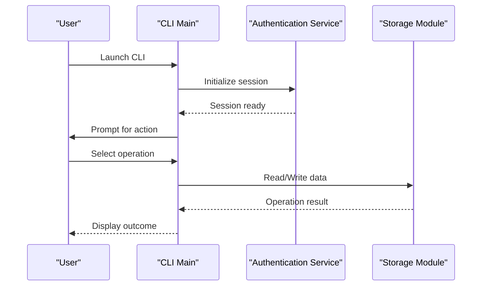
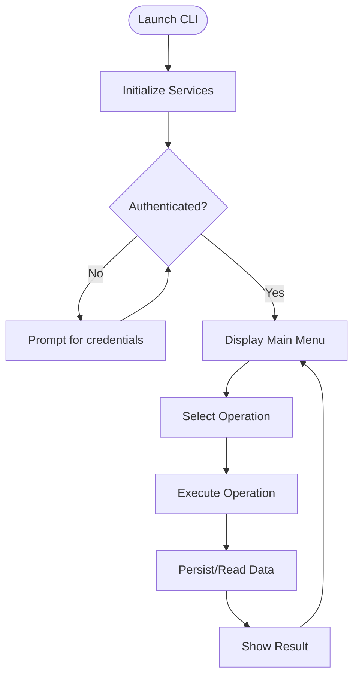
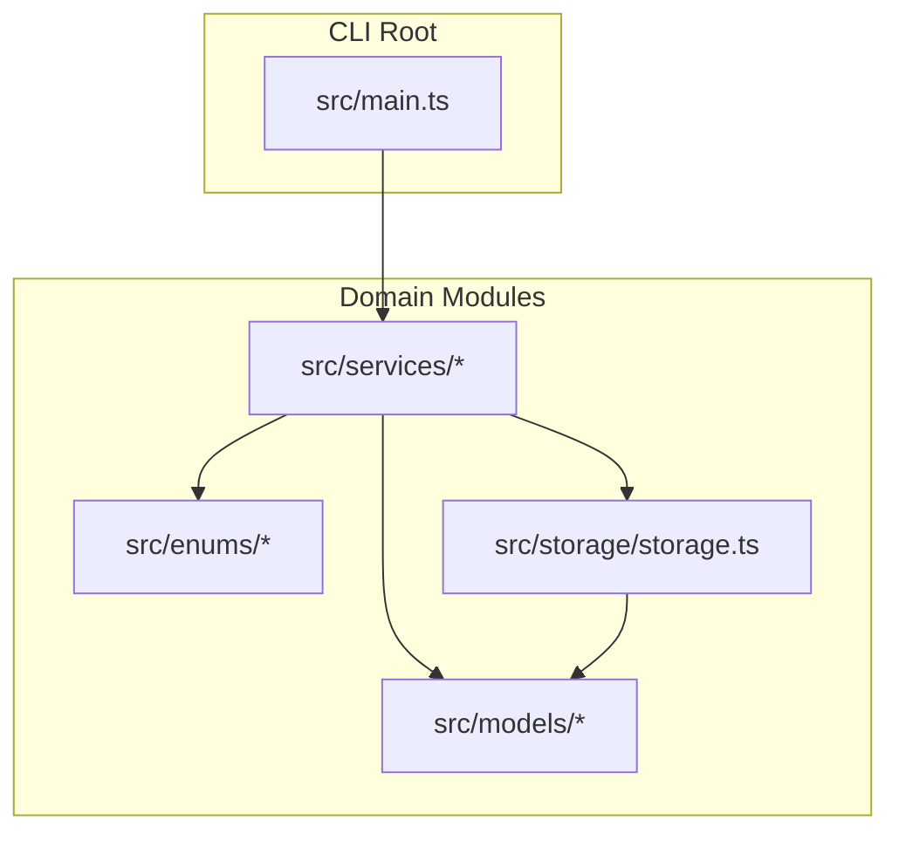

# Getting Started

<cite>
**Referenced Files in This Document**
- [package.json](file://package.json)
- [src/main.ts](file://src/main.ts)
- [src/enums/nivelPermissao.ts](file://src/enums/nivelPermissao.ts)
- [src/models/aeronave.ts](file://src/models/aeronave.ts)
- [src/services/autenticacao.ts](file://src/services/autenticacao.ts)
- [src/storage/storage.ts](file://src/storage/storage.ts)
</cite>

## Table of Contents
1. [Introduction](#introduction)
2. [Prerequisites](#prerequisites)
3. [Installation](#installation)
4. [Build and Run](#build-and-run)
5. [Understanding the CLI](#understanding-the-cli)
6. [First Run and Basic Operations](#first-run-and-basic-operations)
7. [Development Workflow](#development-workflow)
8. [Project Structure](#project-structure)
9. [Troubleshooting](#troubleshooting)
10. [Conclusion](#conclusion)

## Introduction
This guide helps you set up and use the Aerocode CLI System for aircraft production management. It covers prerequisites, installation via npm, building with TypeScript, running the CLI, and performing basic operations. It also includes development tips, first-run scenarios, and troubleshooting advice tailored for new users.

## Prerequisites
Before installing and using the Aerocode CLI, ensure your environment meets the following requirements:
- Node.js runtime installed on your system. The project declares a runtime dependency on Node.js through TypeScript tooling and Node types.
- A terminal or command prompt capable of running npm scripts.
- Optional: A modern code editor with TypeScript support for development.

Why these matter:
- Node.js is required to execute the compiled JavaScript and to run npm scripts defined in the project.
- TypeScript and related dev dependencies enable type-safe development and compilation.

**Section sources**
- [package.json:14-22](file://package.json#L14-L22)

## Installation
Install the project dependencies using npm:
- Open a terminal in the project root.
- Run the install command to fetch dependencies declared in the manifest.

What you get after installation:
- Production dependencies such as readline-sync for interactive terminal input.
- Dev dependencies including TypeScript compiler, ts-node for development, and type definitions for Node.js and readline-sync.

Verification steps:
- Confirm that the node_modules folder exists after installation.
- Verify that the scripts section includes build, start, and dev commands.

**Section sources**
- [package.json:6-10](file://package.json#L6-L10)
- [package.json:14-22](file://package.json#L14-L22)

## Build and Run
The project uses TypeScript for development and compiles to JavaScript for execution. Follow these steps to build and run the CLI:

Build process
- Compile TypeScript sources into JavaScript using the TypeScript compiler script.
- The compiled output targets the distribution directory configured in the manifest.

Run the CLI
- Start the compiled CLI using the start script.
- Alternatively, run in development mode using the dev script for immediate feedback without a separate compile step.

Important notes
- The main entry point for the compiled application is defined in the manifest’s main field.
- During development, the dev script executes the TypeScript source directly with ts-node.

**Section sources**
- [package.json:5](file://package.json#L5)
- [package.json:6-10](file://package.json#L6-L10)

## Understanding the CLI
The CLI exposes a command-line interface built with Node.js and TypeScript. It reads user input from the terminal and orchestrates operations across domain modules.

How it works conceptually
- The CLI initializes by loading the main entry point and setting up interactive prompts.
- It delegates tasks to service modules for authentication, reporting, and other operations.
- Data is persisted or retrieved via the storage module.

[No sources needed since this diagram shows conceptual workflow, not actual code structure]

## First Run and Basic Operations
On first run, the CLI performs initialization and presents a menu of actions. Typical first-run scenarios include:
- Starting the application and navigating the main menu.
- Performing operations that require authentication before proceeding.
- Interacting with data models such as aircraft, parts, and stages.

Common usage patterns
- Use the main menu to select operations related to aircraft, parts, or reports.
- Follow on-screen prompts to confirm actions and enter required details.
- Review outputs and logs generated by the CLI.

[No sources needed since this diagram shows conceptual workflow, not actual code structure]

## Development Workflow
During development, you can iterate quickly using the dev script, which runs the TypeScript source directly. For production-like builds, use the build script to compile TypeScript to JavaScript.

Development tips
- Use the dev script to test changes without recompiling.
- After making changes, run the build script to produce distributable JavaScript.
- Keep the main entry point aligned with the compiled output location.

Production builds
- Compile TypeScript sources to JavaScript using the build script.
- Execute the compiled CLI using the start script.

**Section sources**
- [package.json:6-10](file://package.json#L6-L10)

## Project Structure
The Aerocode CLI follows a modular structure organized by concerns. The main entry point coordinates interactions among domain modules.

**Diagram sources**
- [src/main.ts](file://src/main.ts)
- [src/enums/nivelPermissao.ts](file://src/enums/nivelPermissao.ts)
- [src/models/aeronave.ts](file://src/models/aeronave.ts)
- [src/services/autenticacao.ts](file://src/services/autenticacao.ts)
- [src/storage/storage.ts](file://src/storage/storage.ts)

**Section sources**
- [src/main.ts](file://src/main.ts)
- [src/enums/nivelPermissao.ts](file://src/enums/nivelPermissao.ts)
- [src/models/aeronave.ts](file://src/models/aeronave.ts)
- [src/services/autenticacao.ts](file://src/services/autenticacao.ts)
- [src/storage/storage.ts](file://src/storage/storage.ts)

## Troubleshooting
Common issues and resolutions for new users:

- Node.js not found
  - Cause: Node.js is not installed or not in PATH.
  - Resolution: Install a supported Node.js version and verify installation by running the Node command in your terminal.

- npm install fails
  - Cause: Network or permission issues.
  - Resolution: Retry installation, check network connectivity, and ensure permissions for the project directory.

- TypeScript errors on build
  - Cause: Type mismatches or missing type definitions.
  - Resolution: Review type-related errors reported by the TypeScript compiler and align code with the declared types.

- CLI does not start after build
  - Cause: Incorrect main entry point or missing compiled output.
  - Resolution: Confirm the main field in the manifest matches the compiled output location and that the build completed successfully.

- Authentication prompts fail
  - Cause: Missing or invalid credentials.
  - Resolution: Re-enter credentials when prompted and ensure the authentication service is reachable.

**Section sources**
- [package.json:5](file://package.json#L5)
- [package.json:6-10](file://package.json#L6-L10)

## Conclusion
You are now ready to install, build, and run the Aerocode CLI. Use the dev script for rapid iteration during development and the build/start scripts for production execution. Explore the CLI’s menu-driven interface, perform basic operations, and consult the troubleshooting section if you encounter issues. As you become familiar with the system, leverage the modular structure to extend functionality and integrate new features.