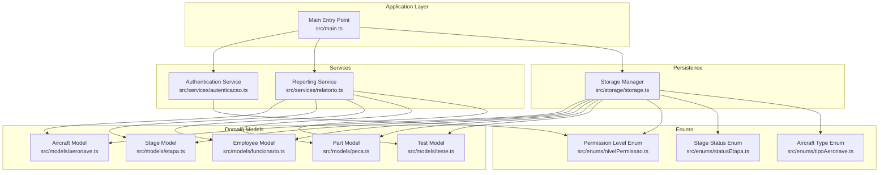
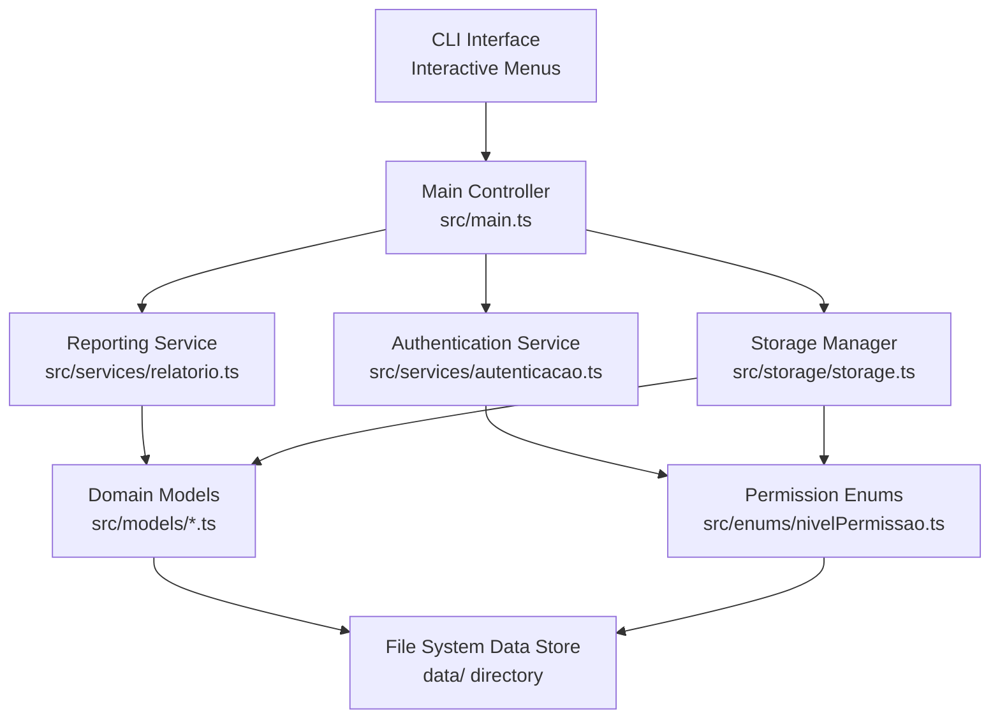
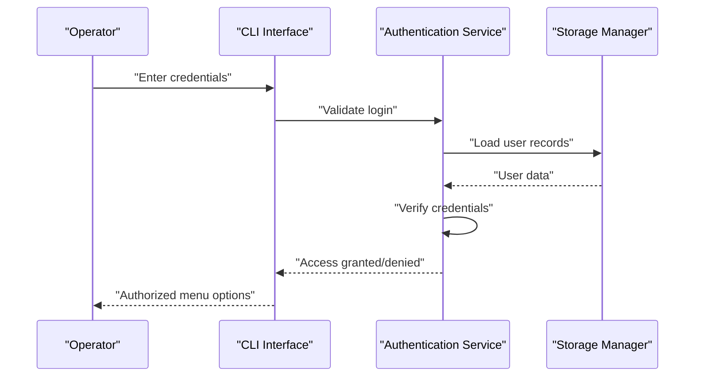
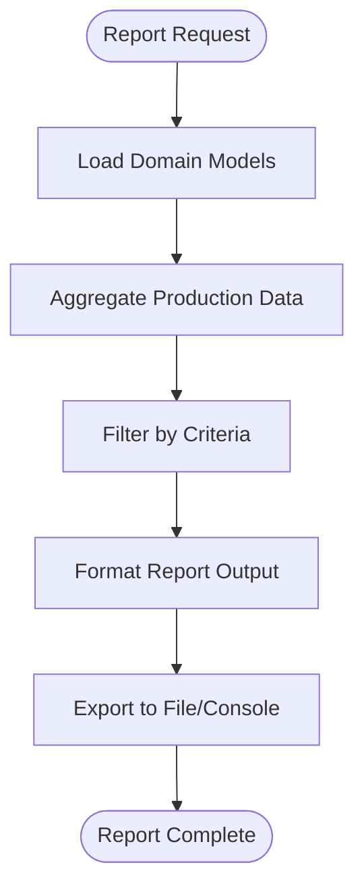
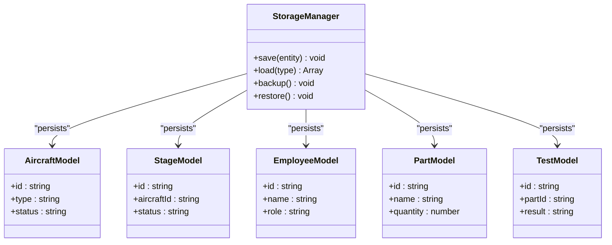
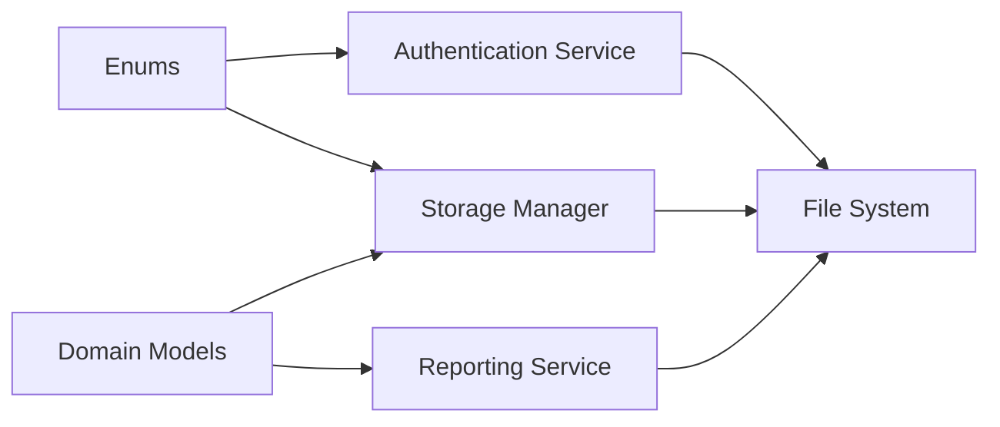

# Project Overview

<cite>
**Referenced Files in This Document**
- [package.json](file://package.json)
- [main.ts](file://src/main.ts)
- [autenticacao.ts](file://src/services/autenticacao.ts)
- [relatorio.ts](file://src/services/relatorio.ts)
- [storage.ts](file://src/storage/storage.ts)
- [nivelPermissao.ts](file://src/enums/nivelPermissao.ts)
- [statusEtapa.ts](file://src/enums/statusEtapa.ts)
- [tipoAeronave.ts](file://src/enums/tipoAeronave.ts)
- [aeronave.ts](file://src/models/aeronave.ts)
- [etapa.ts](file://src/models/etapa.ts)
- [funcionario.ts](file://src/models/funcionario.ts)
- [peca.ts](file://src/models/peca.ts)
- [teste.ts](file://src/models/teste.ts)
</cite>

## Table of Contents
1. [Introduction](#introduction)
2. [Project Structure](#project-structure)
3. [Core Components](#core-components)
4. [Architecture Overview](#architecture-overview)
5. [Detailed Component Analysis](#detailed-component-analysis)
6. [Dependency Analysis](#dependency-analysis)
7. [Performance Considerations](#performance-considerations)
8. [Troubleshooting Guide](#troubleshooting-guide)
9. [Conclusion](#conclusion)

## Introduction
Aerocode is a Command-Line Interface (CLI) system designed to streamline aircraft production management workflows in manufacturing facilities. Its primary purpose is to digitize and automate core production processes, enabling teams to manage aircraft assembly stages, track components, handle authentication, and generate reports efficiently. The system targets production managers, engineers, quality assurance specialists, and shop floor operators working in aerospace manufacturing environments.

Key objectives:
- Centralize production data and processes for improved visibility and control
- Support stage-based assembly workflows with clear status tracking
- Enable secure user access with role-based permissions
- Provide actionable insights via built-in reporting capabilities
- Maintain simplicity and reliability through a file-system based persistence model

## Project Structure
The project follows a modular TypeScript architecture organized by functional domains:
- src/enums: Domain enumerations for permissions, statuses, and aircraft types
- src/models: Core domain entities representing aircraft, stages, employees, parts, and tests
- src/services: Business logic modules for authentication and reporting
- src/storage: Data persistence layer managing file-based storage
- Root: Build scripts and dependencies for development and runtime

**Diagram sources**
- [main.ts](file://src/main.ts)
- [autenticacao.ts](file://src/services/autenticacao.ts)
- [relatorio.ts](file://src/services/relatorio.ts)
- [storage.ts](file://src/storage/storage.ts)
- [nivelPermissao.ts](file://src/enums/nivelPermissao.ts)
- [statusEtapa.ts](file://src/enums/statusEtapa.ts)
- [tipoAeronave.ts](file://src/enums/tipoAeronave.ts)
- [aeronave.ts](file://src/models/aeronave.ts)
- [etapa.ts](file://src/models/etapa.ts)
- [funcionario.ts](file://src/models/funcionario.ts)
- [peca.ts](file://src/models/peca.ts)
- [teste.ts](file://src/models/teste.ts)

**Section sources**
- [package.json](file://package.json)

## Core Components
This section outlines the primary building blocks of the Aerocode system and their roles in aircraft production management.

- Authentication Service
  - Purpose: Validates user credentials and enforces role-based access control
  - Key responsibilities: User login verification, permission level checks, session management
  - Integration: Uses permission enums to determine access rights

- Reporting Service
  - Purpose: Generates production insights and summaries
  - Key responsibilities: Aggregates data from models, formats reports, exports findings
  - Integration: Consumes aircraft, stage, employee, part, and test entities

- Storage Manager
  - Purpose: Provides file-system based persistence for all domain entities
  - Key responsibilities: Read/write operations, data serialization, backup and restore
  - Integration: Serves as the backbone for all data operations across services

- Domain Models
  - Aircraft: Represents production units with type and status attributes
  - Stage: Captures assembly steps with progress indicators
  - Employee: Stores workforce information and roles
  - Part: Tracks components used during assembly
  - Test: Records quality checks and validation outcomes

- Enumerations
  - Permission Levels: Defines access tiers for user roles
  - Stage Statuses: Standardizes assembly progress states
  - Aircraft Types: Categorizes production variants

**Section sources**
- [autenticacao.ts](file://src/services/autenticacao.ts)
- [relatorio.ts](file://src/services/relatorio.ts)
- [storage.ts](file://src/storage/storage.ts)
- [nivelPermissao.ts](file://src/enums/nivelPermissao.ts)
- [statusEtapa.ts](file://src/enums/statusEtapa.ts)
- [tipoAeronave.ts](file://src/enums/tipoAeronave.ts)
- [aeronave.ts](file://src/models/aeronave.ts)
- [etapa.ts](file://src/models/etapa.ts)
- [funcionario.ts](file://src/models/funcionario.ts)
- [peca.ts](file://src/models/peca.ts)
- [teste.ts](file://src/models/teste.ts)

## Architecture Overview
Aerocode employs a layered architecture optimized for maintainability and extensibility:
- Presentation Layer: CLI interface orchestrating user interactions
- Application Layer: Services implementing business logic
- Domain Layer: Strongly-typed models encapsulating production data
- Infrastructure Layer: Storage manager providing persistent data access

**Diagram sources**
- [main.ts](file://src/main.ts)
- [autenticacao.ts](file://src/services/autenticacao.ts)
- [relatorio.ts](file://src/services/relatorio.ts)
- [storage.ts](file://src/storage/storage.ts)
- [nivelPermissao.ts](file://src/enums/nivelPermissao.ts)
- [aeronave.ts](file://src/models/aeronave.ts)
- [etapa.ts](file://src/models/etapa.ts)
- [funcionario.ts](file://src/models/funcionario.ts)
- [peca.ts](file://src/models/peca.ts)
- [teste.ts](file://src/models/teste.ts)

## Detailed Component Analysis

### Authentication Flow
The authentication service validates user credentials and applies role-based access control to protect sensitive operations.

**Diagram sources**
- [autenticacao.ts](file://src/services/autenticacao.ts)
- [storage.ts](file://src/storage/storage.ts)
- [nivelPermissao.ts](file://src/enums/nivelPermissao.ts)

### Production Reporting Workflow
The reporting service aggregates data from domain models to produce actionable insights for production oversight.

**Diagram sources**
- [relatorio.ts](file://src/services/relatorio.ts)
- [aeronave.ts](file://src/models/aeronave.ts)
- [etapa.ts](file://src/models/etapa.ts)
- [funcionario.ts](file://src/models/funcionario.ts)
- [peca.ts](file://src/models/peca.ts)
- [teste.ts](file://src/models/teste.ts)

### Data Persistence Strategy
The storage manager implements a file-system based persistence approach ensuring simplicity, portability, and minimal external dependencies.

**Diagram sources**
- [storage.ts](file://src/storage/storage.ts)
- [aeronave.ts](file://src/models/aeronave.ts)
- [etapa.ts](file://src/models/etapa.ts)
- [funcionario.ts](file://src/models/funcionario.ts)
- [peca.ts](file://src/models/peca.ts)
- [teste.ts](file://src/models/teste.ts)

**Section sources**
- [autenticacao.ts](file://src/services/autenticacao.ts)
- [relatorio.ts](file://src/services/relatorio.ts)
- [storage.ts](file://src/storage/storage.ts)
- [aeronave.ts](file://src/models/aeronave.ts)
- [etapa.ts](file://src/models/etapa.ts)
- [funcionario.ts](file://src/models/funcionario.ts)
- [peca.ts](file://src/models/peca.ts)
- [teste.ts](file://src/models/teste.ts)

## Dependency Analysis
The system maintains clean separation of concerns with explicit dependencies flowing from services to models and storage, while enums provide shared constants across layers.

**Diagram sources**
- [nivelPermissao.ts](file://src/enums/nivelPermissao.ts)
- [statusEtapa.ts](file://src/enums/statusEtapa.ts)
- [tipoAeronave.ts](file://src/enums/tipoAeronave.ts)
- [autenticacao.ts](file://src/services/autenticacao.ts)
- [relatorio.ts](file://src/services/relatorio.ts)
- [storage.ts](file://src/storage/storage.ts)
- [aeronave.ts](file://src/models/aeronave.ts)
- [etapa.ts](file://src/models/etapa.ts)
- [funcionario.ts](file://src/models/funcionario.ts)
- [peca.ts](file://src/models/peca.ts)
- [teste.ts](file://src/models/teste.ts)

**Section sources**
- [package.json](file://package.json)

## Performance Considerations
- File I/O Boundaries: Storage operations are I/O bound; batch writes and minimize redundant reads for better throughput
- Memory Efficiency: Load only required model subsets for reporting and avoid loading entire datasets unnecessarily
- Enum Usage: Leverage enumerations to reduce string comparisons and improve lookup performance
- CLI Responsiveness: Keep interactive loops efficient; defer heavy computations to background tasks when possible

## Troubleshooting Guide
Common operational issues and resolutions:
- Authentication Failures
  - Verify credential format and ensure user records exist in storage
  - Confirm permission levels align with expected roles
- Reporting Errors
  - Check that required models are populated before generating reports
  - Validate filters and criteria used for report generation
- Storage Problems
  - Confirm data directory accessibility and write permissions
  - Use backup/restore routines to recover from corruption scenarios
- Build and Runtime Issues
  - Ensure TypeScript compilation completes successfully
  - Verify Node.js runtime compatibility and dependency versions

**Section sources**
- [autenticacao.ts](file://src/services/autenticacao.ts)
- [relatorio.ts](file://src/services/relatorio.ts)
- [storage.ts](file://src/storage/storage.ts)
- [package.json](file://package.json)

## Conclusion
Aerocode delivers a focused, modular solution tailored for aircraft production management. Its CLI-first design, combined with a clear separation of concerns and file-system persistence, makes it practical for manufacturing environments requiring reliable, low-overhead tools. By centralizing authentication, production tracking, component management, and reporting, the system supports streamlined workflows and informed decision-making across the assembly process.