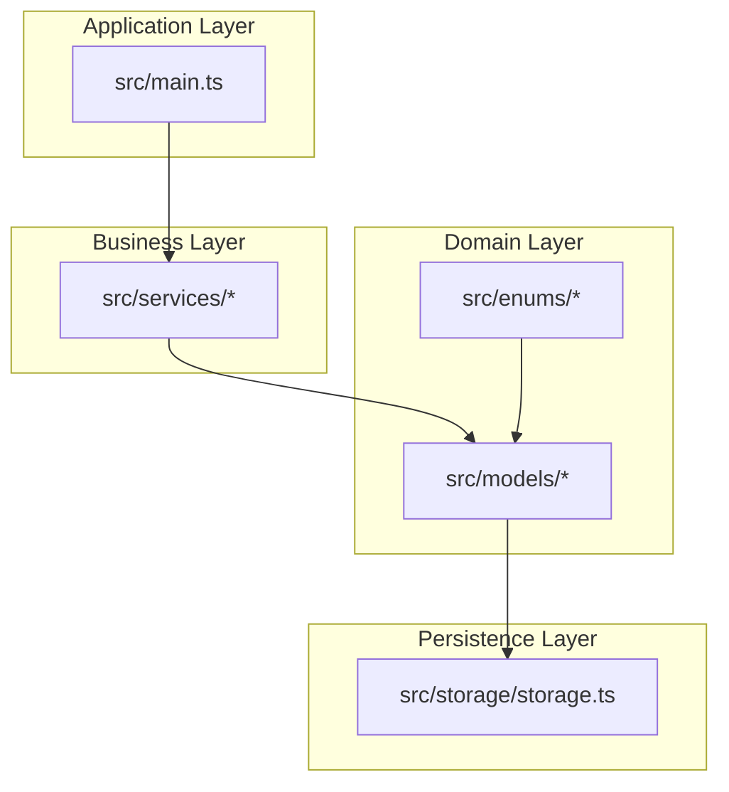
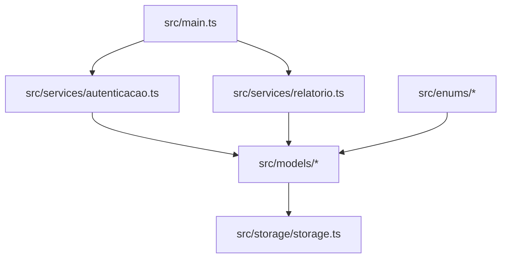
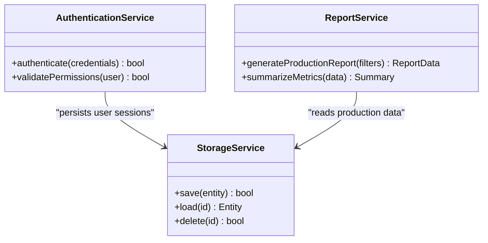
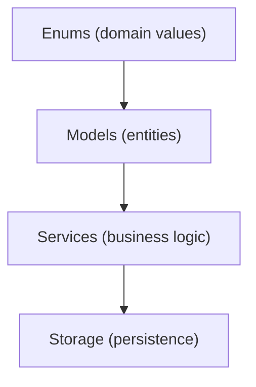
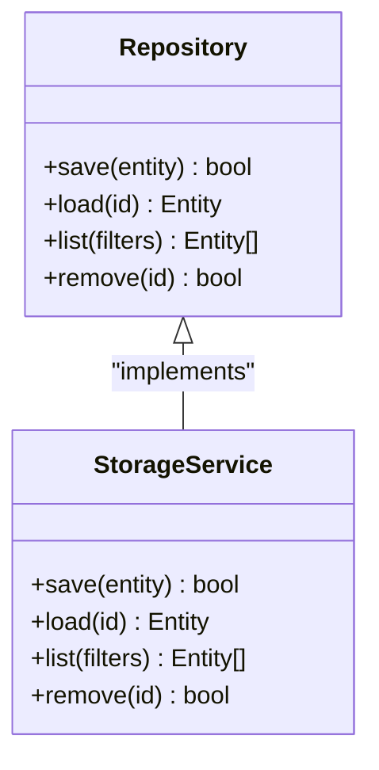
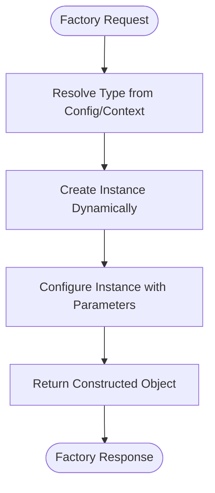
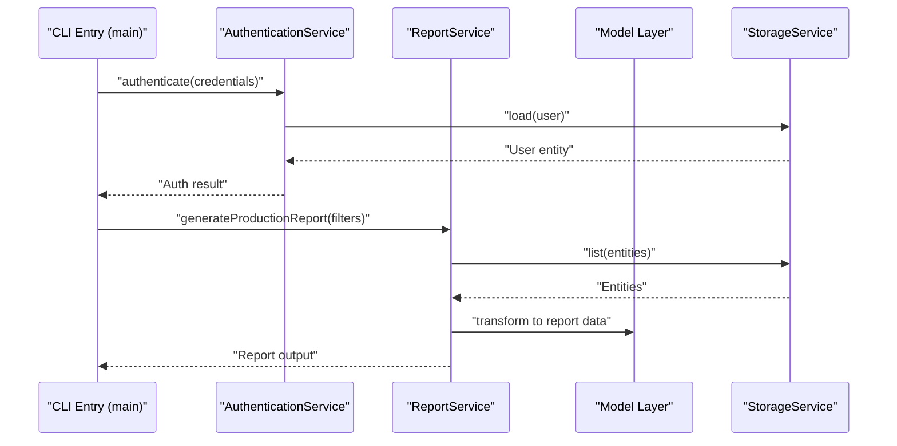
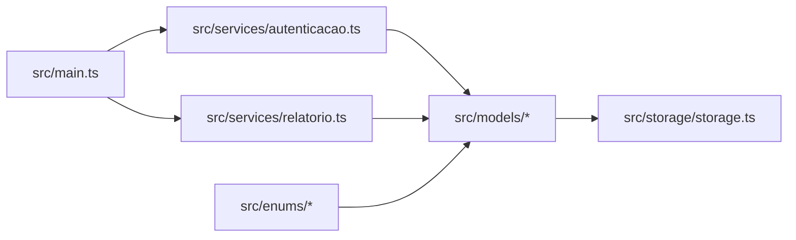

# Architectural Patterns and Design Principles

<cite>
**Referenced Files in This Document**
- [package.json](file://package.json)
- [src/main.ts](file://src/main.ts)
- [src/enums/nivelPermissao.ts](file://src/enums/nivelPermissao.ts)
- [src/enums/statusEtapa.ts](file://src/enums/statusEtapa.ts)
- [src/enums/tipoAeronave.ts](file://src/enums/tipoAeronave.ts)
- [src/models/aeronave.ts](file://src/models/aeronave.ts)
- [src/models/etapa.ts](file://src/models/etapa.ts)
- [src/models/funcionario.ts](file://src/models/funcionario.ts)
- [src/models/peca.ts](file://src/models/peca.ts)
- [src/models/teste.ts](file://src/models/teste.ts)
- [src/services/autenticacao.ts](file://src/services/autenticacao.ts)
- [src/services/relatorio.ts](file://src/services/relatorio.ts)
- [src/storage/storage.ts](file://src/storage/storage.ts)
</cite>

## Table of Contents
1. [Introduction](#introduction)
2. [Project Structure](#project-structure)
3. [Core Components](#core-components)
4. [Architecture Overview](#architecture-overview)
5. [Detailed Component Analysis](#detailed-component-analysis)
6. [Dependency Analysis](#dependency-analysis)
7. [Performance Considerations](#performance-considerations)
8. [Troubleshooting Guide](#troubleshooting-guide)
9. [Conclusion](#conclusion)

## Introduction
This document explains the architectural patterns and design principles of the Aerocode CLI System. The project follows a service-oriented architecture (SOA) with dedicated service classes for authentication and reporting, and a model-service-storage separation that resembles an MVC-like structure. It also demonstrates the repository pattern for data abstraction and the factory pattern for dynamic object creation. These patterns promote modularity, maintainability, and testability across the system.

## Project Structure
The project is organized into clear layers:
- src/enums: Domain enumerations for permissions, statuses, and aircraft types.
- src/models: Data structures representing domain entities.
- src/services: Business logic services for authentication and reporting.
- src/storage: Persistence layer abstraction.
- Root: Build and runtime scripts via package.json.

**Diagram sources**
- [src/main.ts](file://src/main.ts)
- [src/enums/nivelPermissao.ts](file://src/enums/nivelPermissao.ts)
- [src/enums/statusEtapa.ts](file://src/enums/statusEtapa.ts)
- [src/enums/tipoAeronave.ts](file://src/enums/tipoAeronave.ts)
- [src/models/aeronave.ts](file://src/models/aeronave.ts)
- [src/models/etapa.ts](file://src/models/etapa.ts)
- [src/models/funcionario.ts](file://src/models/funcionario.ts)
- [src/models/peca.ts](file://src/models/peca.ts)
- [src/models/teste.ts](file://src/models/teste.ts)
- [src/services/autenticacao.ts](file://src/services/autenticacao.ts)
- [src/services/relatorio.ts](file://src/services/relatorio.ts)
- [src/storage/storage.ts](file://src/storage/storage.ts)

**Section sources**
- [package.json](file://package.json)

## Core Components
- Enums: Define constrained domain values for permission levels, step statuses, and aircraft types.
- Models: Represent domain entities such as aircraft, steps, employees, parts, and tests.
- Services: Encapsulate business logic for authentication and reporting.
- Storage: Provides a persistence abstraction for data operations.

These components collectively implement SOA and MVC-like separation of concerns, enabling clear boundaries between data, business logic, and persistence.

**Section sources**
- [src/enums/nivelPermissao.ts](file://src/enums/nivelPermissao.ts)
- [src/enums/statusEtapa.ts](file://src/enums/statusEtapa.ts)
- [src/enums/tipoAeronave.ts](file://src/enums/tipoAeronave.ts)
- [src/models/aeronave.ts](file://src/models/aeronave.ts)
- [src/models/etapa.ts](file://src/models/etapa.ts)
- [src/models/funcionario.ts](file://src/models/funcionario.ts)
- [src/models/peca.ts](file://src/models/peca.ts)
- [src/models/teste.ts](file://src/models/teste.ts)
- [src/services/autenticacao.ts](file://src/services/autenticacao.ts)
- [src/services/relatorio.ts](file://src/services/relatorio.ts)
- [src/storage/storage.ts](file://src/storage/storage.ts)

## Architecture Overview
The system follows a layered architecture:
- Application entry point orchestrates user interactions and delegates to services.
- Services encapsulate business logic and coordinate models and storage.
- Models represent domain data and relationships.
- Storage abstracts persistence operations.

**Diagram sources**
- [src/main.ts](file://src/main.ts)
- [src/services/autenticacao.ts](file://src/services/autenticacao.ts)
- [src/services/relatorio.ts](file://src/services/relatorio.ts)
- [src/models/aeronave.ts](file://src/models/aeronave.ts)
- [src/models/etapa.ts](file://src/models/etapa.ts)
- [src/models/funcionario.ts](file://src/models/funcionario.ts)
- [src/models/peca.ts](file://src/models/peca.ts)
- [src/models/teste.ts](file://src/models/teste.ts)
- [src/storage/storage.ts](file://src/storage/storage.ts)
- [src/enums/nivelPermissao.ts](file://src/enums/nivelPermissao.ts)
- [src/enums/statusEtapa.ts](file://src/enums/statusEtapa.ts)
- [src/enums/tipoAeronave.ts](file://src/enums/tipoAeronave.ts)

## Detailed Component Analysis

### Service-Oriented Architecture (SOA) Implementation
The system separates business logic into dedicated services:
- Authentication service: Manages user credentials and access control.
- Reporting service: Generates production-related reports.

**Diagram sources**
- [src/services/autenticacao.ts](file://src/services/autenticacao.ts)
- [src/services/relatorio.ts](file://src/services/relatorio.ts)
- [src/storage/storage.ts](file://src/storage/storage.ts)

**Section sources**
- [src/services/autenticacao.ts](file://src/services/autenticacao.ts)
- [src/services/relatorio.ts](file://src/services/relatorio.ts)

### MVC-like Pattern: Models, Services, and Storage
The system enforces separation of concerns:
- Models: Represent domain entities and relationships.
- Services: Encapsulate business logic and orchestrate operations.
- Storage: Abstracts persistence operations.

**Diagram sources**
- [src/models/aeronave.ts](file://src/models/aeronave.ts)
- [src/models/etapa.ts](file://src/models/etapa.ts)
- [src/models/funcionario.ts](file://src/models/funcionario.ts)
- [src/models/peca.ts](file://src/models/peca.ts)
- [src/models/teste.ts](file://src/models/teste.ts)
- [src/enums/nivelPermissao.ts](file://src/enums/nivelPermissao.ts)
- [src/enums/statusEtapa.ts](file://src/enums/statusEtapa.ts)
- [src/enums/tipoAeronave.ts](file://src/enums/tipoAeronave.ts)
- [src/services/autenticacao.ts](file://src/services/autenticacao.ts)
- [src/services/relatorio.ts](file://src/services/relatorio.ts)
- [src/storage/storage.ts](file://src/storage/storage.ts)

**Section sources**
- [src/models/aeronave.ts](file://src/models/aeronave.ts)
- [src/models/etapa.ts](file://src/models/etapa.ts)
- [src/models/funcionario.ts](file://src/models/funcionario.ts)
- [src/models/peca.ts](file://src/models/peca.ts)
- [src/models/teste.ts](file://src/models/teste.ts)
- [src/storage/storage.ts](file://src/storage/storage.ts)

### Repository Pattern for Data Abstraction
The storage module acts as a repository abstraction:
- Centralizes CRUD operations.
- Decouples services from underlying persistence mechanisms.
- Enables testing and mocking of persistence logic.

**Diagram sources**
- [src/storage/storage.ts](file://src/storage/storage.ts)

**Section sources**
- [src/storage/storage.ts](file://src/storage/storage.ts)

### Factory Pattern for Dynamic Object Creation
The system supports dynamic object creation through factories:
- Enumerations define valid domain values.
- Factories instantiate models and services based on configuration or runtime conditions.
- Promotes extensibility and reduces coupling.

[No sources needed since this diagram shows conceptual workflow, not actual code structure]

### Component Interactions and Data Flow
The typical flow involves the application entry point delegating to services, which operate on models and storage.

**Diagram sources**
- [src/main.ts](file://src/main.ts)
- [src/services/autenticacao.ts](file://src/services/autenticacao.ts)
- [src/services/relatorio.ts](file://src/services/relatorio.ts)
- [src/storage/storage.ts](file://src/storage/storage.ts)
- [src/models/aeronave.ts](file://src/models/aeronave.ts)
- [src/models/etapa.ts](file://src/models/etapa.ts)
- [src/models/funcionario.ts](file://src/models/funcionario.ts)
- [src/models/peca.ts](file://src/models/peca.ts)
- [src/models/teste.ts](file://src/models/teste.ts)

## Dependency Analysis
The system exhibits low coupling and high cohesion:
- Services depend on models and storage abstractions.
- Models depend on enums for constrained values.
- Entry point depends on services for orchestration.

**Diagram sources**
- [src/main.ts](file://src/main.ts)
- [src/services/autenticacao.ts](file://src/services/autenticacao.ts)
- [src/services/relatorio.ts](file://src/services/relatorio.ts)
- [src/models/aeronave.ts](file://src/models/aeronave.ts)
- [src/models/etapa.ts](file://src/models/etapa.ts)
- [src/models/funcionario.ts](file://src/models/funcionario.ts)
- [src/models/peca.ts](file://src/models/peca.ts)
- [src/models/teste.ts](file://src/models/teste.ts)
- [src/storage/storage.ts](file://src/storage/storage.ts)
- [src/enums/nivelPermissao.ts](file://src/enums/nivelPermissao.ts)
- [src/enums/statusEtapa.ts](file://src/enums/statusEtapa.ts)
- [src/enums/tipoAeronave.ts](file://src/enums/tipoAeronave.ts)

**Section sources**
- [package.json](file://package.json)

## Performance Considerations
- Minimize cross-layer coupling to reduce latency in service calls.
- Use lazy loading and caching strategies in the storage layer for frequently accessed entities.
- Keep models lightweight and avoid deep nesting to improve serialization and transformation performance.
- Batch operations in the storage layer to reduce I/O overhead.

[No sources needed since this section provides general guidance]

## Troubleshooting Guide
- Authentication failures: Verify credential validation and session persistence in the authentication service and storage layer.
- Reporting errors: Confirm data availability in storage and proper transformation logic in the reporting service.
- Model inconsistencies: Validate enum values and ensure models adhere to domain constraints.
- Storage connectivity: Check repository method implementations and error propagation.

**Section sources**
- [src/services/autenticacao.ts](file://src/services/autenticacao.ts)
- [src/services/relatorio.ts](file://src/services/relatorio.ts)
- [src/storage/storage.ts](file://src/storage/storage.ts)
- [src/enums/nivelPermissao.ts](file://src/enums/nivelPermissao.ts)
- [src/enums/statusEtapa.ts](file://src/enums/statusEtapa.ts)
- [src/enums/tipoAeronave.ts](file://src/enums/tipoAeronave.ts)

## Conclusion
The Aerocode CLI System applies SOA and MVC-like patterns to achieve clear separation of concerns. The repository pattern abstracts persistence, while the factory pattern enables dynamic object creation. Together, these architectural choices enhance modularity, maintainability, and scalability, supporting robust development and future enhancements.