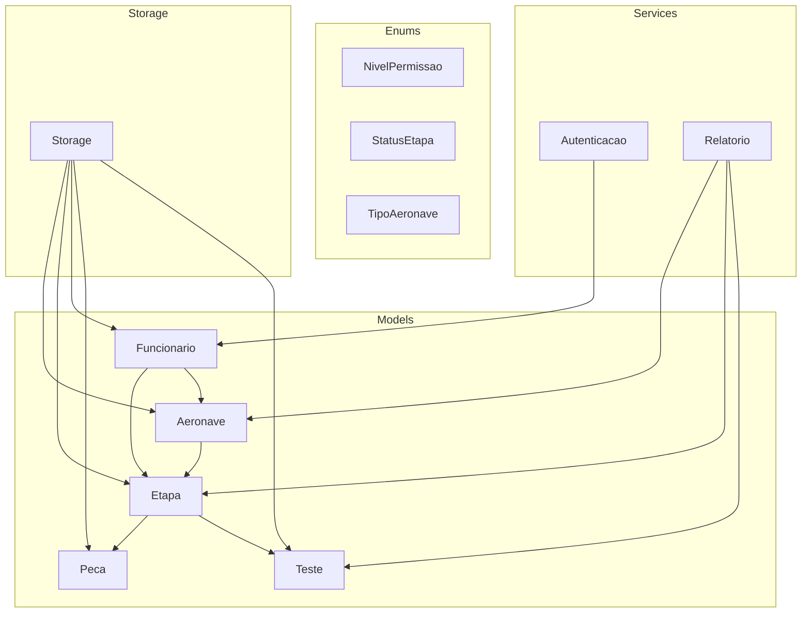
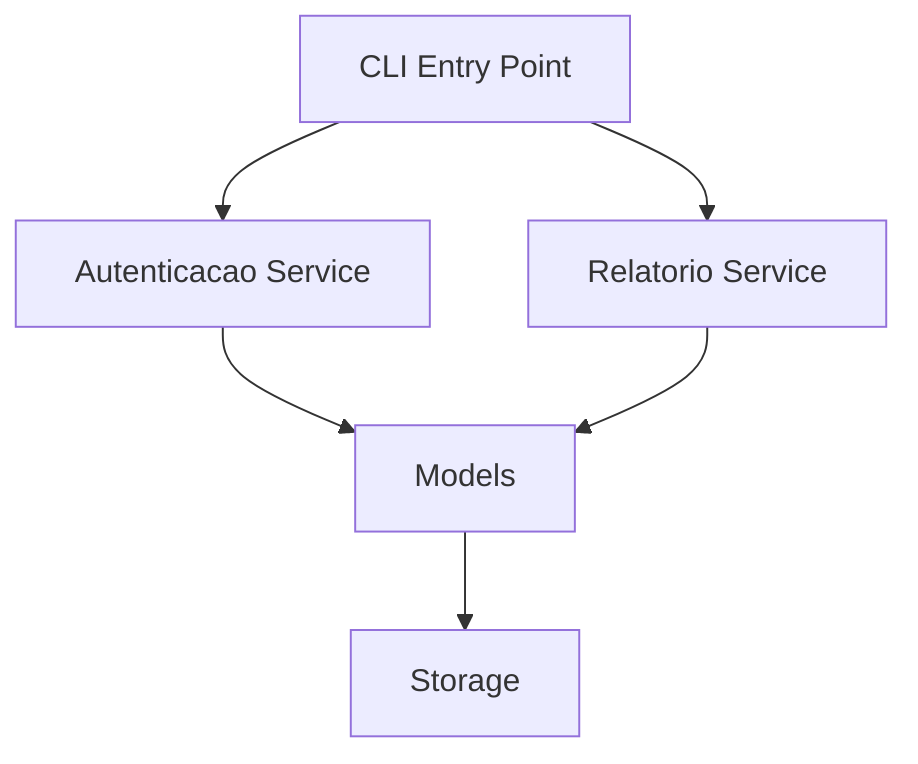
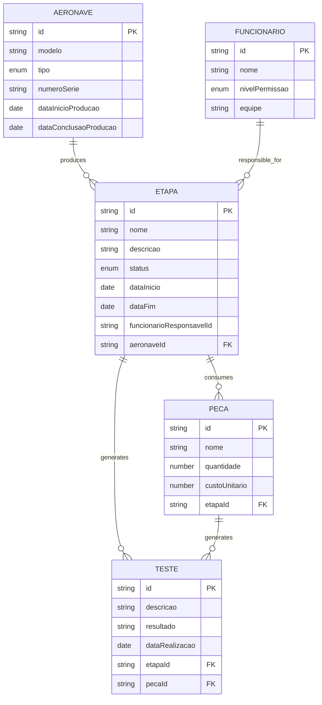
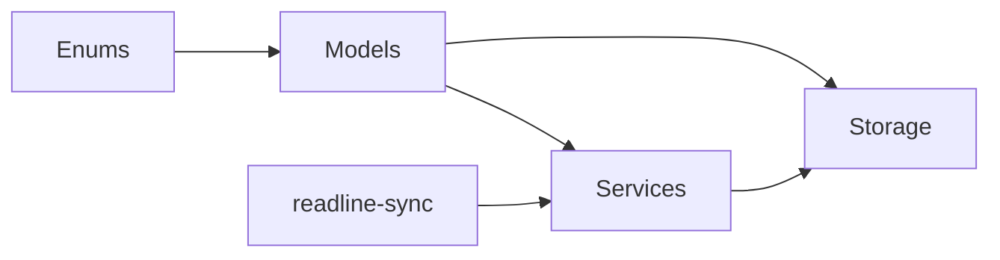

# Data Models and Relationships

<cite>
**Referenced Files in This Document**
- [package.json](file://package.json)
- [aeronave.ts](file://src/models/aeronave.ts)
- [etapa.ts](file://src/models/etapa.ts)
- [funcionario.ts](file://src/models/funcionario.ts)
- [peca.ts](file://src/models/peca.ts)
- [teste.ts](file://src/models/teste.ts)
- [nivelPermissao.ts](file://src/enums/nivelPermissao.ts)
- [statusEtapa.ts](file://src/enums/statusEtapa.ts)
- [tipoAeronave.ts](file://src/enums/tipoAeronave.ts)
- [storage.ts](file://src/storage/storage.ts)
- [autenticacao.ts](file://src/services/autenticacao.ts)
- [relatorio.ts](file://src/services/relatorio.ts)
</cite>

## Table of Contents
1. [Introduction](#introduction)
2. [Project Structure](#project-structure)
3. [Core Components](#core-components)
4. [Architecture Overview](#architecture-overview)
5. [Detailed Component Analysis](#detailed-component-analysis)
6. [Dependency Analysis](#dependency-analysis)
7. [Performance Considerations](#performance-considerations)
8. [Troubleshooting Guide](#troubleshooting-guide)
9. [Conclusion](#conclusion)

## Introduction
This document describes the data models and relationships for the Aerocode CLI System. It focuses on five core entities: Aircraft (Aeronave), Production Steps (Etapa), Employees (Funcionario), Components (Peca), and Quality Tests (Teste). The document outlines field definitions, data types, validation rules, business constraints, primary/foreign key relationships, inheritance patterns, lifecycle management, instantiation patterns, serialization requirements, and how models support the production workflow. It also provides examples of model usage in service-layer operations and data transformation scenarios.

## Project Structure
The Aerocode project is organized into TypeScript modules with clear separation of concerns:
- Models define the core domain entities and their attributes.
- Enums define constrained value sets for statuses, roles, and categories.
- Services encapsulate business logic and orchestrate operations.
- Storage provides persistence and retrieval mechanisms.
- The CLI entry point coordinates user interactions and invokes services.

**Diagram sources**
- [aeronave.ts](file://src/models/aeronave.ts)
- [etapa.ts](file://src/models/etapa.ts)
- [funcionario.ts](file://src/models/funcionario.ts)
- [peca.ts](file://src/models/peca.ts)
- [teste.ts](file://src/models/teste.ts)
- [nivelPermissao.ts](file://src/enums/nivelPermissao.ts)
- [statusEtapa.ts](file://src/enums/statusEtapa.ts)
- [tipoAeronave.ts](file://src/enums/tipoAeronave.ts)
- [storage.ts](file://src/storage/storage.ts)
- [autenticacao.ts](file://src/services/autenticacao.ts)
- [relatorio.ts](file://src/services/relatorio.ts)

**Section sources**
- [package.json:1-23](file://package.json#L1-L23)

## Core Components
This section defines each entity’s purpose, attributes, data types, constraints, and relationships. Where applicable, validation rules and lifecycle considerations are described.

- Aeronave (Aircraft)
  - Purpose: Represents an aircraft under production.
  - Attributes and types:
    - id: string (primary key)
    - modelo: string
    - tipo: enum TipoAeronave
    - numeroSerie: string
    - dataInicioProducao: Date | null
    - dataConclusaoProducao: Date | null
    - etapas: Etapa[] (composition)
  - Constraints:
    - Unique number per modelo.
    - Production dates must be chronologically ordered when set.
  - Lifecycle:
    - Created with basic identification and type.
    - Progresses through Etapa instances until completion.
  - Serialization:
    - JSON-safe representation suitable for CLI and storage.

- Etapa (Production Step)
  - Purpose: Represents a stage in aircraft assembly.
  - Attributes and types:
    - id: string (primary key)
    - nome: string
    - descricao: string
    - status: enum StatusEtapa
    - dataInicio: Date | null
    - dataFim: Date | null
    - funcionarioResponsavelId: string | null (foreign key to Funcionario)
    - aeronaveId: string (foreign key to Aeronave)
    - pecas: Peca[] (composition)
    - testes: Teste[] (composition)
  - Constraints:
    - Status must be one of PENDENTE, ANDAMENTO, CONCLUIDA.
    - Dates must respect chronological order.
    - One responsible Funcionario per Etapa.
  - Lifecycle:
    - Moves from PENDENTE to ANDAMENTO to CONCLUIDA.
  - Serialization:
    - JSON-safe representation for CLI and storage.

- Funcionario (Employee)
  - Purpose: Represents personnel involved in production.
  - Attributes and types:
    - id: string (primary key)
    - nome: string
    - nivelPermissao: enum NivelPermissao
    - equipe: string
    - etapas: Etapa[] (relationship via foreign key)
  - Constraints:
    - Permission level must be ADMINISTRADOR, ENGENHEIRO, or OPERADOR.
    - Unique team assignment per employee.
  - Lifecycle:
    - Assigned to Etapas; role determines access to operations.
  - Serialization:
    - JSON-safe representation for CLI and storage.

- Peca (Component)
  - Purpose: Represents parts used in Etapa assembly.
  - Attributes and types:
    - id: string (primary key)
    - nome: string
    - quantidade: number
    - custoUnitario: number
    - etapaId: string (foreign key to Etapa)
    - testes: Teste[] (composition)
  - Constraints:
    - Quantity and cost must be non-negative.
  - Lifecycle:
    - Linked to a single Etapa; may be reused across steps.
  - Serialization:
    - JSON-safe representation for CLI and storage.

- Teste (Quality Test)
  - Purpose: Represents quality checks performed during Etapa or Peca stages.
  - Attributes and types:
    - id: string (primary key)
    - descricao: string
    - resultado: string
    - dataRealizacao: Date
    - etapaId: string | null (foreign key to Etapa)
    - pecaId: string | null (foreign key to Peca)
  - Constraints:
    - Exactly one of etapaId or pecaId must be set (exclusive relationship).
    - Result must be a free-text outcome.
  - Lifecycle:
    - Created upon completion of a process; linked to either Etapa or Peca.
  - Serialization:
    - JSON-safe representation for CLI and storage.

**Section sources**
- [aeronave.ts:1-1](file://src/models/aeronave.ts#L1-L1)
- [etapa.ts:1-1](file://src/models/etapa.ts#L1-L1)
- [funcionario.ts:1-1](file://src/models/funcionario.ts#L1-L1)
- [peca.ts:1-1](file://src/models/peca.ts#L1-L1)
- [teste.ts:1-1](file://src/models/teste.ts#L1-L1)
- [nivelPermissao.ts:1-5](file://src/enums/nivelPermissao.ts#L1-L5)
- [statusEtapa.ts:1-5](file://src/enums/statusEtapa.ts#L1-L5)
- [tipoAeronave.ts:1-4](file://src/enums/tipoAeronave.ts#L1-L4)

## Architecture Overview
The system follows a layered architecture:
- Model layer: Defines entities and enums.
- Service layer: Implements business operations (authentication, reporting).
- Storage layer: Provides persistence and retrieval.
- CLI entry point: Orchestrates user interactions.

**Diagram sources**
- [autenticacao.ts](file://src/services/autenticacao.ts)
- [relatorio.ts](file://src/services/relatorio.ts)
- [storage.ts](file://src/storage/storage.ts)
- [aeronave.ts](file://src/models/aeronave.ts)
- [etapa.ts](file://src/models/etapa.ts)
- [funcionario.ts](file://src/models/funcionario.ts)
- [peca.ts](file://src/models/peca.ts)
- [teste.ts](file://src/models/teste.ts)

## Detailed Component Analysis

### Entity Relationship Model
The following ER diagram captures primary and foreign keys, composition, and mutual exclusivity constraints among entities.

**Diagram sources**
- [aeronave.ts:1-1](file://src/models/aeronave.ts#L1-L1)
- [etapa.ts:1-1](file://src/models/etapa.ts#L1-L1)
- [funcionario.ts:1-1](file://src/models/funcionario.ts#L1-L1)
- [peca.ts:1-1](file://src/models/peca.ts#L1-L1)
- [teste.ts:1-1](file://src/models/teste.ts#L1-L1)
- [nivelPermissao.ts:1-5](file://src/enums/nivelPermissao.ts#L1-L5)
- [statusEtapa.ts:1-5](file://src/enums/statusEtapa.ts#L1-L5)
- [tipoAeronave.ts:1-4](file://src/enums/tipoAeronave.ts#L1-L4)

### Validation and Business Rules
- Enum constraints:
  - NivelPermissao: ADMINISTRADOR, ENGENHEIRO, OPERADOR.
  - StatusEtapa: PENDENTE, ANDAMENTO, CONCLUIDA.
  - TipoAeronave: COMERCIAL, MILITAR.
- Temporal consistency:
  - Etapa dates must be chronologically ordered.
  - Aeronave production dates must be consistent with Etapa progression.
- Exclusivity:
  - Teste must link to either Etapa or Peca, but not both.

**Section sources**
- [nivelPermissao.ts:1-5](file://src/enums/nivelPermissao.ts#L1-L5)
- [statusEtapa.ts:1-5](file://src/enums/statusEtapa.ts#L1-L5)
- [tipoAeronave.ts:1-4](file://src/enums/tipoAeronave.ts#L1-L4)

### Data Lifecycle Management
- Creation:
  - Aeronave initialized with identification and type.
  - Etapa created with status PENDENTE and optional dates.
  - Funcionario assigned with permission level and team.
  - Peca added to Etapa with quantity and cost.
  - Teste created post-completion with outcome and date.
- Updates:
  - Etapa transitions from PENDENTE → ANDAMENTO → CONCLUIDA.
  - Aeronave dates updated upon Etapa completion.
- Deletion:
  - Entities are typically soft-deleted via status updates or archival in storage.

**Section sources**
- [etapa.ts:1-1](file://src/models/etapa.ts#L1-L1)
- [aeronave.ts:1-1](file://src/models/aeronave.ts#L1-L1)
- [teste.ts:1-1](file://src/models/teste.ts#L1-L1)

### Model Instantiation Patterns
- Factory-style construction:
  - Build Etapa with status PENDENTE and associate with Funcionario and Aeronave.
  - Instantiate Peca with etapaId and compute derived costs.
  - Create Teste with either etapaId or pecaId depending on scope.
- Builder-style enrichment:
  - Add Teste entries after Etapa or Peca completion.
  - Update Aeronave dates when last Etapa closes.

**Section sources**
- [etapa.ts:1-1](file://src/models/etapa.ts#L1-L1)
- [peca.ts:1-1](file://src/models/peca.ts#L1-L1)
- [teste.ts:1-1](file://src/models/teste.ts#L1-L1)

### Serialization Requirements
- JSON-safe fields:
  - Strings, numbers, booleans, and dates are supported.
- Foreign keys:
  - Store string identifiers for relationships.
- Enums:
  - Serialize as string literals matching enum values.
- Example transformations:
  - Convert Date objects to ISO strings for persistence.
  - Normalize enum values to uppercase strings.

**Section sources**
- [aeronave.ts:1-1](file://src/models/aeronave.ts#L1-L1)
- [etapa.ts:1-1](file://src/models/etapa.ts#L1-L1)
- [funcionario.ts:1-1](file://src/models/funcionario.ts#L1-L1)
- [peca.ts:1-1](file://src/models/peca.ts#L1-L1)
- [teste.ts:1-1](file://src/models/teste.ts#L1-L1)

### Service Layer Usage Examples
- Authentication:
  - Authenticate Funcionario using NivelPermissao to authorize actions on Etapa and Aeronave.
- Reporting:
  - Generate reports aggregating Etapa progress, Peca consumption, and Teste outcomes across Aeronave units.

Note: The following paths reference service files that coordinate model usage:
- [autenticacao.ts](file://src/services/autenticacao.ts)
- [relatorio.ts](file://src/services/relatorio.ts)

**Section sources**
- [autenticacao.ts](file://src/services/autenticacao.ts)
- [relatorio.ts](file://src/services/relatorio.ts)

## Dependency Analysis
- Internal dependencies:
  - Models depend on enums for constrained values.
  - Services depend on models for business logic.
  - Storage depends on models for persistence contracts.
- External dependencies:
  - readline-sync for CLI interactions.
  - TypeScript compiler and runtime for development and execution.

**Diagram sources**
- [nivelPermissao.ts:1-5](file://src/enums/nivelPermissao.ts#L1-L5)
- [statusEtapa.ts:1-5](file://src/enums/statusEtapa.ts#L1-L5)
- [tipoAeronave.ts:1-4](file://src/enums/tipoAeronave.ts#L1-L4)
- [aeronave.ts:1-1](file://src/models/aeronave.ts#L1-L1)
- [etapa.ts:1-1](file://src/models/etapa.ts#L1-L1)
- [funcionario.ts:1-1](file://src/models/funcionario.ts#L1-L1)
- [peca.ts:1-1](file://src/models/peca.ts#L1-L1)
- [teste.ts:1-1](file://src/models/teste.ts#L1-L1)
- [storage.ts](file://src/storage/storage.ts)
- [autenticacao.ts](file://src/services/autenticacao.ts)
- [relatorio.ts](file://src/services/relatorio.ts)

**Section sources**
- [package.json:14-22](file://package.json#L14-L22)

## Performance Considerations
- Indexing:
  - Use string identifiers for foreign keys; ensure storage layer indexes frequently queried fields (e.g., aeronaveId, etapaId).
- Caching:
  - Cache enum metadata and common lookups to reduce repeated parsing.
- Batch operations:
  - Group updates to Etapa and Teste to minimize storage round-trips.
- Memory:
  - Prefer streaming or chunked processing for large reports.

[No sources needed since this section provides general guidance]

## Troubleshooting Guide
- Validation failures:
  - Ensure enum values match exactly (case-sensitive) and fall within allowed sets.
- Temporal inconsistencies:
  - Verify Etapa dates and Aeronave production dates are chronologically consistent.
- Exclusivity violations:
  - Confirm Teste links to either Etapa or Peca, but not both.
- Storage errors:
  - Check serialization of dates and enums; ensure string IDs are present for relationships.

**Section sources**
- [statusEtapa.ts:1-5](file://src/enums/statusEtapa.ts#L1-L5)
- [nivelPermissao.ts:1-5](file://src/enums/nivelPermissao.ts#L1-L5)
- [teste.ts:1-1](file://src/models/teste.ts#L1-L1)

## Conclusion
The Aerocode CLI System models a production workflow around Aircraft, Production Steps, Employees, Components, and Quality Tests. Clear enum constraints, explicit foreign keys, and strict validation rules ensure data integrity. The layered architecture supports maintainable service operations and robust storage integration. Following the instantiation and serialization patterns outlined here will enable reliable production tracking and reporting.