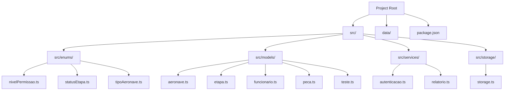
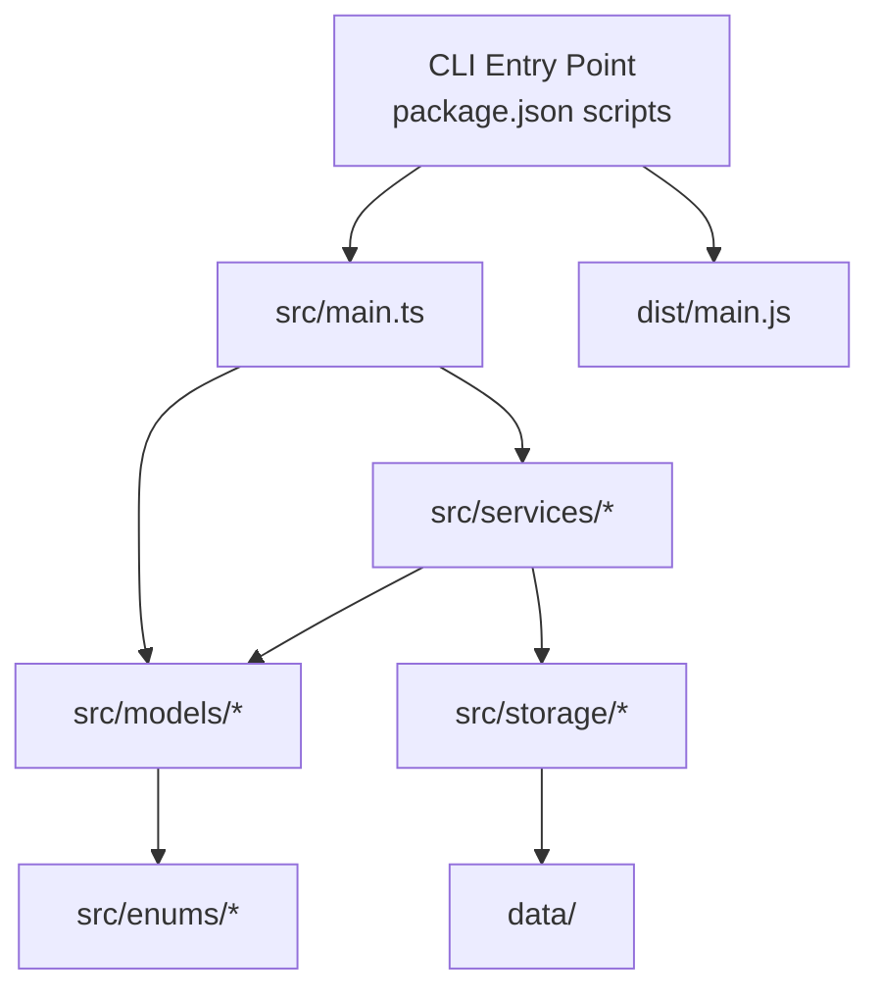
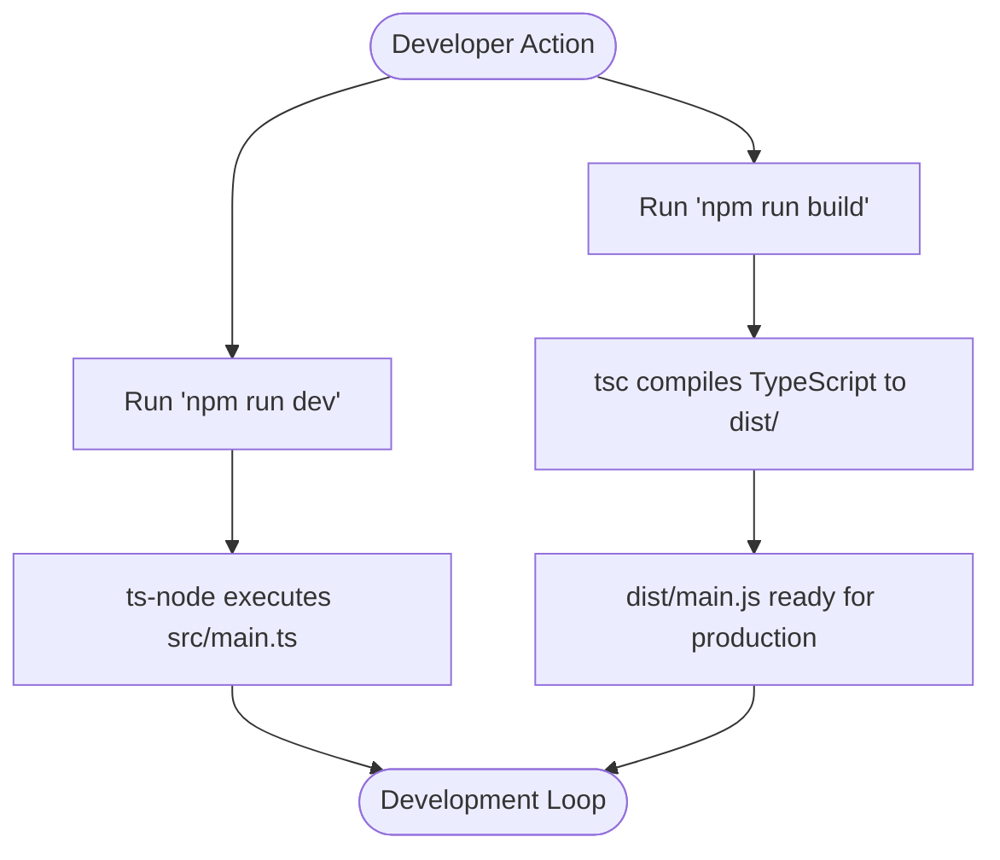
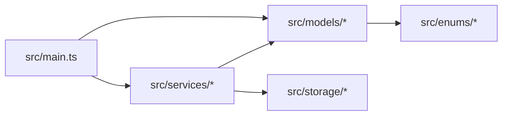

# Directory Structure and Organization

<cite>
**Referenced Files in This Document**
- [package.json](file://package.json)
- [main.ts](file://src/main.ts)
- [nivelPermissao.ts](file://src/enums/nivelPermissao.ts)
- [statusEtapa.ts](file://src/enums/statusEtapa.ts)
- [tipoAeronave.ts](file://src/enums/tipoAeronave.ts)
- [aeronave.ts](file://src/models/aeronave.ts)
- [etapa.ts](file://src/models/etapa.ts)
- [funcionario.ts](file://src/models/funcionario.ts)
- [peca.ts](file://src/models/peca.ts)
- [teste.ts](file://src/models/teste.ts)
- [autenticacao.ts](file://src/services/autenticacao.ts)
- [relatorio.ts](file://src/services/relatorio.ts)
- [storage.ts](file://src/storage/storage.ts)
</cite>

## Table of Contents
1. [Introduction](#introduction)
2. [Project Structure](#project-structure)
3. [Core Components](#core-components)
4. [Architecture Overview](#architecture-overview)
5. [Detailed Component Analysis](#detailed-component-analysis)
6. [Dependency Analysis](#dependency-analysis)
7. [Performance Considerations](#performance-considerations)
8. [Troubleshooting Guide](#troubleshooting-guide)
9. [Conclusion](#conclusion)

## Introduction
This document explains the Aerocode project's directory structure and organizational principles. Aerocode is a Command-Line Interface (CLI) system for aircraft production management written in TypeScript. The project follows a layered architecture with clear separation of concerns across directories: enums, models, services, and storage. The structure supports maintainability and scalability by enforcing consistent naming conventions, module organization, and build processes.

## Project Structure
The project is organized around a conventional TypeScript CLI layout with a focus on domain-driven separation:

- Root-level configuration defines the build pipeline and runtime entry point.
- The src directory contains the application source code grouped by responsibility:
  - enums: Domain enumerations for permissions, statuses, and aircraft types.
  - models: Domain entities and data structures representing aircraft, steps, employees, parts, and tests.
  - services: Business logic modules for authentication and reporting.
  - storage: Persistence layer abstraction for data storage.
- The data directory exists but appears unused in the current structure.

**Diagram sources**
- [package.json:1-23](file://package.json#L1-L23)
- [main.ts:1-50](file://src/main.ts#L1-L50)
- [nivelPermissao.ts:1-50](file://src/enums/nivelPermissao.ts#L1-L50)
- [statusEtapa.ts:1-50](file://src/enums/statusEtapa.ts#L1-L50)
- [tipoAeronave.ts:1-50](file://src/enums/tipoAeronave.ts#L1-L50)
- [aeronave.ts:1-50](file://src/models/aeronave.ts#L1-L50)
- [etapa.ts:1-50](file://src/models/etapa.ts#L1-L50)
- [funcionario.ts:1-50](file://src/models/funcionario.ts#L1-L50)
- [peca.ts:1-50](file://src/models/peca.ts#L1-L50)
- [teste.ts:1-50](file://src/models/teste.ts#L1-L50)
- [autenticacao.ts:1-50](file://src/services/autenticacao.ts#L1-L50)
- [relatorio.ts:1-50](file://src/services/relatorio.ts#L1-L50)
- [storage.ts:1-50](file://src/storage/storage.ts#L1-L50)

**Section sources**
- [package.json:1-23](file://package.json#L1-L23)
- [main.ts:1-50](file://src/main.ts#L1-L50)

## Core Components
This section documents the purpose and contents of each major directory and how they contribute to the overall architecture:

- enums: Centralizes domain constants and enumerations to avoid magic values and improve type safety. Examples include permission levels, step statuses, and aircraft types.
- models: Defines domain entities and related data structures. These represent core business objects such as aircraft, steps, employees, parts, and tests.
- services: Encapsulates business logic and operations. Authentication and reporting services demonstrate how domain actions are abstracted from the CLI interface.
- storage: Provides a dedicated layer for persistence concerns, enabling future database integrations while keeping domain logic isolated.

These directories collectively enforce separation of concerns, ensuring that business logic remains independent of data access and presentation concerns.

**Section sources**
- [nivelPermissao.ts:1-50](file://src/enums/nivelPermissao.ts#L1-L50)
- [statusEtapa.ts:1-50](file://src/enums/statusEtapa.ts#L1-L50)
- [tipoAeronave.ts:1-50](file://src/enums/tipoAeronave.ts#L1-L50)
- [aeronave.ts:1-50](file://src/models/aeronave.ts#L1-L50)
- [etapa.ts:1-50](file://src/models/etapa.ts#L1-L50)
- [funcionario.ts:1-50](file://src/models/funcionario.ts#L1-L50)
- [peca.ts:1-50](file://src/models/peca.ts#L1-L50)
- [teste.ts:1-50](file://src/models/teste.ts#L1-L50)
- [autenticacao.ts:1-50](file://src/services/autenticacao.ts#L1-L50)
- [relatorio.ts:1-50](file://src/services/relatorio.ts#L1-L50)
- [storage.ts:1-50](file://src/storage/storage.ts#L1-L50)

## Architecture Overview
The application follows a layered architecture with clear boundaries:

- Entry point: The CLI starts from the main entry script defined in package.json, which runs the compiled JavaScript in dist/main.js during production or ts-node for development.
- Domain model: Models encapsulate business entities and their relationships.
- Services: Encapsulate business operations and coordinate between models and storage.
- Persistence: Storage module abstracts data access, isolating domain logic from implementation details.
- Enums: Provide shared, typed constants across the application.

**Diagram sources**
- [package.json:6-10](file://package.json#L6-L10)
- [main.ts:1-50](file://src/main.ts#L1-L50)
- [storage.ts:1-50](file://src/storage/storage.ts#L1-L50)

**Section sources**
- [package.json:6-10](file://package.json#L6-L10)
- [main.ts:1-50](file://src/main.ts#L1-L50)

## Detailed Component Analysis

### TypeScript Compilation and Build Setup
- Build command: The project uses tsc to compile TypeScript sources into JavaScript under the dist directory.
- Runtime entry point: The main field in package.json points to dist/main.js, indicating the compiled output as the production entry point.
- Development workflow: The dev script leverages ts-node to execute TypeScript directly without pre-compilation, streamlining local development.

**Diagram sources**
- [package.json:6-10](file://package.json#L6-L10)

**Section sources**
- [package.json:6-10](file://package.json#L6-L10)

### Enumerations (src/enums)
Purpose:
- Provide strongly-typed constants for permission levels, step statuses, and aircraft types.
- Reduce errors by constraining values to predefined sets.

Organization principles:
- One file per logical enumeration group.
- Consistent naming aligned with domain vocabulary.

Maintainability and scalability:
- Centralized definitions enable easy updates and cross-cutting usage across models and services.

**Section sources**
- [nivelPermissao.ts:1-50](file://src/enums/nivelPermissao.ts#L1-L50)
- [statusEtapa.ts:1-50](file://src/enums/statusEtapa.ts#L1-L50)
- [tipoAeronave.ts:1-50](file://src/enums/tipoAeronave.ts#L1-L50)

### Models (src/models)
Purpose:
- Define core business entities and their attributes.
- Represent real-world concepts such as aircraft, steps, employees, parts, and tests.

Examples:
- Aircraft model: Represents an aircraft entity with associated properties.
- Step model: Represents production steps with status indicators.
- Employee model: Represents workforce data.
- Part model: Represents components used in production.
- Test model: Represents quality assurance checks.

Integration pattern:
- Models can import enums for constrained values and can be consumed by services for business operations.

**Section sources**
- [aeronave.ts:1-50](file://src/models/aeronave.ts#L1-L50)
- [etapa.ts:1-50](file://src/models/etapa.ts#L1-L50)
- [funcionario.ts:1-50](file://src/models/funcionario.ts#L1-L50)
- [peca.ts:1-50](file://src/models/peca.ts#L1-L50)
- [teste.ts:1-50](file://src/models/teste.ts#L1-L50)

### Services (src/services)
Purpose:
- Encapsulate business logic and operations.
- Coordinate between models and storage.

Examples:
- Authentication service: Handles user authentication flows.
- Reporting service: Generates reports based on models and storage data.

Integration pattern:
- Services depend on models for data representation and storage for persistence.
- This separation ensures that business logic remains independent of data access mechanisms.

**Section sources**
- [autenticacao.ts:1-50](file://src/services/autenticacao.ts#L1-L50)
- [relatorio.ts:1-50](file://src/services/relatorio.ts#L1-L50)

### Storage (src/storage)
Purpose:
- Abstract data persistence concerns.
- Isolate domain logic from implementation details of storage backends.

Current state:
- Contains a single storage module that serves as the central persistence interface.

Scalability:
- Future enhancements can introduce database adapters while keeping models and services unchanged.

**Section sources**
- [storage.ts:1-50](file://src/storage/storage.ts#L1-L50)

### Entry Point (src/main.ts)
Purpose:
- Acts as the CLI entry point.
- Initializes the application and orchestrates user interactions.

Integration:
- Imports and coordinates models, services, and storage to fulfill CLI commands.

**Section sources**
- [main.ts:1-50](file://src/main.ts#L1-L50)

## Dependency Analysis
The project exhibits clean dependency relationships:

- Entry point depends on models and services.
- Services depend on models and storage.
- Models depend on enums for constrained values.
- Storage is a leaf dependency, consumed by services.

**Diagram sources**
- [main.ts:1-50](file://src/main.ts#L1-L50)
- [storage.ts:1-50](file://src/storage/storage.ts#L1-L50)
- [autenticacao.ts:1-50](file://src/services/autenticacao.ts#L1-L50)
- [relatorio.ts:1-50](file://src/services/relatorio.ts#L1-L50)
- [aeronave.ts:1-50](file://src/models/aeronave.ts#L1-L50)
- [nivelPermissao.ts:1-50](file://src/enums/nivelPermissao.ts#L1-L50)

**Section sources**
- [main.ts:1-50](file://src/main.ts#L1-L50)
- [storage.ts:1-50](file://src/storage/storage.ts#L1-L50)
- [autenticacao.ts:1-50](file://src/services/autenticacao.ts#L1-L50)
- [relatorio.ts:1-50](file://src/services/relatorio.ts#L1-L50)
- [aeronave.ts:1-50](file://src/models/aeronave.ts#L1-L50)
- [nivelPermissao.ts:1-50](file://src/enums/nivelPermissao.ts#L1-L50)

## Performance Considerations
- Compilation: Using tsc ensures fast production startup via precompiled JavaScript.
- Development: ts-node enables quick iteration during development without manual recompilation.
- Separation of concerns: Clear boundaries between models, services, and storage reduce coupling and improve testability, indirectly supporting performance through maintainable code.

[No sources needed since this section provides general guidance]

## Troubleshooting Guide
Common issues and resolutions:
- Build failures: Verify TypeScript configuration and ensure all source files compile cleanly.
- Runtime errors: Confirm that dist/main.js exists after building and that the main field in package.json points to the correct location.
- Development issues: Ensure ts-node and TypeScript devDependencies are installed and that src/main.ts is executable.

**Section sources**
- [package.json:6-10](file://package.json#L6-L10)

## Conclusion
Aerocode’s directory structure enforces separation of concerns through enums, models, services, and storage. The TypeScript build and development workflow supports efficient iteration and reliable production deployment. Following the established patterns ensures maintainability and scalability as the project evolves.