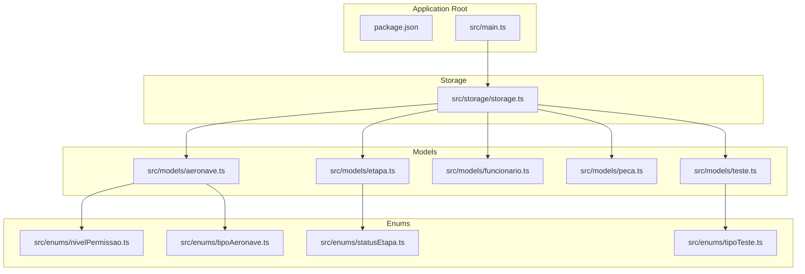
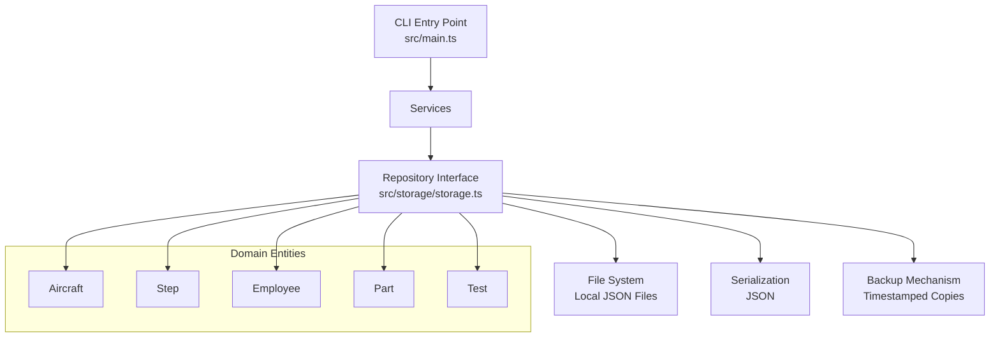
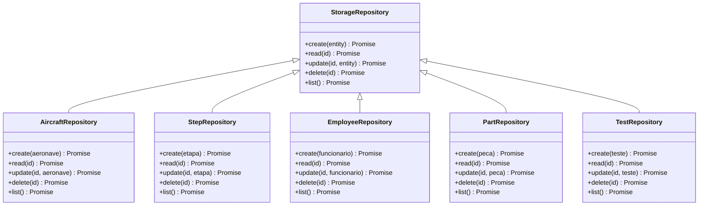
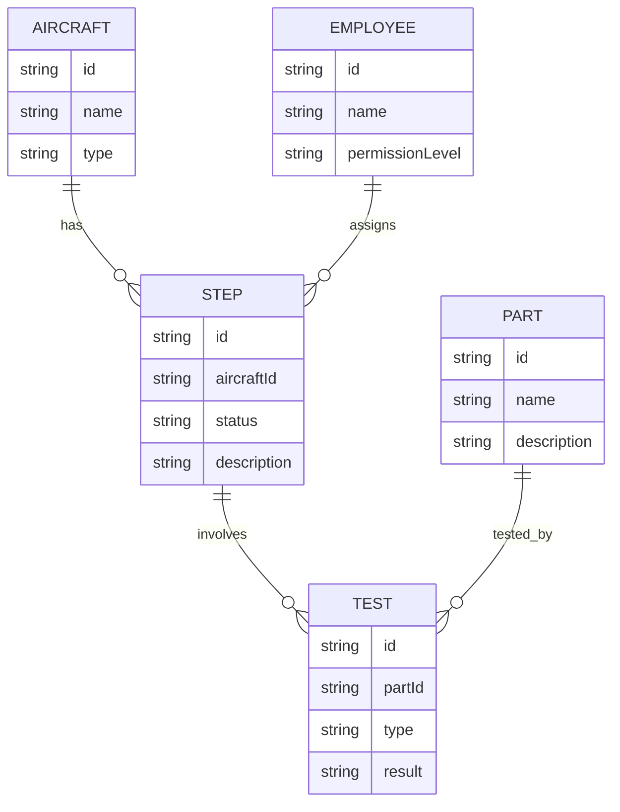
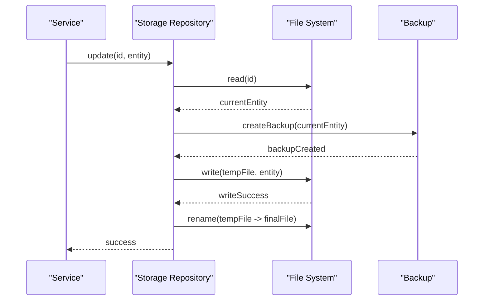
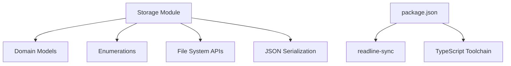

# Storage Layer Implementation

<cite>
**Referenced Files in This Document**
- [main.ts](file://src/main.ts)
- [storage.ts](file://src/storage/storage.ts)
- [aeronave.ts](file://src/models/aeronave.ts)
- [etapa.ts](file://src/models/etapa.ts)
- [funcionario.ts](file://src/models/funcionario.ts)
- [peca.ts](file://src/models/peca.ts)
- [teste.ts](file://src/models/teste.ts)
- [nivelPermissao.ts](file://src/enums/nivelPermissao.ts)
- [statusEtapa.ts](file://src/enums/statusEtapa.ts)
- [tipoAeronave.ts](file://src/enums/tipoAeronave.ts)
- [tipoTeste.ts](file://src/enums/tipoTeste.ts)
- [package.json](file://package.json)
</cite>

## Table of Contents
1. [Introduction](#introduction)
2. [Project Structure](#project-structure)
3. [Core Components](#core-components)
4. [Architecture Overview](#architecture-overview)
5. [Detailed Component Analysis](#detailed-component-analysis)
6. [Dependency Analysis](#dependency-analysis)
7. [Performance Considerations](#performance-considerations)
8. [Troubleshooting Guide](#troubleshooting-guide)
9. [Conclusion](#conclusion)
10. [Appendices](#appendices)

## Introduction
This document explains the storage layer implementation and file system integration for the Aerocode CLI application. It focuses on the repository pattern design, data persistence operations, file system abstractions, and serialization mechanisms used to persist domain entities. It also documents the local file storage approach, data directory structure, backup operations, error handling strategies, and data integrity measures. Finally, it outlines CRUD operation patterns, retrieval strategies, integration with the broader service layer, performance considerations, scalability limitations, and potential migration paths to alternative storage backends.

## Project Structure
The repository follows a layered structure with clear separation between models, services, enums, and storage. The storage module encapsulates persistence concerns behind a repository-like interface, while models define the domain entities and enums represent typed enumerations used across the system.

**Diagram sources**
- [main.ts](file://src/main.ts)
- [storage.ts](file://src/storage/storage.ts)
- [aeronave.ts](file://src/models/aeronave.ts)
- [etapa.ts](file://src/models/etapa.ts)
- [funcionario.ts](file://src/models/funcionario.ts)
- [peca.ts](file://src/models/peca.ts)
- [teste.ts](file://src/models/teste.ts)
- [nivelPermissao.ts](file://src/enums/nivelPermissao.ts)
- [statusEtapa.ts](file://src/enums/statusEtapa.ts)
- [tipoAeronave.ts](file://src/enums/tipoAeronave.ts)
- [tipoTeste.ts](file://src/enums/tipoTeste.ts)

**Section sources**
- [package.json](file://package.json)
- [main.ts](file://src/main.ts)
- [storage.ts](file://src/storage/storage.ts)

## Core Components
- Storage module: Provides a repository-like abstraction for data persistence and retrieval. It manages local file storage, serialization/deserialization, and backup operations.
- Domain models: Define the persisted entities and their relationships, including aircraft, steps, parts, employees, and tests.
- Enums: Provide strongly typed enumerations for permissions, statuses, and categories used by models.
- Application entry point: Initializes the CLI and orchestrates service-layer interactions, which in turn depend on the storage layer.

Key responsibilities:
- Encapsulate file system operations and JSON serialization.
- Implement CRUD operations for each entity type.
- Maintain data integrity via atomic writes and backups.
- Expose a clean interface for services to access and mutate data.

**Section sources**
- [storage.ts](file://src/storage/storage.ts)
- [aeronave.ts](file://src/models/aeronave.ts)
- [etapa.ts](file://src/models/etapa.ts)
- [funcionario.ts](file://src/models/funcionario.ts)
- [peca.ts](file://src/models/peca.ts)
- [teste.ts](file://src/models/teste.ts)
- [nivelPermissao.ts](file://src/enums/nivelPermissao.ts)
- [statusEtapa.ts](file://src/enums/statusEtapa.ts)
- [tipoAeronave.ts](file://src/enums/tipoAeronave.ts)
- [tipoTeste.ts](file://src/enums/tipoTeste.ts)

## Architecture Overview
The storage layer adheres to a repository pattern that abstracts persistence concerns. Services request data through a typed interface, while the storage module handles file I/O, serialization, and backup. The application entry point coordinates CLI interactions and delegates business logic to services.

**Diagram sources**
- [main.ts](file://src/main.ts)
- [storage.ts](file://src/storage/storage.ts)

## Detailed Component Analysis

### Storage Module (Repository Pattern)
The storage module defines a repository-like interface that exposes methods for creating, reading, updating, and deleting domain entities. It centralizes file system operations, JSON serialization, and backup logic.

- Responsibilities:
  - Local file storage with JSON serialization.
  - Atomic write operations to prevent corruption.
  - Backup creation before updates/deletes.
  - Entity-specific CRUD methods for each model.
  - Error handling and logging for I/O failures.

- Data directory structure:
  - Each entity type is stored in a dedicated folder under a configurable base path.
  - Files are named using unique identifiers to avoid collisions.
  - Backups are stored alongside original files with timestamp suffixes.

- Serialization mechanism:
  - Entities are serialized to JSON for persistence.
  - Deserialization reconstructs typed objects with proper field mapping.

- Backup operations:
  - Before mutating an existing record, a timestamped copy is created.
  - Backup filenames include a suffix indicating the backup timestamp.
  - Backups enable quick rollback and audit trails.

- Error handling strategies:
  - Try/catch blocks around file operations.
  - Validation of input parameters and identifiers.
  - Graceful degradation and informative error messages.
  - Logging of errors for diagnostics.

- Data integrity measures:
  - Atomic writes using temporary files followed by atomic rename.
  - Existence checks before updates/deletes.
  - Backup verification after successful mutations.

**Diagram sources**
- [storage.ts](file://src/storage/storage.ts)

**Section sources**
- [storage.ts](file://src/storage/storage.ts)

### Domain Models and Enumerations
Domain models define the shape and relationships of persisted entities. Enumerations provide strongly typed values for statuses, categories, and permissions.

- Aircraft model:
  - Identifies an aircraft with attributes aligned with its type enumeration.
  - Links to related entities such as steps and parts.

- Step model:
  - Represents production stages with status enumeration.
  - Associates with parts and tests.

- Employee model:
  - Holds employee details with permission level enumeration.

- Part model:
  - Represents components used in production.

- Test model:
  - Captures test results with category enumeration.

- Enumerations:
  - Permission levels, step statuses, aircraft types, and test types ensure type safety and consistency.

**Diagram sources**
- [aeronave.ts](file://src/models/aeronave.ts)
- [etapa.ts](file://src/models/etapa.ts)
- [funcionario.ts](file://src/models/funcionario.ts)
- [peca.ts](file://src/models/peca.ts)
- [teste.ts](file://src/models/teste.ts)
- [statusEtapa.ts](file://src/enums/statusEtapa.ts)
- [tipoAeronave.ts](file://src/enums/tipoAeronave.ts)
- [nivelPermissao.ts](file://src/enums/nivelPermissao.ts)
- [tipoTeste.ts](file://src/enums/tipoTeste.ts)

**Section sources**
- [aeronave.ts](file://src/models/aeronave.ts)
- [etapa.ts](file://src/models/etapa.ts)
- [funcionario.ts](file://src/models/funcionario.ts)
- [peca.ts](file://src/models/peca.ts)
- [teste.ts](file://src/models/teste.ts)
- [nivelPermissao.ts](file://src/enums/nivelPermissao.ts)
- [statusEtapa.ts](file://src/enums/statusEtapa.ts)
- [tipoAeronave.ts](file://src/enums/tipoAeronave.ts)
- [tipoTeste.ts](file://src/enums/tipoTeste.ts)

### CRUD Operation Flow
The following sequence illustrates a typical update operation for an entity, including backup creation and atomic write:

**Diagram sources**
- [storage.ts](file://src/storage/storage.ts)

**Section sources**
- [storage.ts](file://src/storage/storage.ts)

### Data Retrieval Patterns
- Single-entity retrieval: Load a specific entity by ID from its dedicated file.
- List retrieval: Enumerate all entities by scanning the entity’s directory and deserializing each file.
- Filtering and sorting: Apply client-side filtering/sorting on retrieved lists when needed.

**Section sources**
- [storage.ts](file://src/storage/storage.ts)

### Integration with the Service Layer
- Services depend on repository interfaces to access data.
- The CLI entry point initializes services and routes user commands to appropriate handlers.
- Storage exceptions propagate to services for centralized error handling and user feedback.

**Section sources**
- [main.ts](file://src/main.ts)
- [storage.ts](file://src/storage/storage.ts)

## Dependency Analysis
The storage module depends on:
- Domain models and enums for type-safe persistence.
- Node.js file system APIs for I/O operations.
- JSON serialization for data representation.

External dependencies:
- readline-sync for CLI interactions.
- TypeScript compiler and runtime for development and execution.

**Diagram sources**
- [storage.ts](file://src/storage/storage.ts)
- [package.json](file://package.json)

**Section sources**
- [package.json](file://package.json)
- [storage.ts](file://src/storage/storage.ts)

## Performance Considerations
- File I/O overhead: Each operation involves disk reads/writes; batch operations where possible to reduce I/O.
- Atomic writes: Using temporary files and atomic renames prevents corruption but adds extra write cycles.
- Backup frequency: Creating backups before every mutation ensures safety but increases I/O load; consider periodic backups for high-frequency updates.
- Serialization cost: JSON serialization/deserialization is lightweight but can accumulate with large datasets.
- Directory scanning: Listing all entities requires reading all files; consider indexing or metadata files for large-scale retrieval.

[No sources needed since this section provides general guidance]

## Troubleshooting Guide
Common issues and resolutions:
- File not found errors: Verify entity directories and filenames; ensure IDs correspond to existing records.
- Serialization errors: Confirm entity shapes match model definitions; check enum values align with allowed sets.
- Backup failures: Ensure write permissions in target directories; confirm sufficient disk space.
- Atomic write failures: Check filesystem support for atomic rename; retry operations if interrupted.
- Permission denied: Validate file ownership and access rights for the application user.

**Section sources**
- [storage.ts](file://src/storage/storage.ts)

## Conclusion
The storage layer implements a robust repository pattern with local file system persistence, JSON serialization, and backup mechanisms. It provides a clean interface for services, enforces data integrity, and supports basic CRUD operations across domain entities. While suitable for small to medium workloads, the current implementation has scalability limitations due to file I/O constraints. Migration to alternative backends (e.g., embedded databases or cloud storage) is feasible by swapping the storage implementation while preserving the repository interface contract.

[No sources needed since this section summarizes without analyzing specific files]

## Appendices

### Appendix A: Data Directory Layout
- Base directory: application-defined path for persistent data.
- Entity folders: separate directories per entity type.
- Files: JSON-formatted records named by unique identifiers.
- Backups: timestamped copies co-located with original files.

**Section sources**
- [storage.ts](file://src/storage/storage.ts)

### Appendix B: Example Operation Workflows
- Create: Serialize entity → write to temp file → atomic rename → finalize.
- Read: Deserialize JSON from file → return typed entity.
- Update: Read current → backup → serialize new → write temp → atomic rename.
- Delete: Read current → backup → remove file → finalize.

**Section sources**
- [storage.ts](file://src/storage/storage.ts)