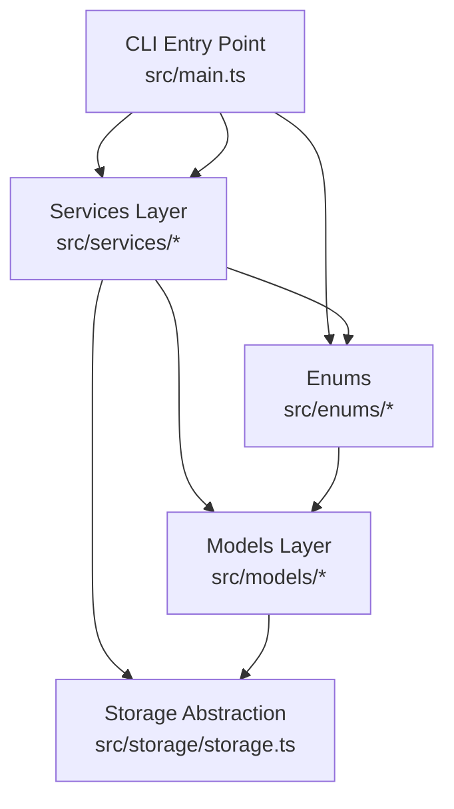
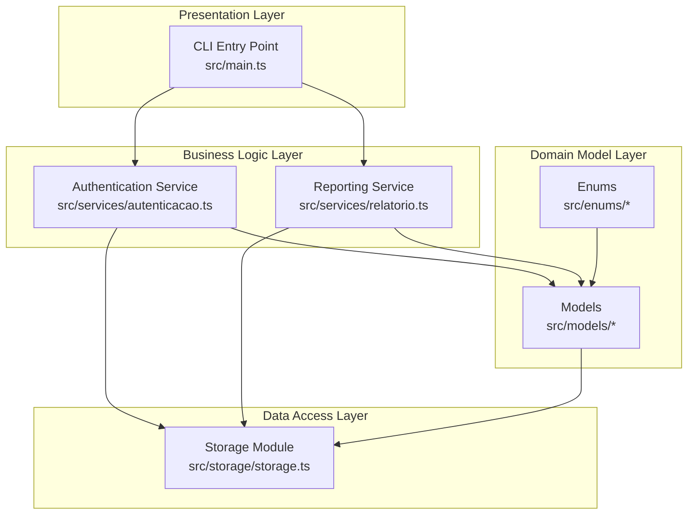
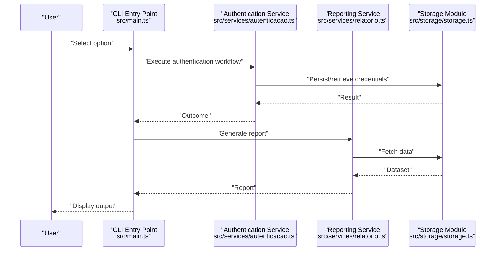
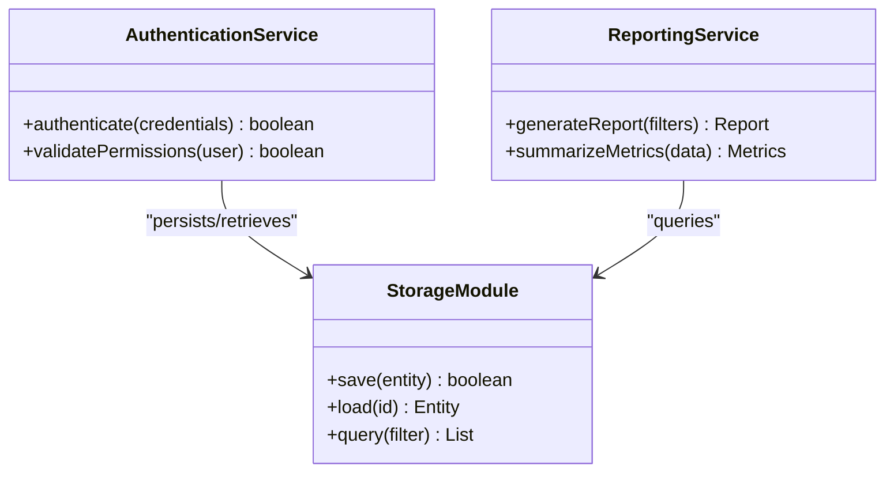
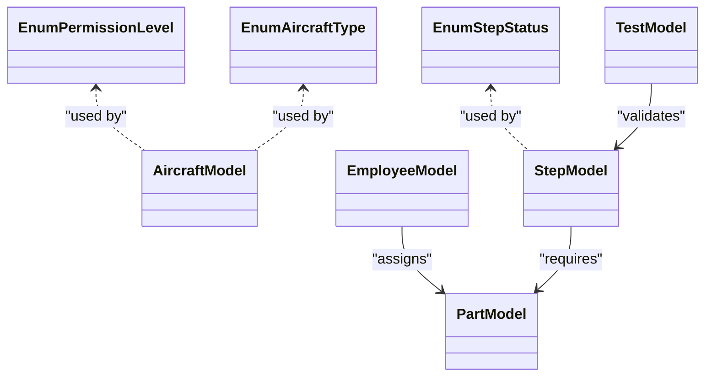
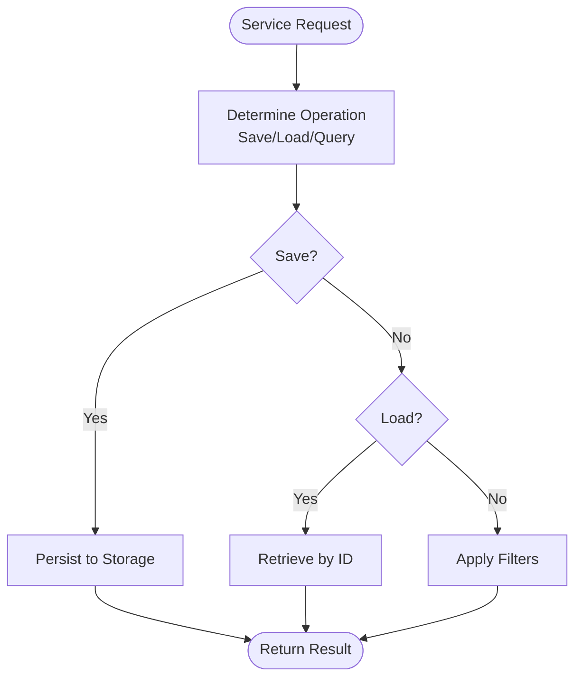
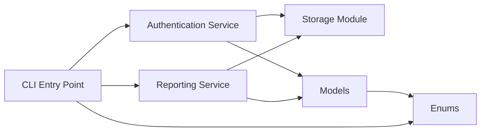

# Technical Architecture

<cite>
**Referenced Files in This Document**
- [package.json](file://package.json)
- [src/main.ts](file://src/main.ts)
- [src/enums/nivelPermissao.ts](file://src/enums/nivelPermissao.ts)
- [src/enums/statusEtapa.ts](file://src/enums/statusEtapa.ts)
- [src/enums/tipoAeronave.ts](file://src/enums/tipoAeronave.ts)
- [src/models/aeronave.ts](file://src/models/aeronave.ts)
- [src/models/etapa.ts](file://src/models/etapa.ts)
- [src/models/funcionario.ts](file://src/models/funcionario.ts)
- [src/models/peca.ts](file://src/models/peca.ts)
- [src/models/teste.ts](file://src/models/teste.ts)
- [src/services/autenticacao.ts](file://src/services/autenticacao.ts)
- [src/services/relatorio.ts](file://src/services/relatorio.ts)
- [src/storage/storage.ts](file://src/storage/storage.ts)
</cite>

## Table of Contents
1. [Introduction](#introduction)
2. [Project Structure](#project-structure)
3. [Core Components](#core-components)
4. [Architecture Overview](#architecture-overview)
5. [Detailed Component Analysis](#detailed-component-analysis)
6. [Dependency Analysis](#dependency-analysis)
7. [Performance Considerations](#performance-considerations)
8. [Troubleshooting Guide](#troubleshooting-guide)
9. [Conclusion](#conclusion)

## Introduction
This document describes the technical architecture of the Aerocode CLI System. The system follows a service-oriented, layered design with clear separation between:
- UI (CLI): Command-line interface orchestrating user interactions
- Business logic (Services): Domain-specific operations and workflows
- Data layer (Models and Storage): Data structures and persistence abstraction

The architecture also demonstrates an MVC-like pattern where the CLI acts as the controller, services encapsulate model logic, and storage abstracts persistence. The repository pattern is evident in the storage module’s role as a data access boundary. The codebase is organized in a modular TypeScript structure, enabling maintainability, testability, and extensibility.

## Project Structure
The project is organized into distinct modules:
- src/enums: Type-safe enumerations for domain constants
- src/models: Data models representing entities and their attributes
- src/services: Business logic services implementing domain operations
- src/storage: Persistence abstraction and data access utilities
- src/main.ts: Application entry point and CLI orchestration
- package.json: Build scripts and dependencies

**Diagram sources**
- [src/main.ts](file://src/main.ts)
- [src/services/autenticacao.ts](file://src/services/autenticacao.ts)
- [src/services/relatorio.ts](file://src/services/relatorio.ts)
- [src/models/aeronave.ts](file://src/models/aeronave.ts)
- [src/models/etapa.ts](file://src/models/etapa.ts)
- [src/models/funcionario.ts](file://src/models/funcionario.ts)
- [src/models/peca.ts](file://src/models/peca.ts)
- [src/models/teste.ts](file://src/models/teste.ts)
- [src/storage/storage.ts](file://src/storage/storage.ts)
- [src/enums/nivelPermissao.ts](file://src/enums/nivelPermissao.ts)
- [src/enums/statusEtapa.ts](file://src/enums/statusEtapa.ts)
- [src/enums/tipoAeronave.ts](file://src/enums/tipoAeronave.ts)

**Section sources**
- [package.json](file://package.json)
- [src/main.ts](file://src/main.ts)

## Core Components
- CLI Entry Point (src/main.ts): Orchestrates user interactions and routes commands to services. It integrates with the readline-sync library for synchronous console input.
- Services (src/services/*):
  - Authentication service: Manages user authentication workflows.
  - Reporting service: Generates reports based on models and storage data.
- Models (src/models/*): Define domain entities such as aircraft, steps, employees, parts, and tests.
- Storage (src/storage/storage.ts): Provides a unified abstraction for data persistence and retrieval.
- Enums (src/enums/*): Define type-safe enumerations for permissions, statuses, and aircraft types.

Key architectural characteristics:
- Separation of concerns: CLI handles presentation, services encapsulate business logic, and storage abstracts persistence.
- MVC-like pattern: CLI acts as the controller; services and models represent the model and view layers conceptually.
- Repository pattern: Storage module acts as a repository for data access operations.

**Section sources**
- [src/main.ts](file://src/main.ts)
- [src/services/autenticacao.ts](file://src/services/autenticacao.ts)
- [src/services/relatorio.ts](file://src/services/relatorio.ts)
- [src/storage/storage.ts](file://src/storage/storage.ts)
- [src/enums/nivelPermissao.ts](file://src/enums/nivelPermissao.ts)
- [src/enums/statusEtapa.ts](file://src/enums/statusEtapa.ts)
- [src/enums/tipoAeronave.ts](file://src/enums/tipoAeronave.ts)
- [src/models/aeronave.ts](file://src/models/aeronave.ts)
- [src/models/etapa.ts](file://src/models/etapa.ts)
- [src/models/funcionario.ts](file://src/models/funcionario.ts)
- [src/models/peca.ts](file://src/models/peca.ts)
- [src/models/teste.ts](file://src/models/teste.ts)

## Architecture Overview
The system architecture enforces a layered design with explicit boundaries:
- Presentation Layer: CLI entry point and user prompts
- Business Logic Layer: Services implementing domain workflows
- Data Access Layer: Storage module abstracting persistence
- Domain Model Layer: Strongly typed models and enums

**Diagram sources**
- [src/main.ts](file://src/main.ts)
- [src/services/autenticacao.ts](file://src/services/autenticacao.ts)
- [src/services/relatorio.ts](file://src/services/relatorio.ts)
- [src/storage/storage.ts](file://src/storage/storage.ts)
- [src/enums/nivelPermissao.ts](file://src/enums/nivelPermissao.ts)
- [src/enums/statusEtapa.ts](file://src/enums/statusEtapa.ts)
- [src/enums/tipoAeronave.ts](file://src/enums/tipoAeronave.ts)
- [src/models/aeronave.ts](file://src/models/aeronave.ts)
- [src/models/etapa.ts](file://src/models/etapa.ts)
- [src/models/funcionario.ts](file://src/models/funcionario.ts)
- [src/models/peca.ts](file://src/models/peca.ts)
- [src/models/teste.ts](file://src/models/teste.ts)

## Detailed Component Analysis

### CLI Entry Point (src/main.ts)
- Purpose: Central command routing and user interaction loop
- Responsibilities:
  - Present menus and capture user input via readline-sync
  - Invoke appropriate services based on user selections
  - Coordinate data flow between services and storage
- Integration: Depends on services and enums for command handling and validation

**Diagram sources**
- [src/main.ts](file://src/main.ts)
- [src/services/autenticacao.ts](file://src/services/autenticacao.ts)
- [src/services/relatorio.ts](file://src/services/relatorio.ts)
- [src/storage/storage.ts](file://src/storage/storage.ts)

**Section sources**
- [src/main.ts](file://src/main.ts)

### Services Layer
- Authentication Service (src/services/autenticacao.ts):
  - Encapsulates user authentication logic
  - Coordinates with storage for credential persistence and retrieval
- Reporting Service (src/services/relatorio.ts):
  - Implements reporting workflows
  - Aggregates data from models and storage to produce reports

**Diagram sources**
- [src/services/autenticacao.ts](file://src/services/autenticacao.ts)
- [src/services/relatorio.ts](file://src/services/relatorio.ts)
- [src/storage/storage.ts](file://src/storage/storage.ts)

**Section sources**
- [src/services/autenticacao.ts](file://src/services/autenticacao.ts)
- [src/services/relatorio.ts](file://src/services/relatorio.ts)

### Models and Enums
- Models (src/models/*):
  - Aircraft, Step, Employee, Part, Test: Represent domain entities
  - Provide structured data for services and storage
- Enums (src/enums/*):
  - Permission level, Step status, Aircraft type: Enforce type safety and consistency

**Diagram sources**
- [src/enums/nivelPermissao.ts](file://src/enums/nivelPermissao.ts)
- [src/enums/statusEtapa.ts](file://src/enums/statusEtapa.ts)
- [src/enums/tipoAeronave.ts](file://src/enums/tipoAeronave.ts)
- [src/models/aeronave.ts](file://src/models/aeronave.ts)
- [src/models/etapa.ts](file://src/models/etapa.ts)
- [src/models/funcionario.ts](file://src/models/funcionario.ts)
- [src/models/peca.ts](file://src/models/peca.ts)
- [src/models/teste.ts](file://src/models/teste.ts)

**Section sources**
- [src/enums/nivelPermissao.ts](file://src/enums/nivelPermissao.ts)
- [src/enums/statusEtapa.ts](file://src/enums/statusEtapa.ts)
- [src/enums/tipoAeronave.ts](file://src/enums/tipoAeronave.ts)
- [src/models/aeronave.ts](file://src/models/aeronave.ts)
- [src/models/etapa.ts](file://src/models/etapa.ts)
- [src/models/funcionario.ts](file://src/models/funcionario.ts)
- [src/models/peca.ts](file://src/models/peca.ts)
- [src/models/teste.ts](file://src/models/teste.ts)

### Storage Abstraction (Repository Pattern)
- Role: Centralized data access and persistence operations
- Responsibilities:
  - Save, load, and query domain entities
  - Provide a stable interface for services and models
- Extensibility: New storage backends can be integrated behind the same interface

**Diagram sources**
- [src/storage/storage.ts](file://src/storage/storage.ts)

**Section sources**
- [src/storage/storage.ts](file://src/storage/storage.ts)

## Dependency Analysis
- Internal dependencies:
  - CLI depends on services and enums
  - Services depend on models and storage
  - Models depend on enums
- External dependencies:
  - readline-sync for synchronous console interactions
- Build and runtime:
  - TypeScript compilation and Node.js execution

**Diagram sources**
- [src/main.ts](file://src/main.ts)
- [src/services/autenticacao.ts](file://src/services/autenticacao.ts)
- [src/services/relatorio.ts](file://src/services/relatorio.ts)
- [src/storage/storage.ts](file://src/storage/storage.ts)
- [src/enums/nivelPermissao.ts](file://src/enums/nivelPermissao.ts)
- [src/enums/statusEtapa.ts](file://src/enums/statusEtapa.ts)
- [src/enums/tipoAeronave.ts](file://src/enums/tipoAeronave.ts)
- [src/models/aeronave.ts](file://src/models/aeronave.ts)
- [src/models/etapa.ts](file://src/models/etapa.ts)
- [src/models/funcionario.ts](file://src/models/funcionario.ts)
- [src/models/peca.ts](file://src/models/peca.ts)
- [src/models/teste.ts](file://src/models/teste.ts)

**Section sources**
- [package.json](file://package.json)

## Performance Considerations
- Synchronous I/O: readline-sync introduces blocking behavior; consider asynchronous alternatives for improved responsiveness under heavy user interaction.
- Data access patterns: Batch queries and caching strategies can reduce repeated storage calls.
- Memory footprint: Large datasets should be streamed or paginated to avoid excessive memory usage.
- Compilation: Ensure optimized TypeScript builds for production deployments.

## Troubleshooting Guide
- CLI hangs or blocks:
  - Verify readline-sync usage and confirm non-blocking alternatives if needed.
- Service failures:
  - Check service-to-storage communication and validate entity schemas.
- Data inconsistencies:
  - Review storage operations and ensure atomicity for critical updates.
- Build errors:
  - Confirm TypeScript configuration and installed dev dependencies.

**Section sources**
- [package.json](file://package.json)

## Conclusion
The Aerocode CLI System employs a clean, layered architecture with clear separation between presentation, business logic, and data access. The MVC-like controller-service-model pattern, combined with a repository-style storage abstraction, yields a maintainable and extensible foundation. By leveraging enums for type safety and modular TypeScript organization, the system supports scalable enhancements and robust integrations for future capabilities.