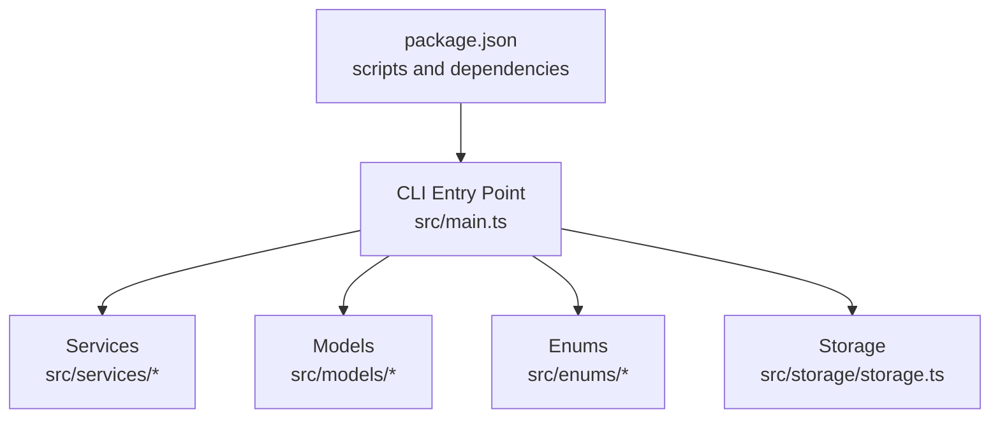
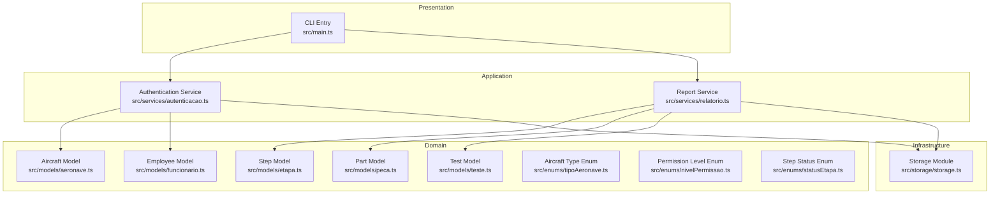

# Troubleshooting & FAQ

<cite>
**Referenced Files in This Document**
- [package.json](file://package.json)
- [src/main.ts](file://src/main.ts)
- [src/storage/storage.ts](file://src/storage/storage.ts)
- [src/services/autenticacao.ts](file://src/services/autenticacao.ts)
- [src/services/relatorio.ts](file://src/services/relatorio.ts)
- [src/enums/tipoAeronave.ts](file://src/enums/tipoAeronave.ts)
- [src/enums/nivelPermissao.ts](file://src/enums/nivelPermissao.ts)
- [src/enums/statusEtapa.ts](file://src/enums/statusEtapa.ts)
- [src/models/aeronave.ts](file://src/models/aeronave.ts)
- [src/models/funcionario.ts](file://src/models/funcionario.ts)
- [src/models/peca.ts](file://src/models/peca.ts)
- [src/models/etapa.ts](file://src/models/etapa.ts)
- [src/models/teste.ts](file://src/models/teste.ts)
</cite>

## Table of Contents
1. [Introduction](#introduction)
2. [Project Structure](#project-structure)
3. [Core Components](#core-components)
4. [Architecture Overview](#architecture-overview)
5. [Detailed Component Analysis](#detailed-component-analysis)
6. [Dependency Analysis](#dependency-analysis)
7. [Performance Considerations](#performance-considerations)
8. [Troubleshooting Guide](#troubleshooting-guide)
9. [Conclusion](#conclusion)
10. [Appendices](#appendices)

## Introduction
This document provides a comprehensive troubleshooting and frequently asked questions guide for the Aerocode CLI System. It focuses on resolving installation issues, dependency conflicts, environment setup problems, runtime errors, data persistence failures, CLI interface issues, and performance optimization. It also includes debugging strategies, log analysis techniques, error interpretation, platform-specific considerations, Node.js and TypeScript compatibility, and preventive maintenance recommendations.

## Project Structure
The Aerocode CLI System is organized around a CLI entry point, domain models, services, enums, and a storage module. The build and runtime scripts are defined in the project configuration.

**Diagram sources**
- [package.json:1-23](file://package.json#L1-L23)
- [src/main.ts:1-1](file://src/main.ts#L1-L1)
- [src/storage/storage.ts:1-1](file://src/storage/storage.ts#L1-L1)

**Section sources**
- [package.json:1-23](file://package.json#L1-L23)
- [src/main.ts:1-1](file://src/main.ts#L1-L1)
- [src/storage/storage.ts:1-1](file://src/storage/storage.ts#L1-L1)

## Core Components
- CLI Entry Point: The CLI starts from the main entry defined in the configuration and delegates to services and models.
- Services: Authentication and reporting services encapsulate business logic and interactions.
- Models: Domain entities represent aircraft, steps, parts, employees, and tests.
- Enums: Typed enumerations define aircraft types, permission levels, and step statuses.
- Storage: Persistence layer abstraction for data operations.

Key operational scripts:
- Build: Compiles TypeScript sources.
- Start: Runs the compiled JavaScript entry.
- Dev: Runs TypeScript sources directly for development.

**Section sources**
- [package.json:6-10](file://package.json#L6-L10)
- [src/services/autenticacao.ts:1-1](file://src/services/autenticacao.ts#L1-L1)
- [src/services/relatorio.ts:1-1](file://src/services/relatorio.ts#L1-L1)
- [src/enums/tipoAeronave.ts:1-4](file://src/enums/tipoAeronave.ts#L1-L4)
- [src/enums/nivelPermissao.ts:1-1](file://src/enums/nivelPermissao.ts#L1-L1)
- [src/enums/statusEtapa.ts:1-4](file://src/enums/statusEtapa.ts#L1-L4)
- [src/models/aeronave.ts:1-1](file://src/models/aeronave.ts#L1-L1)
- [src/models/funcionario.ts:1-1](file://src/models/funcionario.ts#L1-L1)
- [src/models/peca.ts:1-1](file://src/models/peca.ts#L1-L1)
- [src/models/etapa.ts:1-1](file://src/models/etapa.ts#L1-L1)
- [src/models/teste.ts:1-1](file://src/models/teste.ts#L1-L1)

## Architecture Overview
The CLI follows a layered architecture:
- Presentation Layer: CLI entry point orchestrates user interactions.
- Application Layer: Services implement workflows and validations.
- Domain Layer: Models represent business entities.
- Infrastructure Layer: Storage module abstracts persistence.

**Diagram sources**
- [src/main.ts:1-1](file://src/main.ts#L1-L1)
- [src/services/autenticacao.ts:1-1](file://src/services/autenticacao.ts#L1-L1)
- [src/services/relatorio.ts:1-1](file://src/services/relatorio.ts#L1-L1)
- [src/models/aeronave.ts:1-1](file://src/models/aeronave.ts#L1-L1)
- [src/models/etapa.ts:1-1](file://src/models/etapa.ts#L1-L1)
- [src/models/peca.ts:1-1](file://src/models/peca.ts#L1-L1)
- [src/models/funcionario.ts:1-1](file://src/models/funcionario.ts#L1-L1)
- [src/models/teste.ts:1-1](file://src/models/teste.ts#L1-L1)
- [src/enums/tipoAeronave.ts:1-4](file://src/enums/tipoAeronave.ts#L1-L4)
- [src/enums/nivelPermissao.ts:1-1](file://src/enums/nivelPermissao.ts#L1-L1)
- [src/enums/statusEtapa.ts:1-4](file://src/enums/statusEtapa.ts#L1-L4)
- [src/storage/storage.ts:1-1](file://src/storage/storage.ts#L1-L1)

## Detailed Component Analysis

### CLI Entry Point
- Purpose: Initializes the CLI and routes commands to services.
- Common Issues:
  - Missing or misconfigured main entry in project configuration.
  - Unhandled exceptions during startup.
- Resolution Steps:
  - Verify the main entry matches the built output.
  - Wrap initialization in try/catch and log stack traces.
  - Ensure all required services are imported and initialized.

**Section sources**
- [package.json:5](file://package.json#L5)
- [src/main.ts:1-1](file://src/main.ts#L1-L1)

### Authentication Service
- Purpose: Handles user authentication and permission checks.
- Common Issues:
  - Authentication failures due to invalid credentials or missing permissions.
  - Permission level mismatches.
- Resolution Steps:
  - Validate input parameters and normalize user input.
  - Compare against defined permission levels.
  - Log failed attempts with timestamps and identifiers.

**Section sources**
- [src/services/autenticacao.ts:1-1](file://src/services/autenticacao.ts#L1-L1)
- [src/enums/nivelPermissao.ts:1-4](file://src/enums/nivelPermissao.ts#L1-L4)

### Report Service
- Purpose: Generates reports based on steps, parts, and tests.
- Common Issues:
  - Missing or inconsistent data causing report generation failures.
  - Performance issues with large datasets.
- Resolution Steps:
  - Validate required fields before generating reports.
  - Paginate or stream large outputs.
  - Add progress indicators for long-running operations.

**Section sources**
- [src/services/relatorio.ts:1-1](file://src/services/relatorio.ts#L1-L1)
- [src/enums/statusEtapa.ts:1-4](file://src/enums/statusEtapa.ts#L1-L4)

### Storage Module
- Purpose: Provides persistence abstraction for data operations.
- Common Issues:
  - File system permissions errors.
  - Disk space exhaustion.
  - Corrupted or locked data files.
- Resolution Steps:
  - Check write permissions for target directories.
  - Monitor disk usage and implement cleanup policies.
  - Validate file locks and retry mechanisms.

**Section sources**
- [src/storage/storage.ts:1-1](file://src/storage/storage.ts#L1-L1)

### Aircraft Model
- Purpose: Represents aircraft entities and related attributes.
- Common Issues:
  - Invalid aircraft type values.
  - Missing required fields.
- Resolution Steps:
  - Validate enums against allowed values.
  - Enforce required field presence during creation/update.

**Section sources**
- [src/models/aeronave.ts:1-1](file://src/models/aeronave.ts#L1-L1)
- [src/enums/tipoAeronave.ts:1-4](file://src/enums/tipoAeronave.ts#L1-L4)

### Step Model
- Purpose: Represents production steps with status tracking.
- Common Issues:
  - Invalid status transitions.
  - Missing step metadata.
- Resolution Steps:
  - Validate status against allowed transitions.
  - Ensure all required metadata is present.

**Section sources**
- [src/models/etapa.ts:1-1](file://src/models/etapa.ts#L1-L1)
- [src/enums/statusEtapa.ts:1-4](file://src/enums/statusEtapa.ts#L1-L4)

### Part Model
- Purpose: Represents parts used in production steps.
- Common Issues:
  - Missing part identifiers or quantities.
- Resolution Steps:
  - Validate identifiers and numeric quantities.
  - Normalize units and categories.

**Section sources**
- [src/models/peca.ts:1-1](file://src/models/peca.ts#L1-L1)

### Employee Model
- Purpose: Represents employees involved in production.
- Common Issues:
  - Missing employee identifiers or roles.
- Resolution Steps:
  - Validate identifiers and role assignments.
  - Ensure uniqueness constraints are enforced.

**Section sources**
- [src/models/funcionario.ts:1-1](file://src/models/funcionario.ts#L1-L1)

### Test Model
- Purpose: Represents quality assurance tests.
- Common Issues:
  - Missing test results or dates.
- Resolution Steps:
  - Validate required fields and date formats.
  - Ensure test outcomes align with expected criteria.

**Section sources**
- [src/models/teste.ts:1-1](file://src/models/teste.ts#L1-L1)

## Dependency Analysis
- Runtime Dependencies:
  - readline-sync: Provides synchronous terminal input.
- Development Dependencies:
  - TypeScript compiler and type definitions.
  - ts-node for development-time execution.
- Scripts:
  - Build compiles TypeScript.
  - Start runs the compiled output.
  - Dev runs TypeScript sources directly.

Potential Issues:
- Version mismatches between Node.js and TypeScript.
- Missing type definitions causing compilation warnings.
- Outdated dependencies leading to compatibility issues.

Resolution Steps:
- Align Node.js version with TypeScript compiler expectations.
- Install and update dependencies via package manager.
- Pin versions in configuration for reproducibility.

**Section sources**
- [package.json:14-22](file://package.json#L14-L22)
- [package.json:6-10](file://package.json#L6-L10)

## Performance Considerations
- Compilation:
  - Use incremental builds to speed up repeated compilations.
  - Enable appropriate TypeScript compiler options for performance.
- Runtime:
  - Minimize synchronous I/O operations; prefer asynchronous alternatives where feasible.
  - Batch operations to reduce overhead.
  - Monitor memory usage and implement periodic garbage collection awareness.
- Resource Requirements:
  - Ensure sufficient disk space for logs and persisted data.
  - Allocate adequate CPU resources for report generation and data processing tasks.

[No sources needed since this section provides general guidance]

## Troubleshooting Guide

### Installation and Setup
- Issue: Cannot install dependencies.
  - Verify network connectivity and registry access.
  - Clear package manager cache and retry installation.
  - Check Node.js and npm versions for compatibility.
- Issue: Build fails after cloning.
  - Run the build script to compile TypeScript sources.
  - Resolve any TypeScript errors reported by the compiler.
- Issue: CLI does not start in development mode.
  - Confirm dev script executes ts-node with the correct entry file.
  - Ensure all imports resolve correctly.

**Section sources**
- [package.json:6-10](file://package.json#L6-L10)

### Dependency Conflicts
- Issue: Conflicting versions of TypeScript or Node types.
  - Align versions across dependencies.
  - Use a lock file to enforce consistent installs.
- Issue: readline-sync compatibility issues.
  - Verify supported Node.js versions.
  - Reinstall the package if necessary.

**Section sources**
- [package.json:14-22](file://package.json#L14-L22)

### Environment Setup Problems
- Issue: Incorrect main entry path.
  - Ensure the main entry matches the built output location.
  - Update configuration if the build output directory changes.
- Issue: Missing environment variables.
  - Define required environment variables before running the CLI.
  - Load environment from a configuration file if applicable.

**Section sources**
- [package.json:5](file://package.json#L5)

### Runtime Errors
- Issue: Authentication failures.
  - Validate user credentials and permission levels.
  - Check service logs for detailed error messages.
- Issue: Report generation errors.
  - Verify data completeness and validity.
  - Reduce dataset size temporarily to isolate issues.

**Section sources**
- [src/services/autenticacao.ts:1-1](file://src/services/autenticacao.ts#L1-L1)
- [src/services/relatorio.ts:1-1](file://src/services/relatorio.ts#L1-L1)

### Data Persistence Failures
- Issue: Storage write failures.
  - Check file system permissions and available disk space.
  - Implement retry logic and error logging.
- Issue: Data corruption or lock contention.
  - Validate file integrity and release locks promptly.
  - Use atomic writes where possible.

**Section sources**
- [src/storage/storage.ts:1-1](file://src/storage/storage.ts#L1-L1)

### CLI Interface Issues
- Issue: Unexpected behavior or crashes.
  - Capture stack traces and error logs.
  - Reproduce with minimal input to isolate the problem.
- Issue: Slow response times.
  - Profile I/O-bound operations.
  - Optimize loops and reduce synchronous calls.

**Section sources**
- [src/main.ts:1-1](file://src/main.ts#L1-L1)

### Debugging Strategies
- Logging:
  - Add structured logs with timestamps and severity levels.
  - Include contextual information such as user IDs and operation IDs.
- Tracing:
  - Use stack traces to identify failure origins.
  - Correlate logs across services and storage.
- Interactive Debugging:
  - Use development mode to step through code.
  - Set breakpoints at service boundaries.

**Section sources**
- [package.json:9](file://package.json#L9)

### Error Message Interpretation
- Authentication Errors:
  - Indicates invalid credentials or insufficient permissions.
  - Check permission levels and re-authenticate.
- Report Generation Errors:
  - Often caused by missing or invalid data.
  - Validate model fields and enums.
- Storage Errors:
  - Typically related to file system permissions or disk space.
  - Inspect filesystem and quotas.

**Section sources**
- [src/services/autenticacao.ts:1-1](file://src/services/autenticacao.ts#L1-L1)
- [src/services/relatorio.ts:1-1](file://src/services/relatorio.ts#L1-L1)
- [src/storage/storage.ts:1-1](file://src/storage/storage.ts#L1-L1)

### Platform-Specific Issues
- Windows:
  - Ensure paths use proper separators.
  - Check antivirus or security software blocking file operations.
- Linux/macOS:
  - Verify executable permissions for scripts.
  - Confirm shell compatibility for scripts.

[No sources needed since this section provides general guidance]

### Node.js and TypeScript Compatibility
- Node.js Version:
  - Use LTS versions compatible with TypeScript compiler.
  - Avoid experimental features until stable.
- TypeScript Configuration:
  - Keep compiler options aligned with project needs.
  - Update types and type definitions regularly.

**Section sources**
- [package.json:17-22](file://package.json#L17-L22)

### Preventive Measures and Maintenance
- Regular Updates:
  - Keep dependencies updated and monitor for security advisories.
- Monitoring:
  - Track disk usage, memory consumption, and error rates.
- Backups:
  - Periodically back up persistent data.
- Testing:
  - Add unit and integration tests for critical paths.

**Section sources**
- [package.json:14-22](file://package.json#L14-L22)

### Monitoring Best Practices
- Logs:
  - Centralize logs and apply retention policies.
  - Alert on elevated error rates.
- Metrics:
  - Track command execution times and resource usage.
- Health Checks:
  - Implement periodic checks for storage availability and service responsiveness.

[No sources needed since this section provides general guidance]

## Conclusion
This guide consolidates actionable steps to troubleshoot and maintain the Aerocode CLI System. By following the outlined procedures—covering installation, dependencies, environment setup, runtime errors, persistence, CLI issues, performance, debugging, and platform considerations—you can quickly diagnose and resolve most issues while establishing robust preventive and monitoring practices.

## Appendices

### Quick Reference: Common Commands
- Build: Compile TypeScript sources.
- Start: Run the compiled CLI.
- Dev: Run TypeScript sources in development mode.

**Section sources**
- [package.json:6-10](file://package.json#L6-L10)